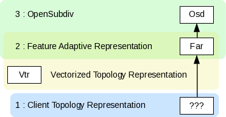
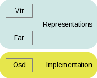
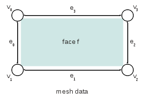
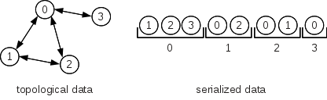
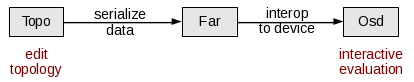

..  
       Copyright 2013 Pixar

       Licensed under the Apache License, Version 2.0 (the "License");
       you may not use this file except in compliance with the License
       and the following modification to it: Section 6 Trademarks.
       deleted and replaced with:

       6. Trademarks. This License does not grant permission to use the
       trade names, trademarks, service marks, or product names of the
       Licensor and its affiliates, except as required for reproducing
       the content of the NOTICE file.

       You may obtain a copy of the License at

       http://www.apache.org/licenses/LICENSE-2.0

       Unless required by applicable law or agreed to in writing,
       software distributed under the License is distributed on an
       "AS IS" BASIS, WITHOUT WARRANTIES OR CONDITIONS OF ANY KIND,
       either express or implied.  See the License for the specific
       language governing permissions and limitations under the
       License.
  

API Overview
------------

.. contents::
   :local:
   :backlinks: none

Architecture Overview
=====================

Because the OpenSubdiv software is intended to run on a variete of computing
resources, the API architecture has to accomodate a fairly complex matrix of
interoperations. In order to achieve the requisite flexibility, the code structure
is both layered and modular.

----

Opt-In Features
===============

One of the fundamental requirement of all our API's design patterns is the opt-in
implementation of features. Because most of the algorithms are used within the
constraints of interactive applications, we want to provide optimal code paths
wherever possible. 

Therefore, client-code should always have the option to opt-out of the memory and
processing costs of any given feature that is not used.

----

Layers
======

From a top-down point of view, OpenSubdiv is comprised of 3 layers : **Hbr**, 
**Far** and **Osd**. 

The color groupings indicate inter-layer functional dependencies:

  * Osd depends on Far, but not on Hbr
  * Far depends on Hbr
  * Hbr has no dependencies

It is therefore possible to use functionality from Hbr without introducing any
dependency on either Far or Osd.

----

Representation vs. Implementation Layers
****************************************

One of the core performance goals of our subdivision algorithms is to leverage
interactive performance out of massively parallel code execution wherever 
possible. In order to support a large diversity of discrete compute devices through
multiple dedicated SDKs, it is critical to distill the computations into the
smallest and simplest kernels possible. These can in turn be safely ported and 
optimized for each of the hardware platforms. 

This separation of general purpose against hardware-specific code is translated into
two types of layers : the **implementation** layer against the **representation** 
layers.

----

Data Flows
**********

Data flows are mostly 1-directional, from top to bottom as a number of algorithms 
are preparing the coarse mesh data to be refined and passing their results to 
the next element in the processing chain.

----

Multiple Representations
************************

The coarse mesh of a subdivision surface is represented by a collection of 
components that maintain relationships to each other. 

For instance:
  - vertex to incident edge
  - edge to origin and destination vertex
  - face to edges

This allows authoring applications to easily access "neighboring" components 
in order to make topology edits or manipulate properties of the components 
themselves. The key to achieving efficient many-core processing is to reduce data
interdependencies. However, by definition, the bulk of topological mesh data is 
the very description of these connections (dependencies) between vertices. 

This is why OpenSubdiv provides specific representations for mesh data: 
  - Hbr is a half-edge relational representation
  - Far is a serialized representation

A typical workflow would be to manipulate the topology in authoring applications,
maybe using Hbr meshes for common editing operations. Once the topology of the mesh 
has stabilized, it is processed into a serialized form that can then be evaluated 
at interactive framerates. The serialized form is embodied by Far, which can then 
be migrated by the device-specific functions in Osd.

----

Feature Adaptive Subdivision
============================

Because of the high-performance apsects, one of the main goals of the OpenSubdiv 
set of APIs is to compartmentalize subdivision rules from interpolation 
computations, which can then be dispatched to discrete compute devices, including
a variety of GPUs.

The data paths for the feature adaptive algorithm layered over the OpenSubdiv
architecture:

.. image:: images/osd_layers.png

Hbr serves both as an advanced topological description and the custodian of the
Catmull-Clark (and Loop) subdivision rules. Far is then used to leverage these
rules in order to produce serialized topological tables. 

The remaining computations have been reduced to extremely simple forms of 
interpolation, which can be dispatched to a variety of discrete computation 
platforms.
