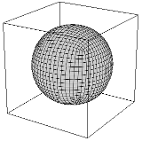

..  
     Copyright 2013 Pixar
  
     Licensed under the Apache License, Version 2.0 (the "Apache License")
     with the following modification; you may not use this file except in
     compliance with the Apache License and the following modification to it:
     Section 6. Trademarks. is deleted and replaced with:
  
     6. Trademarks. This License does not grant permission to use the trade
        names, trademarks, service marks, or product names of the Licensor
        and its affiliates, except as required to comply with Section 4(c) of
        the License and to reproduce the content of the NOTICE file.
  
     You may obtain a copy of the Apache License at
  
         http://www.apache.org/licenses/LICENSE-2.0
  
     Unless required by applicable law or agreed to in writing, software
     distributed under the Apache License with the above modification is
     distributed on an "AS IS" BASIS, WITHOUT WARRANTIES OR CONDITIONS OF ANY
     KIND, either express or implied. See the Apache License for the specific
     language governing permissions and limitations under the Apache License.
  

API Overview
------------

.. contents::
   :local:
   :backlinks: none

.. image:: images/osd_splash.png 
   :align: center
   :target: images/osd_splash.png 

API Layers
==========

OpenSubdiv is structured as a set of layered libraries.  This structure facilitates
operation on a variety of computing resources, and allows developers to only opt-in
to the layers and feature sets that they require.
From a top-down point of view, OpenSubdiv is comprised of several layers,
some public, and some private.

Layers list:

+-----------------------------------------+--------------------------------------------------------------------------------+
| | **Sdc**                               |The lowest level layer, implements the core subdivision details                 |
| | Subdivision Core                      |to facilitate the generation of consistent results. Most cases will only        |
| | `Sdc Overview <sdc_overview.html>`__  |require the use of simple public types and constants from Sdc.                  |
+-----------------------------------------+--------------------------------------------------------------------------------+
| | **Vtr**                               | A suite of classes to provide an intermediate                                  |
| | Vectorized Topological Representation | representation of topology that supports efficient refinement.                 |
| | `Vtr Overview <vtr_overview.html>`__  | *Vtr* is intended for internal use only.                                       |
+-----------------------------------------+--------------------------------------------------------------------------------+
| | **Far**                               |                                                                                |
| | Feature Adaptive Representation       | The central interface that processes client-supplied                           |
| | `Far Overview <far_overview.html>`__  | geometry and turns it into a serialized data                                   |
|                                         | representation ready for parallel processing in *Osd*.                         |
|                                         | *Far* also provides a fully-featured single-threaded                           |
|                                         | implementation of subdivision interpolation algorithms.                        |
+-----------------------------------------+--------------------------------------------------------------------------------+
| | **Bfr**                               | A suite of classes to provide parameterization, evaluation                     |
| | Bace Face Representation              | and tessellation on the CPU.  *Bfr* is more flexible and more                  |
| | `Bfr Overview <bfr_overview.html>`__  | scalable than *Osd* but potentially less efficient.                            |
+-----------------------------------------+--------------------------------------------------------------------------------+
| | **Osd**                               |                                                                                |
| | OpenSubdiv cross platform             | A suite of classes to provide parallel subdivision                             |
| | `Osd Overview <osd_overview.html>`__  | kernels and drawing utilities on a variety of platforms                        |
|                                         | such as TBB, CUDA, OpenCL, GLSL and DirectX.                                   |
+-----------------------------------------+--------------------------------------------------------------------------------+

Client mesh data enters the API through the Far layer. Typically, results will
be collected from the Osd layer. However, it is possible to use
functionality from Far without introducing any dependency on Osd.

Although there are several entry-points to provide topology and primitive variable
data to OpenSubdiv, eventually everything must pass through the private Vtr and Sdc
representations for topological analysis.

.. image:: images/api_layers_3_0.png
   :align: center

Using the Right Tools
=====================

OpenSubdiv's tiered interface offers a lot flexibility to make your application
both fast and robust. Because navigating through the large collection of classes and
features can be challenging, here are use cases that should help sketch
the broad lines of going about using subdivisions in your application.

General client application requirements:

+----------------------+-------------------------------------------------------+
| Surface Limit        | For some applications, a polygonal approximation of   | 
|                      | the smooth surface is enough. Others require          |  
|                      | C :sup:`2` continuous differentiable bi-cubic patches |  
|                      | (ex: deformable displacement mapping, smooth normals  |  
|                      | and semi-sharp creases...)                            |  
+----------------------+-------------------------------------------------------+
| Deforming Surface    | Applications such as off-line image renderers often   |
|                      | process a single frame at a time. Others, such as     |    
|                      | interactive games need to evaluate deforming          |    
|                      | character surface every frame. Because we can amortize|    
|                      | many computations if the topology of the mesh does not|    
|                      | change, OpenSubdiv provides 'stencil tables' in order |    
|                      | to leverage subdivision refinement into a             |     
|                      | pre-computation step.                                 |                 
+----------------------+-------------------------------------------------------+
| Multi-threading      | OpenSubdiv also provides dedicated interfaces to      |
|                      | leverage parallelism on a wide variety of platforms   |
|                      | and API standards, including both CPUs and GPUs.      |
+----------------------+-------------------------------------------------------+
| GPU Draw             | If the application requires interactive drawing on    |
|                      | screen, OpenSubdiv provides several back-end          |
|                      | implementations, including D3D11 and OpenGL. These    |
|                      | back-ends provide full support for programmable       |
|                      | shading.                                              |
+----------------------+-------------------------------------------------------+

Use case 1: Simple refinement
=============================

The following example shows the most simple case to get your mesh refined uniformly.

1. Define a class for the primvar you want to refine.
   It's required to have Clear() and AddWithWeight() functions.

.. code:: c++

    struct Vertex {
        void Clear() { x = y = z = 0; }
        void AddWithWeight(Vertex const &src, float weight) {
            x += weight * src.x;
            y += weight * src.y;
            z += weight * src.z;
        }
        float x, y, z;
    };

2. Instantiate a `Far::TopologyRefiner <far_overview.html#far-topologyrefiner>`_
from the `Far::TopologyDescriptor <far_overview.html#far-topologyrefinerfactory>`_.

.. code:: c++

    Far::TopologyDescriptor desc;
    desc.numVertices         = <the number of vertices>
    desc.numFaces            = <the number of faces>
    desc.numVertsPerFace     = <array of the number of verts per face>
    desc.vertIndicesPerFace  = <array of vert indices>

    Far::TopologyRefiner * refiner = Far::TopologyRefinerFactory<Descriptor>::Create(desc);

3. Call RefineUniform() to refine the topology up to 'maxlevel'.

.. code:: c++

    refiner->RefineUniform(Far::TopologyRefiner::UniformOptions(maxlevel));

4. Interpolate vertex primvar data at 'level' using
`Far::PrimvarRefiner <far_overview.html#far-primvarrefiner>`_

.. code:: c++

    Far::PrimvarRefiner primvarRefiner(*refiner);

    Vertex const *src = <coarse vertices>
    Vertex *dst       = <refined vertices>

    primvarRefiner.Interpolate(level, src, dst);

5. The topology at the refined level can be obtained from Far::TopologyLevel

.. code:: c++

    Far::TopologyLevel const & refLastLevel = refiner->GetLevel(maxlevel);

    int nverts = refLastLevel.GetNumVertices();
    int nfaces = refLastLevel.GetNumFaces();

    for (int face = 0; face < nfaces; ++face) {
        Far::ConstIndexArray fverts = refLastLevel.GetFaceVertices(face);

        // do something with dst and fverts
    }

6. Done! See `Far tutorial 1.1 <far_tutorial_1_1.html>`__ for the complete code example.

Use case 2: GL adaptive tessellation drawing of animating mesh
==============================================================

The next example is showing how to draw adaptive tessellated patches in GL using OpenSubdiv.
The osd layer helps you to interact with GL and other device specific APIs. Also for an
efficient refinement of animating mesh on a static topology, we create a stencil table to
refine the positions changing over time.

The following example code uses an Osd::GLMesh utility class which composites a stencil
table, patch table, vertex buffer and evaluator in osd layer. You can also use those classes
independently.

.. image:: images/usecase2.png
   :align: center

1. Instantiate a `Far::TopologyRefiner <far_overview.html#far-topologyrefiner>`_ from the
`Far::TopologyDescriptor <far_overview.html#far-topologyrefinerfactory>`_, same as usecase 1.

2. Setup Osd::Mesh. In this example we use b-spline endcap.

.. code:: c++

    int numVertexElements = 3; // x, y, z

    Osd::MeshBitset bits;
    bits.set(Osd::MeshAdaptive, true);           // set adaptive
    bits.set(Osd::MeshEndCapBSplineBasis, true); // use b-spline basis patch for endcap.

    Osd::GLMeshInterface *mesh = new Osd::Mesh<Osd::CpuGLVertexBuffer, Far::StencilTable,
                                               Osd::CpuEvaluator, Osd::GLPatchTable>
                                        (refiner, numVertexElements, 0, level, bits);

3. Update coarse vertices and refine (Osd::Mesh::Refine() calls
`Osd::CpuEvaluator::EvalStencils() <osd_overview.html#refinement>`_)

.. code:: c++

    mesh->UpdateVertexBuffer(&vertex[0], 0, nverts);
    mesh->Refine();

4. Bind index buffer, PatchParamBuffer and vertex buffer

.. code:: c++

    // index buffer
    glBindBuffer(GL_ELEMENT_ARRAY_BUFFER, mesh->GetPatchTable()->GetPatchIndexBuffer());

    // vertex buffer
    glBindBuffer(GL_ARRAY_BUFFER, mesh->BindVertexBuffer());
    glEnableVertexAttribArray(0);
    glVertexAttribPointer(0, numVertexElements, GL_FLOAT, GL_FALSE,
                          numVertexElements*sizeof(float), 0);

    // patch param buffer
    glActiveTexture(GL_TEXTURE0);
    glBindTexture(GL_TEXTURE_BUFFER, mesh->GetPatchTable()->GetPatchParamTextureBuffer());

5. Draw. Since we use b-spline endcaps in this example, there is only one PatchArray in the patch table. You may need to iterate patch arrays as you use other type of endcap. To configure GLSL program for each patch type, see `osd shader interface <osd_shader_interface.html>`__ for more details.

.. code:: c++

    Osd::PatchArray const & patch = mesh->GetPatchTable()->GetPatchArrays()[0];
    Far::PatchDescriptor desc = patch.GetDescriptor();

    int numVertsPerPatch = desc.GetNumControlVertices();  // 16 for B-spline patches
    glUseProgram(BSplinePatchProgram);
    glPatchParameteri(GL_PATCH_VERTICES, numVertsPerPatch);
    glDrawElements(GL_PATCHES, patch.GetNumPatches() * numVertsPerPatch,
                   GL_UNSIGNED_INT, 0);

6. As the mesh animates, repeat from step 3 to update positions, refine, and draw.
   See `glViewer <glviewer.html>`__ and other examples for more complete usage.

Tutorials and Examples
======================

For more use cases, please see `Tutorials <tutorials.html>`_ and `Examples <code_examples.html>`_

