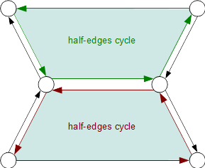

..  
       Copyright (C) Pixar. All rights reserved.
  
       This license governs use of the accompanying software. If you
       use the software, you accept this license. If you do not accept
       the license, do not use the software.
  
       1. Definitions
       The terms "reproduce," "reproduction," "derivative works," and
       "distribution" have the same meaning here as under U.S.
       copyright law.  A "contribution" is the original software, or
       any additions or changes to the software.
       A "contributor" is any person or entity that distributes its
       contribution under this license.
       "Licensed patents" are a contributor's patent claims that read
       directly on its contribution.
  
       2. Grant of Rights
       (A) Copyright Grant- Subject to the terms of this license,
       including the license conditions and limitations in section 3,
       each contributor grants you a non-exclusive, worldwide,
       royalty-free copyright license to reproduce its contribution,
       prepare derivative works of its contribution, and distribute
       its contribution or any derivative works that you create.
       (B) Patent Grant- Subject to the terms of this license,
       including the license conditions and limitations in section 3,
       each contributor grants you a non-exclusive, worldwide,
       royalty-free license under its licensed patents to make, have
       made, use, sell, offer for sale, import, and/or otherwise
       dispose of its contribution in the software or derivative works
       of the contribution in the software.
  
       3. Conditions and Limitations
       (A) No Trademark License- This license does not grant you
       rights to use any contributor's name, logo, or trademarks.
       (B) If you bring a patent claim against any contributor over
       patents that you claim are infringed by the software, your
       patent license from such contributor to the software ends
       automatically.
       (C) If you distribute any portion of the software, you must
       retain all copyright, patent, trademark, and attribution
       notices that are present in the software.
       (D) If you distribute any portion of the software in source
       code form, you may do so only under this license by including a
       complete copy of this license with your distribution. If you
       distribute any portion of the software in compiled or object
       code form, you may only do so under a license that complies
       with this license.
       (E) The software is licensed "as-is." You bear the risk of
       using it. The contributors give no express warranties,
       guarantees or conditions. You may have additional consumer
       rights under your local laws which this license cannot change.
       To the extent permitted under your local laws, the contributors
       exclude the implied warranties of merchantability, fitness for
       a particular purpose and non-infringement.
  

API Overview
------------

.. contents::
   :local:
   :backlinks: none

Architecture Overview
=====================

Because the OpenSubdiv software is intended to run on a variete of computing
resources, the API architecture has to accomodate a fairly complex matrix of
interoperations. In order to achieve the requisite flexibility, the code structure
is both layered and modular.

----

Opt-In Features
***************

One of the fundamental requirement of all our API's design patterns is the opt-in
implementation of features. Because most of the algorithms are used within the
constraints of interactive applications, we want to provide optimal code paths
wherever possible. 

Therefore, client-code should always have the option to opt-out of the memory and
processing costs of any given feature that is not used.

----

Layers
******

From a top-down point of view, OpenSubdiv is comprised of 3 layers : **Hbr**, 
**Far** and **Osd**. 

The color groupings indicate inter-layer functional dependencies:

  * Osd depends on Far, but not on Hbr
  * Far depends on Hbr
  * Hbr has no dependencies

It is therefore possible to use functionality from Hbr without introducing any
dependency on either Far or Osd.

----

Data and Workflows
******************

Data flows are mostly 1-directional, from top to bottom as a number of algorithms 
are preparing the coarse mesh data to be refined and passing their results to 
the next element in the processing chain.

.. image:: images/api_workflows.png
   :align: center

----

Representation vs. Implementation Layers
****************************************

One of the core performance goals of our subdivision algorithms is to leverage
interactive performance out of massively parallel code execution wherever 
possible. In order to support a large diversity of discrete compute devices through
multiple dedicated SDKs, it is critical to distill the critical computations into
the smallest and simplest kernels possible. These can in turn be safely ported and 
optimized for each of the hardware platforms. 

.. image:: images/api_representations.png
   :align: center

This separation of general purpose against hardware-specific code is translated into
two types of layers : the **implementation** layer against the **representation** 
layers.

----

Multiple Representations
************************

The coarse mesh of a subdivision surface is represented by a collection of 
components that maintain relationships to each other. 

.. image:: images/api_mesh_data.png
   :align: center

For instance:
  - vertex to incident edge
  - edge to origin and destination vertex
  - face to edges

This allows authoring applications to easily access "neighboring" components 
in order to make topology edits or manipulate properties of the components 
themselves. The key to achieving efficient many-core processing is to reduce data
interdependencies. However, by definition, the bulk of topological mesh data is 
the very description of the connections (dependencies) between vertices. 

This is why OpenSubdiv provides specific representations for mesh data: 
  - Hbr is a half-edge relational representation
  - Far is a serialized representation

A typical workflow is to manipulate Hbr meshes in authoring applications. Once the
topology of the mesh has stabilized, it is processed into a serialized form that
can then be evaluated at interactive framerates.

----

Hierarchical Boundary Representation (Hbr)
==========================================

Hbr is an interconnected topological data representation. The high level of vertex
connectivity information makes this representation well suited for creation and
editing purposes. It is however inefficient for interactive refinement operations:
Separate objects are allocated for each vertex and edge with pointers to neighboring 
vertices and edges.

Hbr is also the lowest-level subdivision library in Pixar's `Photorealistic RenderMan`.

----

Half-edge Data Structure
************************

The current implementation is based on a half-edge data structure.

.. image:: images/half_edge.png
   :align: center

----

Half-edge cycles and Manifold Topology
**************************************

Because half-edges only carry a reference to their opposite half-edge, a given 
edge can only access a single neighboring edge cycle. 

   
This is a fundamental limitation of the half-edge data structure, in that it
cannot represent non-manifold geometry, in particular fan-type topologies.

----

Templated Vertex Class
**********************

The vertex class has been abstracted into a set of templated function accesses. 
Providing Hbr with a template vertex class that does not implement these functions 
allows client-code to use Hbr as a pure topological analysis tool without having 
to pay any costs for data interpolation. It also allows client-code to remain in 
complete control of the layout of the vertex data : interleaved or non-interleaved.

----

Feature Adaptive Representation (Far)
=====================================

Far is a serialized topoloigcal data representation.Far uses hbr to create and 
cache fast run time data structures for table driven subdivision of vertices and 
cubic patches for limit surface evaluation. `Feature-adaptive <subdivision_surfaces.html#feature-adaptive-subdivision>`__ 
refinement logic is used to adaptively refine coarse topology near features like 
extraordinary vertices and creases in order to make the topology amenable to 
cubic patch evaluation. Far is also a generic, templated algorithmic base API 
that clients in higher levels instantiate and use by providing an implementation 
of a vertex class. It supports these subdivision schemes:

----

OpenSubdiv (Osd)
================

Osd contains client-level code that uses Far to create concrete instances of 
meshes. These meshes use precomputed tables from hbr to perform table-driven 
subdivision steps with a variety of massively parallel computational backend 
technologies. Osd supports both `uniform subdivision <subdivision_surfaces.html#uniform-subdivision>`
and adaptive refinement with cubic patches. With uniform subdivision the 
computational backend code performs Catmull/Clark splitting and averaging on 
each face. With adaptive subdivision the Catmull/Clark steps are used to compute 
the CVs of cubic patches, then the cubic patches are tessellated on with GLSL or DirectX.

OpenSubdiv enforces the same results for the different computation backends with 
a series of regression tests that compare the methods to each other.

The OpenSubdiv layer is comprised of 3 modules : Refine, Draw and Eval.

.. container:: impnotip

   * **Important**

      Face-varying smooth data interpolation is currently not supported in Osd.
      "Smooth UV" modes of various DCC applications are not supported (yet).

----

OsdRefine
*********

The Refine module contains the code paths that manage the application of the 
subdivision rules to the vertex data.

----

OsdDraw
*******

The Draw module manages interactions with discrete display devices and provide
support for interactive drawing of the subdivision surfaces.

----

OsdEval
*******

The Eval module provides computational APIs for the evaluation of vertex data at
the limit, ray intersection and point projection.

