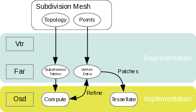

..  
     Copyright 2013 Pixar
  
     Licensed under the Apache License, Version 2.0 (the "Apache License")
     with the following modification; you may not use this file except in
     compliance with the Apache License and the following modification to it:
     Section 6. Trademarks. is deleted and replaced with:
  
     6. Trademarks. This License does not grant permission to use the trade
        names, trademarks, service marks, or product names of the Licensor
        and its affiliates, except as required to comply with Section 4(c) of
        the License and to reproduce the content of the NOTICE file.
  
     You may obtain a copy of the Apache License at
  
         http://www.apache.org/licenses/LICENSE-2.0
  
     Unless required by applicable law or agreed to in writing, software
     distributed under the Apache License with the above modification is
     distributed on an "AS IS" BASIS, WITHOUT WARRANTIES OR CONDITIONS OF ANY
     KIND, either express or implied. See the Apache License for the specific
     language governing permissions and limitations under the Apache License.
  

API Overview
------------

.. contents::
   :local:
   :backlinks: none

Architecture Overview
=====================

Because the OpenSubdiv software is intended to run on a variety of computing
resources, the API architecture has to accomodate a fairly complex matrix of
interoperations. In order to achieve the requisite flexibility, the code structure
is both layered and modular.

----

Opt-In Features
===============

One of the fundamental requirement of all our API's design patterns is the opt-in
implementation of features. Because most of the algorithms are used within the
constraints of interactive applications, we want to provide optimal code paths
wherever possible. 

Therefore, client-code should always have the option to opt-out of the memory and
processing costs of any given feature that is not used.

----

API Layers
==========

From a top-down point of view, OpenSubdiv is comprised of several layers, some
public, and some private.

Layers list in descending order:

  * **Osd** (OpenSubdiv)
  * **Far** (Feature Adaptive Representation)
  * **Vtr** (Vectorized Topological Representation)
  * **Sdc** (Subdivision Core)

Client mesh data enters the API through the Far layer. Typically, results will
be collected from the Osd layer. However, it is possible to use
functionality from Far without introducing any dependency on Osd.

Although there are several entry-points to provide topology and primitive variable
data to OpenSubdiv, eventually everything must pass through the private Vtr and Sdc
representations for topological analysis.

See `Using the Right Tools`_ for more in-depth coverage.

----

Representation vs. Implementation Layers
========================================

One of the core performance goals of our subdivision algorithms is to leverage
interactive performance out of massively parallel code execution wherever 
possible. In order to support a large diversity of compute architectures
it is critical to stream the geometric data to the compute kernels in the
most optimal way.

Data structures that are efficient for topology analysis during the pre-computation
stage are not very good candidates for parallel processing. Our layered structure
reflects this requirement: topology analysis and other pre-computation tasks are
delegated to "representation" layers, while the actual execution of computations
has been moved to an "implementation" layer.

**Representation** layers are for general purpose algorithms and differentiated by
the requirements placed on data represenation. See `Multiple Representations`_ for
more details.

The **Implementation** layer contains hardware and API-specific implementations.
In order to minimize code redundancy and bugs, we strive to reduce device-specific
computation logic to the most simplistic expression possible (in many cases as
simple as series of multiply-ads).

----

Multiple Representations
========================

The coarse mesh of a subdivision surface is represented by a collection of 
components that maintain relationships to each other. 

.. image:: images/api_mesh_data.png
   :align: center

For instance:
  - vertex to incident edge
  - edge to origin and destination vertex
  - face to edges

This allows authoring applications to easily access "neighboring" components 
in order to make topology edits or manipulate properties of the components 
themselves. The key to achieving efficient many-core processing is to reduce data
interdependencies. However, by definition, the bulk of topological mesh data is 
the very description of these connections (dependencies) between vertices. 

.. image:: images/api_serialized_data.png
   :align: center

This is why OpenSubdiv provides specific representations for mesh data: 
  - Vtr is a vectorized topology-only representation
  - Far is a feature adaptive serialized representation

A typical workflow would be to manipulate the topology in authoring applications,
maybe using Hbr or a similar relational representation for common editing operations.
Once the topology of the mesh has stabilized, it is processed into a serialized form
that can then be evaluated at interactive framerates. The serialized form is 
embodied by Far, which can then be migrated by device-specific functions in Osd.

.. image:: images/api_workflows.png
   :align: center

----

Feature Adaptive Subdivision
============================

Because of the high-performance apsects, one of the main goals of the OpenSubdiv 
set of APIs is to compartmentalize subdivision rules from interpolation 
computations, which can then be dispatched to discrete compute devices, including
a variety of GPUs.

The data paths for the feature adaptive algorithm layered over the OpenSubdiv
architecture:

Vtr serves both as a private, efficient, intermediate topological description and
as the custodian of the Catmull-Clark (and Loop) subdivision rules. Far is used to
leverage these rules in order to produce serialized topological tables. 

The remaining computations have been reduced to extremely simple forms of 
interpolation, which can be dispatched to a variety of discrete computation 
platforms.

----

Using the Right Tools
=====================

OpenSubdiv's tiered interface offers a lot flexibility to make your application
both fast and robust. Because navigating through the large collection of classes and
features can be challenging, here is a flow-chart that should help sketch
the broad lines of going about using subdivisions in your application.

General client application requirements:

+----------------------+-------------------------------------------------------+
| Surface Limit        | For some applications, a polygonal approximation of   | 
|                      | the smooth surface is enough. Others require          |  
|                      | C :sup:`2` continuous differentiable bi-cubic patches |  
|                      | (ex: deformable displacement mapping, smooth normals  |  
|                      | and semi-sharp creases...)                            |  
+----------------------+-------------------------------------------------------+
| Deforming Surface    | Applications such as off-line image renderers often   |
|                      | process a single frame at a time. Others, such as     |    
|                      | interactive games need to evaluate deforming          |    
|                      | character surface every frame. Because we can amortize|    
|                      | many computations if the topology of the mesh does not|    
|                      | change, OpenSubdiv provides 'stencil tables' in order |    
|                      | to leverage subdivision refinement into a             |     
|                      | pre-computation step.                                 |                 
+----------------------+-------------------------------------------------------+
| Multi-threading      | OpenSubdiv also provides dedicated interfaces to      |
|                      | leverage parallelism on a wide variety of platforms   |
|                      | and API standards, including both CPUs and GPUs.      |
+----------------------+-------------------------------------------------------+
| GPU Draw             | If the application requires interactive drawing on    |
|                      | screen, OpenSubdiv provides several back-end          |
|                      | implementations, including D3D11 and OpenGL. These    |
|                      | back-ends provide full support for programmable       |
|                      | shading.                                              |
+----------------------+-------------------------------------------------------+

Flow-chart:

.. image:: images/osd_flow.png
   :align: center
   :target: images/osd_flow.png 

