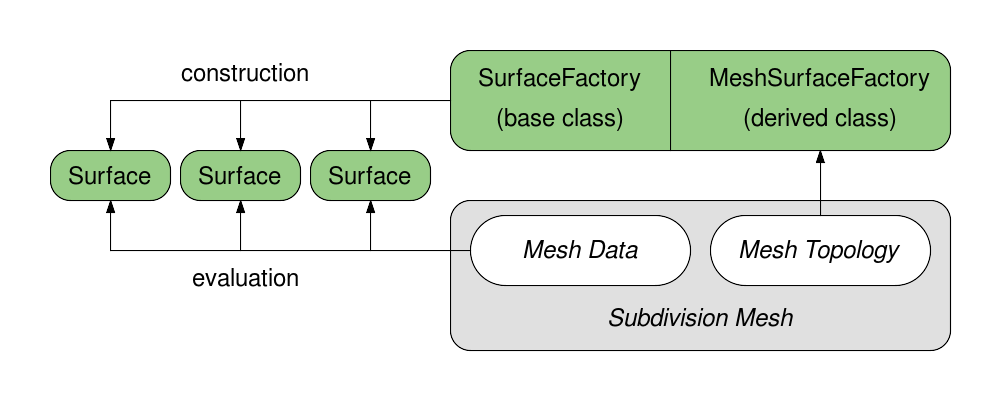
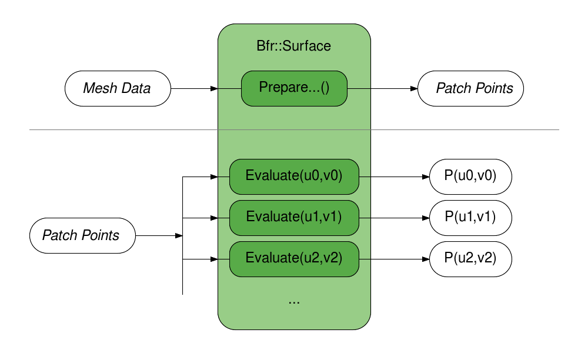

..
     Copyright 2022 Pixar

     Licensed under the Apache License, Version 2.0 (the "Apache License")
     with the following modification; you may not use this file except in
     compliance with the Apache License and the following modification to it:
     Section 6. Trademarks. is deleted and replaced with:

     6. Trademarks. This License does not grant permission to use the trade
        names, trademarks, service marks, or product names of the Licensor
        and its affiliates, except as required to comply with Section 4(c) of
        the License and to reproduce the content of the NOTICE file.

     You may obtain a copy of the Apache License at

         http://www.apache.org/licenses/LICENSE-2.0

     Unless required by applicable law or agreed to in writing, software
     distributed under the Apache License with the above modification is
     distributed on an "AS IS" BASIS, WITHOUT WARRANTIES OR CONDITIONS OF ANY
     KIND, either express or implied. See the Apache License for the specific
     language governing permissions and limitations under the Apache License.

BFR Overview
------------

.. contents::
   :local:
   :backlinks: none

Base Face Representation (Bfr)
==============================

*Bfr* is an alternate API layer that treats a subdivision mesh provided
by a client as a `piecewise parameteric surface primitive
<subdivision_surfaces.html#piecewise-parametric-surfaces>`__.

The name *Bfr* derives from the fact that the concepts and classes of
this interface all relate to the "base faces" of a mesh.  Concepts such
as *parameterization*, *evaluation* and *tessellation* all refer to and
are embodied by classes that deal with a specific face of the original
unrefined mesh.

The *Bfr* interfaces allow the limit surface for a single face to be
identified and evaluated independently of all other faces without any
global pre-processing. While concepts and utilities from the *Far*
interface are used internally, the details of their usage is hidden.
There is no need to coordinate adaptive refinement with tables of
patches, stencils, Ptex indices, patch maps, etc.

The resulting evaluation interface is much simpler, more flexible and
more scalable than those assembled with the *Far* classes -- providing
a preferable alternative for many CPU-based use cases.

The main classes in *Bfr* include:

+------------------+----------------------------------------------------------+
| SurfaceFactory   | A light-weight interface to a mesh that constructs       |
|                  | pieces of limit surface for specified faces of a mesh    |
|                  | in the form of Surfaces.                                 |
+------------------+----------------------------------------------------------+
| Surface          | A class encapsulating the limit surface of a face with   |
|                  | methods for complete parametric evaluation.              |
+------------------+----------------------------------------------------------+
| Parameterization | A simple class defining the available parameterizations  |
|                  | of faces and for identifying that of a particular face.  |
+------------------+----------------------------------------------------------+
| Tessellation     | A simple class providing information about a specified   |
|                  | tessellation pattern for a given Parameterization.       |
+------------------+----------------------------------------------------------+

*Bfr* is well suited to cases where evaluation of the mesh may be sparse,
dynamically determined or iterative (Newton, gradient descent, etc).
It is not intended to replace the cases for which *Far* has been designed
(i.e. repeated evaluation of a fixed set of points) but is intended to
complement them.  While simplicity, flexibility and reasonable performance
were the main goals of *Bfr*, its current implementation often outperforms
the table-based solutions of *Far* for many common use cases -- both in terms
of execution time and memory use.

An area that *Bfr* does not address, and where *Far* remains more suited,
is capturing a specific representation of the limit surface for external
use.  *Bfr* intentionally keeps internal implementation details private to
allow future improvements or extensions. Those representation details may
be publicly exposed in future releases, but until then, use of *Far* is
required for such purposes.

----

.. _bfr-navlink-evaluation:

Evaluation
==========

Since subdivision surfaces are piecewise parametric surfaces, the main
operation of interest is evaluation.

*Bfr* deals with the limit surface of a mesh as a whole by associating
pieces of surface with each face of the mesh.  These pieces of surface
are referred to in the context of *Bfr* simply as "surfaces" and
represented by Bfr::Surface.

Each face of the mesh has an implicit local 2D parameterization and
individual coordinates of that parameterization are used to evaluate its
corresponding Surface. In general, 3- and 4-sided faces use the same
parameterizations for quad and triangular patches used elsewhere in
OpenSubdiv:

+--------------------------------------+--------------------------------------+
| .. image:: images/param_uv.png       | .. image:: images/param_uv2xyz.png   |
|    :width:  100%                     |    :width:  100%                     |
|    :target: images/param_uv.png      |    :target: images/param_uv2xyz.png  |
+--------------------------------------+--------------------------------------+

Parameterizations are defined for other faces (more details to follow), so
Surfaces for all faces can be evaluated given any 2D parametric coordinate
of its face.

Given an instance of a mesh, usage first requires the creation of a
Bfr::SurfaceFactory corresponding to that mesh -- from which Surfaces
can then be created for evaluation. Construction of the SurfaceFactory
involves no pre-processing and Surfaces can be created and discarded
as needed.  The processes of constructing and evaluating Surfaces are
described in more detail below.

Bfr::SurfaceFactory
*******************

Construction of Bfr::Surfaces requires an instance of Bfr::SurfaceFactory.

An instance of SurfaceFactory is a light-weight interface to an instance
of a mesh that requires little to no construction cost or memory. The
SurfaceFactory does no work until a Surface is requested for a particular
face -- at which point the factory inspects the mesh topology around that
face to assemble the Surface.

SurfaceFactory is actually a base class that is inherited to provide a
consistent construction interface for Surfaces. Subclasses are derived
to support a particular class of connected mesh -- to implement the
topology inspection around each face required to construct the Surface.
Use of these subclasses is very simple given the public interface of
SurfaceFactory, but defining such a subclass is not. That more complex
use case of SurfaceFactory will be described in detail later with other
more advanced topics.

In many cases, it is not necessary to explicitly define a subclass of
SurfaceFactory, as the tutorials for *Bfr* illustrate.
If already using OpenSubdiv for other reasons, a Far::TopologyRefiner
will have been constructed to represent the initial base mesh before
refinement. *Bfr* provides a subclass of SurfaceFactory using
Far::TopologyRefiner as the base mesh (ignoring any levels of
refinement) for immediate use in such cases.

For those cases when no connected mesh representation is available at
all (i.e. only raw, unconnected mesh data exists) construction of a
Far::TopologyRefiner provides a reasonably efficient connected mesh
representation (see the *Far* tutorials for construction details),
whose provided subclass for SurfaceFactory is then readily available.

Given the different interpolation types for mesh data (i.e. "vertex",
"varying" and "face-varying"), the common interface for SurfaceFactory
provides methods to construct Surfaces explicitly for all data types.
So for positions, the methods for "vertex" data must be used to obtain
the desired Surface, while for texture coordinates the methods for
"face-varying" are usually required, e.g.:

.. code:: c++

    Surface * CreateVertexSurface(     Index faceIndex) const;
    Surface * CreateVaryingSurface(    Index faceIndex) const;
    Surface * CreateFaceVaryingSurface(Index faceIndex) const;

The Surfaces created by these construction methods may all be
distinct as the underlying representations of the Surfaces and the
indices of the data that define them will often differ.  For
example, the position data may require a bicubic patch while the
face-varying texture data may be linear or a different type of
bicubic patch (given the different interpolation rules for
face-varying and the possibility of seams).

While the internal representations of the Surfaces constructed for
different data interpolation types may differ, since they are all
constructed as Surfaces, the functionality used to evaluate them is
identical.

Bfr::Surface
************

The Surface class encapsulates the piece of limit surface associated
with a particular face of the mesh. The term "surface" is used rather
than "patch" to emphasize that the Surface may itself be a piecewise
parametric surface composed of more than one patch (potentially
even a complex set of patches).

Surface is also a class template selected by floating point precision,
and so typically declared as Bfr::Surface<float>. Just as a simpler
type name is likely to be declared when used, the simple name Surface
will be used to refer to it here. And where code fragments may be
warranted, "float" will be substituted for the template parameter for
clarity.

Once created, there are two steps required to evaluate a Surface:

    * preparation of associated data points from the mesh
    * the actual calls to evaluation methods using these data points

The latter is straight-forward, but the former warrants a little more
explanation.

The shape of a Surface for a base face is influenced by the set of data
points associated with both the vertices of the face and a subset of
those in its immediate neighborhood.  These "control points" are
identified when the Surface is initialized and are publicly available
for inspection if desired.  The control points are sufficient to define
the Surface if the face and its neighborhood are regular, but any
irregularity (an extra-ordinary vertex, crease, etc.) usually requires
additional, intermediate points to be computed from those control points
in order to evaluate the Surface efficiently.

Having previously avoided use of the term "patch" in favor of "surface",
the term "patch points" is now used to refer to these intermediate points.
Patch points always include the control points as a subset and may be
followed by points needed for any additional patches required to represent
a more complex Surface.  While the patch points are assembled in a local
array for direct use by the Surface, the control points can either be
gathered and accessed locally or indexed from buffers associated with the
mesh for other purposes (e.g. computing a bounding box of the Surface):

Once the patch points for a Surface are prepared, they can be passed to
the main evaluation methods with the desired parametric coordinates.
As previously noted, since the Surface class is a template for floating
point precision, evaluation is supported in single or double precision
by constructing a Surface for the desired precision.  Evaluation methods
are overloaded to obtain simply position or including all first or second
derivatives. So preparation and evaluation can be achieved with the
following:

.. code:: c++

    //  Preparing patch points:
    void PreparePatchPoints(
            float const * meshPoints,  PointDescriptor meshPointDescriptor,
            float       * patchPoints, PointDescriptor patchPointDescriptor) const;

    //  Evaluating position and 1st derivatives:
    void Evaluate(float const uv[2],
            float const * patchPoints, PointDescriptor patchPointDescriptor,
            float * P, float * dPdu, float * dPdv) const;

The PointDescriptor class here is a simple struct defining the size and
stride of the associated array of points. Any use of mesh points, control
points or patch points generally requires an accompanying descriptor.

Depending on the complexity of the limit surface, this preparation of
patch points can be costly -- especially if only evaluating the Surface
once or twice.  In such cases, it is worth considering evaluating
"limit stencils", i.e. sets of coefficients that combine the original
control vertices of the mesh without requiring the computation of
intermediate values.
The cost of evaluating stencils is considerably higher than direct
evaluation, but that added overhead is often offset by avoiding the
use of patch points.

Surfaces should be considered a class for transient use as retaining
them for longer term usage can reduce their benefits. The relatively
high cost of initialization of irregular Surfaces can be a deterrent
and often motivates their retention despite increased memory costs.
Retaining all Surfaces of a mesh for random sampling is a situation
that should be undertaken with caution and will be discussed in more
detail later with other advanced topics.

----

.. _bfr-navlink-parameterization:

Parameterization
================

Each face of a mesh has an implicit local 2D parameterization whose 2D
coordinates are used to evaluate the Surface for that face.

*Bfr* adopts the parameterizations defined elsewhere in OpenSubdiv for
quadrilateral and triangular patches, for use quadrilateral and
triangular faces:

+----------------------------------------------+----------------------------------------------+
| .. image:: images/bfr_param_patch_quad.png   | .. image:: images/bfr_param_patch_tri.png    |
|    :align:  center                           |    :align:  center                           |
|    :width:  100%                             |    :width:  100%                             |
|    :target: images/bfr_param_patch_quad.png  |    :target: images/bfr_param_patch_tri.png   |
+----------------------------------------------+----------------------------------------------+

But the parameterization of a face is also dependent on the subdivision
scheme applied to it.

Subdivision schemes that divide faces into quads are ultimately represented
by quadrilateral patches.  So a face that is a quad can be parameterized as
a single quad, but other non-quad faces are parameterized as a set of quad
"sub-faces", i.e. faces resulting from subdivision:

+-------------------------------------------+
| .. image:: images/bfr_param_subfaces.png  |
|    :align:  center                        |
|    :width:  100%                          |
|    :target: images/bfr_param_subfaces.png |
+-------------------------------------------+

A triangle subdivided with a quad-based scheme (e.g. Catmull-Clark) will
therefore not have the parameterization of the triangular patch indicated
previously, but another defined by its quad sub-faces illustrated above
(to be described in more detail below).

Subdivision schemes that divide faces into triangles are currently restricted
to triangles only, so all faces are parameterized as single triangles. (If
Loop subdivision is extended to non-triangles in future, a parameterization
involving triangular sub-faces will be necessary.)

Note that triangles are often parameterized elsewhere in terms of barycentric
coordinates (u,v,w) where *w = 1 - u - v*. As is the case elsewhere in
OpenSubdiv, *Bfr* considers parametric coordinates as 2D (u,v) pairs for all
purposes.  All faces have an implicit 2D local parameterization and all
interfaces requiring parametric coordinates consider only the (u,v) pair.
If interaction with some other tool set requiring barycentric coordinates
for triangles is necessary, it is left to users to compute the implicit *w*
accordingly.

Bfr::Parameterization
*********************

Bfr::Parameterization is a simple class that fully defines the parameterization
for a particular face.

An instance of Parameterization is fully defined on construction given the
"size" of a face and the subdivision scheme applied to it (where the face
"size" is its number of vertices/edges). Since any parameterization of
*N*-sided faces requires *N* in some form, the face size is stored as a member
and made publicly available.

Each Surface has the Parameterization of its face assigned internally as part
of its construction, and that is used internally by the Surface in many of its
methods. The need to deal directly with the explicit details of the
Parameterization class is not generally necessary. Often it is sufficient
to retrieve the Parameterization from a Surface for use in some other context
(e.g. passed to Bfr::Tessellation).

The enumerated type Parameterization::Type currently defines three kinds of
parameterizations -- one of which is assigned to each instance on construction
according to the properties of the face:

+---------------+--------------------------------------------------------------+
| QUAD          | Applied to quadrilateral faces with a quad-based             |
|               | subdivision scheme (e.g. Catmark or Bilinear).               |
+---------------+--------------------------------------------------------------+
| TRI           | Applied to triangular faces with a triangle-based            |
|               | subdivision scheme (e.g. Loop).                              |
+---------------+--------------------------------------------------------------+
| QUAD_SUBFACES | Applied to non-quad faces with a quad-based subdivision      |
|               | scheme -- dividing the face into quadrilateral sub-faces.    |
+---------------+--------------------------------------------------------------+

Parameterizations that involve subdivision into sub-faces, e.g. QUAD_SUBFACES,
may warrant some care as they are not continuous. Depending on how they are
defined, the sub-faces may be disjoint (e.g. *Bfr*) or overlap in parametric
space (e.g. Ptex).  To help these situations, methods to detect the presence
of sub-faces and deal with their local parameterizations are made available.

Discontinuous Parameterizations
*******************************

When a face does not have a regular parameterization, the division of the
parameterization into sub-faces can create complications -- as noted and
addressed elsewhere in OpenSubdiv.

Bfr::Parameterization defines a quadrangulated sub-face parameterization
differently from the *Far* and *Osd* interfaces.  For an *N*-sided face,
*Far* uses a parameterization adopted by Ptex. In this case, all quad
sub-faces are parameterized over the unit square and require an additional
index of the sub-face to identify them. So Ptex coordinates require three
values:  the index and (u,v) of the sub-face.

To embed sub-face coordinates in a single (u,v) pair, *Bfr* tiles the
sub-faces in disjoint regions in parameter space. This tiling is similar
to the Udim convention for textures, where a UDim on the order of *sqrt(N)*
is used to preserve accuracy for increasing *N*:

+---------------------------------------------+------------------------------------------------------------+
| .. image:: images/bfr_param_subfaces_5.png  | .. image:: images/bfr_param_subfaces_5_uv.png              |
|    :align:  center                          |    :align:  center                                         |
|    :width:  100%                            |    :width:  100%                                           |
|    :target: images/bfr_param_subfaces_5.png |    :target: images/bfr_param_subfaces_5_uv.png             |
+---------------------------------------------+------------------------------------------------------------+

|

+--------------------------------------------------+--------------------------------------------------+
| .. image:: images/bfr_param_subfaces_3.png       | .. image:: images/bfr_param_subfaces_3_uv.png    |
|    :align:  center                               |    :align:  center                               |
|    :width:  100%                                 |    :width:  100%                                 |
|    :target: images/bfr_param_subfaces_3.png      |    :target: images/bfr_param_subfaces_3_uv.png   |
+--------------------------------------------------+--------------------------------------------------+

Note also that the edges of each sub-face are of parametric length 0.5,
which results in a total parametric length of 1.0 for all base edges.
This differs again from Ptex, which parameterizes sub-faces with edge
lengths of 1.0, and so can lead to inconsistencies in parametric scale
(typically with derivatives) across edges of the mesh if not careful.

As previously mentioned, care may be necessary when dealing with the
discontinuities that exist in parameterizations with sub-faces. This is
particularly true if evaluating data at sampled locations of the face
and needing to evaluate at other locations interpolated from these.

+--------------------------------------------------+--------------------------------------------------+
| .. image:: images/bfr_param_subfaces_abc.png     | .. image:: images/bfr_param_subfaces_abc_uv.png  |
|    :align:  center                               |    :align:  center                               |
|    :width:  100%                                 |    :width:  100%                                 |
|    :target: images/bfr_param_subfaces_abc.png    |    :target: images/bfr_param_subfaces_abc_uv.png |
+--------------------------------------------------+--------------------------------------------------+
| Interpolation between parametric locations, e.g. A, B and C, should be avoided when discontinuous.  |
+-----------------------------------------------------------------------------------------------------+

In many cases, dealing directly with coordinates of the sub-faces
is unavoidable, e.g. interpolating Ptex coordinates for sampling of
textures assigned explicitly to the sub-faces. Methods are provided
to convert from *Bfr*'s tiled parameterization to and from other
representations that use a local parameterization for each sub-face.

----

.. _bfr-navlink-tessellation:

Tessellation
============

Once a Surface can be evaluated it can be tessellated.  Given a 2D
parameterization, a tessellation consists of two parts:

    * a set of parametric coordinates sampling the Parameterization
    * a set of faces connecting these coordinates that covers the
      entire Parameterization

Once evaluated, the resulting set of sample points and the faces
connecting them effectively define a mesh for that parameterization.

For the sake of brevity both here and in the programming interface,
the parametric coordinates or sample points are referred to simply as
"coords" or "Coords" -- avoiding the term "points", which is already
a heavily overloaded term.  Similarly the faces connecting the coords
are referred to as "facets" or "Facets" -- avoiding the term "face" to
avoid confusion with the base face of the mesh being tessellated.

*Bfr* provides a simple class to support a variety of tessellation patterns
for the different Parameterization types and methods for retrieving its
associated coords and facets. In many cases the patterns they define are
similar to those of GPU hardware tessellation -- which may be more familiar
to many -- but they do differ in several ways, as noted below.

Bfr::Tessellation
*****************

In *Bfr* a Tessellation is a simple class defined by a Parameterization and
a given set of tessellation rates (and a few additional options). These two
elements define a specific tessellation pattern for all faces sharing that
Parameterization. An instance of Tessellation can then be inspected to
identify all or subsets of its coords or facets.

The process of tessellation in other contexts usually generates triangular
facets, but that is not the case with *Bfr*.  While producing triangular
facets is the default, options are available to have Tessellation include
quads in patterns for parameterizations associated with quad-based
subdivision schemes. For simple uniform patterns, these produce patterns
that are similar in topology to those resulting from subdivision:

+--------------------------------------------+--------------------------------------------+
| .. image:: images/bfr_tess_quad_quads.png  | .. image:: images/bfr_tess_quad_tris.png   |
|    :align:  center                         |    :align:  center                         |
|    :width:  100%                           |    :width:  100%                           |
|    :target: images/bfr_tess_quad_quads.png |    :target: images/bfr_tess_quad_tris.png  |
+--------------------------------------------+--------------------------------------------+
| .. image:: images/bfr_tess_pent_quads.png  | .. image:: images/bfr_tess_pent_tris.png   |
|    :align:  center                         |    :align:  center                         |
|    :width:  100%                           |    :width:  100%                           |
|    :target: images/bfr_tess_pent_quads.png |    :target: images/bfr_tess_pent_tris.png  |
+--------------------------------------------+--------------------------------------------+
| Tessellation of 4- and 5-sided faces of a quad-based scheme using quadrilateral facets  |
| (left) and triangular (right)                                                           |
+-----------------------------------------------------------------------------------------+

The name "Tessellation" was chosen rather than "Tessellator" as it is a
passive class that simply holds information define its pattern. It doesn't
do much other than providing information about the pattern when requested.
A few general properties about the pattern are determined and retained on
construction, after which an instance is immutable.  So it does not maintain
any additional state between queries.

In order to provide flexibility when dealing with tessellations of adjacent
faces, the coords arising from an instance of Tessellation are ordered and
are retrievable in ways to help identify points along edges that may be
shared between two or more faces.  The coords of a Tessellation are generated
in concentric rings, beginning with the outer ring and starting with the first
vertex:

+---------------------------------------------+---------------------------------------------+
| .. image:: images/bfr_tess_quad_order.png   | .. image:: images/bfr_tess_tri_order.png    |
|    :align:  center                          |    :align:  center                          |
|    :width:  100%                            |    :width:  100%                            |
|    :target: images/bfr_tess_quad_order.png  |    :target: images/bfr_tess_tri_order.png   |
+---------------------------------------------+---------------------------------------------+
| Ordering of coords around boundary for quad and tri parameterizations.                    |
+-------------------------------------------------------------------------------------------+

Methods of the Tessellation class allow the coords associated with specific
vertices or edges to be identified, as well as providing the coords for the
entire ring around the boundary separately from those of the interior if
desired. While the ordering of coords in the interior is not defined (and
so not to be relied upon), the ordering of the boundary coords is
specifically fixed to support the correlation of potentially shared coords
between faces.

The Tessellation class is completely independent of the Surface class.
Tessellation simply takes a Parameterization and tessellation rates and
provides the coords and facets that define its pattern. So Tessellation can
be used in any other evaluation context where the Parameterizations are
appropriate.

Tessellation Rates
******************

For a particular Parameterization, the various tessellation patterns are
determined by one or more tessellation rates.

The simplest set of patterns uses a single tessellation rate and is said
to be "uniform", i.e. all edges and the interior of the face are split to
a similar degree:

+---------------------------------------------+---------------------------------------------+
| .. image:: images/bfr_tess_uni_quad_5.png   | .. image:: images/bfr_tess_uni_quad_8.png   |
|    :align:  center                          |    :align:  center                          |
|    :width:  100%                            |    :width:  100%                            |
|    :target: images/bfr_tess_uni_quad_5.png  |    :target: images/bfr_tess_uni_quad_8.png  |
+---------------------------------------------+---------------------------------------------+
| .. image:: images/bfr_tess_uni_tri_5.png    | .. image:: images/bfr_tess_uni_tri_8.png    |
|    :align:  center                          |    :align:  center                          |
|    :width:  100%                            |    :width:  100%                            |
|    :target: images/bfr_tess_uni_tri_5.png   |    :target: images/bfr_tess_uni_tri_8.png   |
+---------------------------------------------+---------------------------------------------+
| Uniform tessellation of a quadrilateral and triangle with rates of 5 and 8.               |
+-------------------------------------------------------------------------------------------+

More complex non-uniform patterns allow the edges of the face to be split
independently from the interior of the face.  Given rates for each edge, a
suitable uniform rate for the interior can be either inferred or specified
explicitly. These are typically referred to as the "outer rates" and the
"inner rate". (The single rate specified for a simple uniform tessellation
is essentially the specification of a single inner rate while the outer
rates for all edges are inferred as the same.)

+------------------------------------------------+------------------------------------------------+
| .. image:: images/bfr_tess_nonuni_quad_A.png   | .. image:: images/bfr_tess_nonuni_quad_B.png   |
|    :align:  center                             |    :align:  center                             |
|    :width:  100%                               |    :width:  100%                               |
|    :target: images/bfr_tess_nonuni_quad_A.png  |    :target: images/bfr_tess_nonuni_quad_B.png  |
+------------------------------------------------+------------------------------------------------+
| .. image:: images/bfr_tess_nonuni_tri_A.png    | .. image:: images/bfr_tess_nonuni_tri_B.png    |
|    :align:  center                             |    :align:  center                             |
|    :width:  100%                               |    :width:  100%                               |
|    :target: images/bfr_tess_nonuni_tri_A.png   |    :target: images/bfr_tess_nonuni_tri_B.png   |
+------------------------------------------------+------------------------------------------------+
| .. image:: images/bfr_tess_nonuni_pent_A.png   | .. image:: images/bfr_tess_nonuni_pent_B.png   |
|    :align:  center                             |    :align:  center                             |
|    :width:  100%                               |    :width:  100%                               |
|    :target: images/bfr_tess_nonuni_pent_A.png  |    :target: images/bfr_tess_nonuni_pent_B.png  |
+------------------------------------------------+------------------------------------------------+
| Non-uniform tessellation of a quadrilateral, triangle and 5-sided face                          |
| with various outer and inner rates.                                                             |
+-------------------------------------------------------------------------------------------------+

In the case of Parameterizations for quads, it is common elsewhere to
associate two inner rates with the opposing edges.  So two separate
inner rates are available for quad parameterizations -- to be specified
or otherwise inferred:

+---------------------------------------------+---------------------------------------------+
| .. image:: images/bfr_tess_mXn_quad_A.png   | .. image:: images/bfr_tess_mXn_quad_B.png   |
|    :align:  center                          |    :align:  center                          |
|    :width:  100%                            |    :width:  100%                            |
|    :target: images/bfr_tess_mXn_quad_A.png  |    :target: images/bfr_tess_mXn_quad_B.png  |
+---------------------------------------------+---------------------------------------------+
| Quad tessellations with differing inner rates with matching (left) and varying outer      |
| rates (right).                                                                            |
+-------------------------------------------------------------------------------------------+

Differences from Hardware Tessellation
**************************************

Since the specifications for hardware tessellation often leave some details
of the patterns as implementation dependent, no two hardware implementations
are necessarily the same. Typically there may be subtle differences in the
non-uniform tessellation patterns along boundaries, and that is to be executed
here.

*Bfr* does provide some obvious additional functionality not present in
hardware tessellation and vice versa, e.g. *Bfr* provides the following (not
supported by hardware tessellation):

    * patterns for parameterizations other than quads and tris (e.g. N-sided)
    * preservation of quad facets of quad-based parameterizations

while hardware tessellation provides the following (not supported by *Bfr*):

    * patterns for so-called "fractional" tessellation (non-integer rates)

The lack of fractional tessellation in *Bfr* is something that may be
addressed in a future release.

Where the functionality of *Bfr* and hardware tessellation overlap, a few
other differences are worth noting:

    * indexing of edges and their associated outer tessellation rates
    * uniform tessellation patterns for triangles differ significantly

For the indexing of edges and rates, when specifying an outer rate associated
with an edge, the array index for rate *i* is expected to correspond to edge
*i*.  *Bfr* follows the convention established elsewhere in OpenSubdiv of
labeling/indexing edges 0, 1, etc. between vertex pairs [0,1], [1,2], etc.
So outer rate [0] corresponds to the edge between vertices [0,1]. In contrast,
hardware tessellation associates the rate for the edge between vertices [0,1]
as outer rate [1] -- its outer rate [0] is between vertices [N-1,0].  So an
offset of 1 is warranted when comparing the two.

+------------------------------------------------+------------------------------------------------+
| .. image:: images/bfr_tess_diff_edges_osd.png  | .. image:: images/bfr_tess_diff_edges_gpu.png  |
|    :align:  center                             |    :align:  center                             |
|    :width:  100%                               |    :width:  100%                               |
|    :target: images/bfr_tess_diff_edges_osd.png |    :target: images/bfr_tess_diff_edges_gpu.png |
+------------------------------------------------+------------------------------------------------+
| Outer edge tessellation rates of {1,3,5,7} applied to a quad with *Bfr* (left) and GPU          |
| tessellation (right).                                                                           |
+-------------------------------------------------------------------------------------------------+

For the uniform tessellation of triangles, its well known that the needs of
hardware implementation led designers to factor the patterns for triangles
to make use of the same hardware necessary for quads. As a result, many edges
are introduced into a simple tessellation of a triangle that are not parallel
to one of its three edges.

*Bfr* uses patterns more consistent with those resulting from the subdivision
of triangles. Only edges parallel to the edges of the triangle are introduced,
which creates more uniform facets (both edge lengths and area) and reduces
their number (by one third). This can reduce artifacts that sometimes arise
with use of the hardware patterns at lower tessellation rates:

+----------------------------------------------+----------------------------------------------+
| .. image:: images/bfr_tess_diff_tri_osd.png  | .. image:: images/bfr_tess_diff_tri_gpu.png  |
|    :align:  center                           |    :align:  center                           |
|    :width:  100%                             |    :width:  100%                             |
|    :target: images/bfr_tess_diff_tri_osd.png |    :target: images/bfr_tess_diff_tri_gpu.png |
+----------------------------------------------+----------------------------------------------+
| Uniform tessellation of a triangle with *Bfr* (left) and GPU tessellation (right).          |
+---------------------------------------------------------------------------------------------+

These triangular patterns have been referred to as "integer spacing"
for triangular patches in early work on hardware tessellation. But use of
these patterns was generally discarded in favor of techniques that split
the triangle into three quads -- allowing the hardware solution for quad
tessellation to be reused.

----

.. _bfr-navlink-surfacefactory:

More on Bfr::SurfaceFactory
===========================
The primary function of Bfr::SurfaceFactory is to identify and construct
a representation of the limit surface for a given face of a mesh. It achieves
this by inspecting the topology around the given face and constructing a
suitable representation encapsulated in a Surface.

The regions around a face can be divided into two categories based on their
topology: those that are "regular" and those that are not, i.e. those that
are "irregular". Recalling the illustration from `Irregular versus Irregular
Features <subdivision_surfaces.html#regular-versus-irregular-features>`__:

+-----------------------------------------+-----------------------------------------+
| .. image:: images/val6_regular.jpg      | .. image:: images/val6_irregular.jpg    |
|    :align:  center                      |    :align:  center                      |
|    :width:  100%                        |    :width:  100%                        |
|    :target: images/val6_regular.jpg     |    :target: images/val6_irregular.jpg   |
+-----------------------------------------+-----------------------------------------+
| Patches of regular Surfaces             | Potential patches of irregular Surfaces |
+-----------------------------------------+-----------------------------------------+

The representation of the limit surface for regular regions is trivial --
it is a single parametric patch whose basis is determined by the subdivision
scheme (e.g. uniform bicubic B-spline for Catmull-Clark). In contrast, the
representation of the limit surface for an irregular region cannot be
accurately represented so simply. It can be far more complex depending on the
features present (extra-ordinary vertices, creasing of edges, etc.). It may
be as simple as a different kind of parametric patch whose points are
derived from those of the mesh, or it may often be a set of patches in a
hierarchy resulting from local subdivision. (*Bfr* intentionally hides the
details of these representations to allow future improvement.)

The cost of determining and assembling the representations of irregular
Surfaces is therefore often significant.  Some of the performance benefits of
the SurfaceFactory are achieved by having it cache the complexities of the
irregular surfaces that it encounters.

In many common use cases, awareness and management of this caching is not
necessary (as illustrated by the tutorials). But the thread-safe construction
of Surfaces is one area where some awareness is required. Other use cases
that share the cache between meshes are also worth exploring as they can
further reduce potentially significant costs.

Bfr::SurfaceFactoryCache
************************
The SurfaceFactoryCache is the class used by SurfaceFactory to cache the
topological information that it can reuse for other similarly irregular
faces of the mesh.  Though it is a publicly accessible class, the
SurfaceFactoryCache has little to no public interface other than construction
(made available to support more advanced cases covered later) and in most
cases it can be completely ignored.

Typically an instance of SurfaceFactory has an internal SurfaceFactoryCache
member which is used by that factory for its lifetime.  Since that cache member
is mutable -- potentially updated when an irregular Surface is created -- it
does need to be thread-safe if the SurfaceFactory is to be used in a threaded
context.

To accommodate this need, SurfaceFactoryCache is defined as a base class with
an accompanying class template to allow the trivial declaration of thread-safe
subclasses:

.. code:: c++

    template <typename MUTEX_TYPE,
              typename READ_LOCK_GUARD_TYPE,
              typename WRITE_LOCK_GUARD_TYPE >
    class SurfaceFactoryCacheThreaded : public SurfaceFactoryCache {
        ...
    };

For example, a local type for a thread-safe cache using std::shared_mutex
from C++17 could be simply declared as follows:

.. code:: c++

    #include <shared_mutex>

    typedef Bfr::SurfaceFactoryCacheThreaded<
                std::shared_mutex,
                std::shared_lock<std::shared_mutex>,
                std::unique_lock<std::shared_mutex> >
            ThreadSafeCache;

Such thread-safe cache types are essential when distributing the work of a
single SurfaceFactory across multiple threads. They can be encapsulated in
the definitions of subclasses of SurfaceFactory or used to define external
cache instances for use with any subclass of SurfaceFactory.

Defining a Thread-Safe SurfaceFactory
*************************************

The thread-safety of a SurfaceFactory is purely dependent on the
thread-safety of the SurfaceFactoryCache that it uses. With caching
disabled, any SurfaceFactory is thread-safe but will be far less
efficient in dealing with irregular Surfaces.

When a subclass of SurfaceFactory is defined (discussed in more detail
later), one of its responsibilities is to identify and manage an instance of
SurfaceFactoryCache for its internal use. Defining such a subclass is a
simple matter of declaring a thread-safe SurfaceFactoryCache type (as noted
above) along with a local member of that type to be used by each instance.

Given the widespread use of the Far::TopologyRefiner in OpenSubdiv, and
the lack of a connected mesh representation in many contexts, a subclass of
SurfaceFactory is made available to use a TopologyRefiner as a mesh, i.e.
the Bfr::RefinerSurfaceFactory subclass.

Since many OpenSubdiv users may make use of the RefinerSurfaceFactory
subclass, and they may have different preferences of threading model,
the RefinerSurfaceFactory subclass is similarly defined as a class
template to enable threading flexibility. In this case, the template
is parameterized by the desired type of SurfaceFactoryCache, which
embodies the threading specifications as noted above, i.e.:

.. code:: c++

    template <class CACHE_TYPE = SurfaceFactoryCache>
    class RefinerSurfaceFactory : public ... {
        ...
    };

The default template is the base SurfaceFactoryCache which is not thread-safe,
but a simple declaration of a thread-safe cache type is sufficient to declare
a similarly thread-safe RefinerSurfaceFactory type:

.. code:: c++

    #include <opensubdiv/bfr/surfaceFactoryCache.h>

    //  Declare thread-safe cache type (see std::shared_mutex example above):
    typedef Bfr::SurfaceFactoryCacheThreaded< ... > ThreadSafeCache;

    //  Declare thread-safe factory type:
    typedef Bfr::RefinerSurfaceFactory<ThreadSafeCache> ThreadSafeFactory;

The resulting factory type safely allows the construction of Surfaces
(and their subsequent evaluation and tessellation) to be distributed over
multiple threads.

Internal versus External SurfaceFactoryCache
********************************************

Typical usage of the SurfaceFactoryCache by the SurfaceFactory is to have
the factory create an internal cache member to be used for the lifetime of
the factory associated with a mesh. But the data stored in the cache is not
in any way dependent on the factory or mesh used to create it. So a cache
can potentially be shared by multiple factories.

While such sharing is possible -- and the *Bfr* interfaces intentionally
permit it -- any exploration should proceed with caution. Greater public
knowledge and control of the cache is ultimately necessary to manage its
potentially unbounded memory increase, and support in the public interface
is currently limited.

A cache stored as a member varialbe and managed exclusively by the factory
is said to be "internal" while one managed exclusively by its client is
said to be "external". In both cases, the factory deals with retrieving
data from or adding data to the cache -- only management of the cache's
ownership differs, and that ownership is never transferred.

A subset of the methods of SurfaceFactory::Options provide the means of
specifying the use of an internal or external cache, or no caching at all:

.. code:: c++

    // Assign an external cache to override the internal
    Options & SetExternalCache(SurfaceFactoryCache * cache);

    // Enable or disable caching (default is true):
    Options & EnableCaching(bool on);

As noted here, specifying an external cache will override use of a
factory's internal cache. Disabling caching takes precedence over both,
but is generally not practical and exists mainly to aide debugging.

The common use of the internal cache is to create a SurfaceFactory and
distribute processing of the Surfaces of its faces over multiple threads,
or to construct Surfaces for the mesh for any other purpose while the
mesh remains in scope. There is no need to deal explicitly with the
SurfaceFactoryCache in these cases.

Use cases for an external cache are more varied and explicit, including:

    * creating a single external cache to process a sequence of meshes
      on a single thread (cache thread-safety not required)
    * creating a separate external cache on each thread to process a set
      of meshes distributed over multiple threads (cache thread-safety
      not required)
    * creating a single external cache for multiple meshes distributed
      over multiple threads (cache thread-safety required, and beware of
      unbounded memory growth here)

Future extensions to the public interface of SurfaceFactoryCache may be
made to support common use cases as their common needs are made clearer.

----

.. _bfr-navlink-customizing:

Customizing a Bfr::SurfaceFactory
=================================

One of the goals of *Bfr* is to provide a lightweight interface for the
evaluation of Surfaces from any connected mesh representation. In order to
do so, the factory needs to gather topological information from that mesh
representation. That information is provide to the factory through
inheritance: a subclass of SurfaceFactory is defined that fulfills all
requirements of the factory.

It must be made clear that a subclass can only be created from a *connected*
mesh representation, i.e. a representation that includes connectivity or
adjacency relationships between its components (vertices, faces and edges).

Classes for simple containers of mesh topology used for external formats
(e.g. USD, Alembic, etc.) are generally not *connected*. Many applications
construct a connected mesh representation for internal use when loading such
mesh data -- using a variety of techniques including half-edges, winged-edges
or table-based relationships. There are many choices here that offer a variety
of trade-offs depending on usage (e.g. fixed vs dynamic topology) and so no
"best" solution. Once constructed and available within an application, *Bfr*
strives to take advantage of that representation.

As a minimum requirement for supporting a subclass of SurfaceFactory, a
connected mesh representation must be able to efficiently identify the
incident faces of any given vertex. As noted earlier, when no such
representation is available, users can construct a Far::TopologyRefiner for
their connected mesh and use Bfr::RefinerSurfaceFactory.

There are three requirements of a subclass of SurfaceFactory:

    * fulfill the interface required to adapt the connected mesh to the factory
    * provide an internal cache for the factory of the preferred type
    * extend the existing SurfaceFactory interface for the connected mesh type

The first of these is the most significant and is the focus here. The second
was mentioned previously with the SurfaceFactoryCache and is trivial. The last
should also be trivial and is generally optional (at minimum the subclass will
need a constructor to create an instance of the factory from a given mesh, but
anything more is not strictly essential).

It is important to note that anyone attempting to write such a subclass must
have an intimate understanding of the topological capabilities and limitations
of the mesh representation involved. The SurfaceFactory is topologically
robust in that it will support meshes with a wide range of degenerate or
non-manifold features, but in order to process topology efficiently, a
subclass needs to indicate when and where those degeneracies may occur.

A simplified implementation of the Bfr::RefinerSurfaceFactory is provided in
the tutorials for illustration purposes.

The Bfr::SurfaceFactoryMeshAdapter Interface
********************************************

The SurfaceFactoryMeshAdapter class defines the interface used to satisfy the
topological requirements of the SurfaceFactory. An implementation for a
particular mesh class provides the base factory with everything needed to
identify the limit surface of a given face from its surrounding topology.
The SurfaceFactory actually inherits the SurfaceFactoryMeshAdapter interface
but does not implement it -- deferring that to its subclasses -- since
separate subclasses of SurfaceFactoryMeshAdapter serve no other purpose.

The limit surface for a face is fully defined by the complete set of incident
vertices, faces and edges surrounding the face.  But it is difficult to
accurately and efficiently assemble and represent all of that required
information in a single class or query for all possible cases.  So the mesh
adapter interface provides a suite of methods to allow the factory to gather
only what it needs for the Surface required -- which may differ considerably
according to whether the Surface is for vertex or face-varying data, linear or
non-linear, etc.

The virtual methods required can be organized into small groups devoted to
particular aspects of construction. A description of the methods and purposes
for each group follows, with more details and exact signatures available in
the accompanying Doxygen for the SurfaceFactoryMeshAdapter class.

**Basic Properties of a Face**

A small set of simple methods indicate whether the SurfaceFactory needs to
create a Surface for a face, and if so, how:

.. code:: c++

    virtual bool isFaceHole(Index faceIndex) const = 0;

    virtual int getFaceSize(Index faceIndex) const = 0;

These are trivial and self-explanatory.

**Identifying Indices for an Entire Face**

If the Surface requested turns out to be linearly interpolated (e.g. for
varying or linear face-varying data) indices for the control point data
are all assigned to the face and can be trivially identified:

.. code:: c++

    virtual int getFaceVertexIndices(Index faceIndex,
                    Index vertexIndices[]) const = 0;

    virtual int getFaceFVarValueIndices(Index faceIndex,
                    FVarID faceVaryingID,
                    Index  faceVaryingIndices[]) const = 0;

Since multiple sets of face-varying data with different topology may be
assigned to the mesh, an identifier needs to be specified both in the
public interface when requesting a Surface and here when the factory
assembles it. How a face-varying identifier is interpreted is completely
determined by the subclass through the implementation of the methods
that require it.

**Specifying the Neighborhood Around a Vertex**

When the Surface requested is not linear, the entire neighborhood around
the face must be determined. This is achieved by specifying the
neighborhoods around each of the vertices of the face, which the factory
then assembles.

For the neighborhood of each face-vertex, the factory obtains a complete
specification in a simple VertexDescriptor class. An instance of
VertexDescriptor is provided and populated with the following method:

.. code:: c++

    virtual int populateFaceVertexDescriptor(
                    Index faceIndex, int faceVertex,
                    VertexDescriptor * vertexDescriptor) const = 0;

Within this method, the given VertexDescriptor instance is initialized
using a small suite of VertexDescriptor methods that specify the following
information about the vertex and its neighborhood:

    * whether the neighborhood is manifold (ordered counter-clockwise)
    * whether the vertex is on a boundary
    * the sizes of all or each incident face
    * the sharpness of the vertex
    * the sharpness of edges of incident faces

These methods are specified between Initialize() and Finalize() methods, so
an interior vertex of valence 4 with three incident quads and one incident
triangle might be specified as follows:

.. code:: c++

    int vertexValence = 4;
    vertexDescriptor.Initialize(vertexValence);
        vertexDescriptor.SetManifold(true);
        vertexDescriptor.SetBoundary(false);

        vertexDescriptor.SetIncidentFaceSize(0, 4);
        vertexDescriptor.SetIncidentFaceSize(1, 4);
        vertexDescriptor.SetIncidentFaceSize(2, 3);
        vertexDescriptor.SetIncidentFaceSize(3, 4);
    vertexDescriptor.Finalize();

Specifying the vertex neighborhood as manifold is critical to allowing the
factory to inspect the neighborhood efficiently. A manifold vertex has its
incident faces and edges ordered in a counter-clockwise orientation and is
free of degeneracies. If it is not clear that a vertex is manifold, it
should not be set as such or the factory's inspection of associated data
will not be correct.

**Identifying Indices Around a Vertex**

When the Surface requested is not linear, the indices of control point data
for the entire neighborhood of the face are ultimately required, and that
entire set is similarly determined by identifying the indices for each of
the neighborhoods of the face-vertices:

.. code:: c++

    virtual int getFaceVertexIncidentFaceVertexIndices(
                    Index faceIndex, int faceVertex,
                    Index vertexIndices[]) const = 0;

    virtual int getFaceVertexIncidentFaceFVarValueIndices(
                    Index faceIndex, int faceVertex,
                    FVarID faceVaryingID,
                    Index  faceVaryingIndices[]) const = 0;

As was the case with the methods retrieving indices for the entire face, one
exists for identifying indices vertex data while another exists to identify
indices for a specified set of face-varying data.

Customizing the Subclass Interface
**********************************

Once the topological requirements of a subclass have been satisfied for its
mesh representation, minor customizations of the inherited interface of
SurfaceFactory may be useful.

Consider a class called Mesh and its associated subclass of SurfaceFactory
called MeshSurfaceFactory.

At minimum, a constructor of MeshSurfaceFactory is necessary to construct
an instance for a particular instance of mesh. This is typically achieved
as follows:

.. code:: c++

    MeshSurfaceFactory(Mesh const & mesh,
                       Options const & options);

In addition to the Mesh instance, such a constructor passes a set of
Options (i.e. SurfaceFactory::Options) to the base SurfaceFactory. Any
additional arguments are possible here, e.g. perhaps only a single
face-varying UV set is supported, and that might be specified by
identifying it on construction.

Given that mesh representations often have their own associated classes that
internally contain the actual data, it may be useful to provide a few other
conveniences to simplify working with a Mesh. For example, if mesh data is
stored in a class called MeshPrimvar, a method to construct a Surface from
a given MeshPrimvar may be useful, e.g.:

.. code:: c++

    bool InitPrimvarSurface(int faceIndex,
                            MeshPrimvar const & meshPrimvar,
                            Surface<float> * surface);

which would then determine the nature of the MeshPrimvar data (interpolated
as vertex, varying or face-varying) and act accordingly. It may also be
worth simplifying the template complexity here if only one precision is
ever required.

