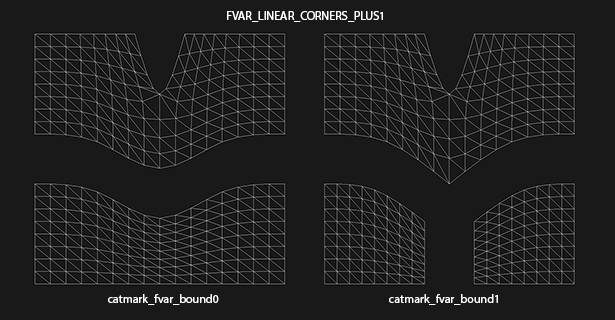
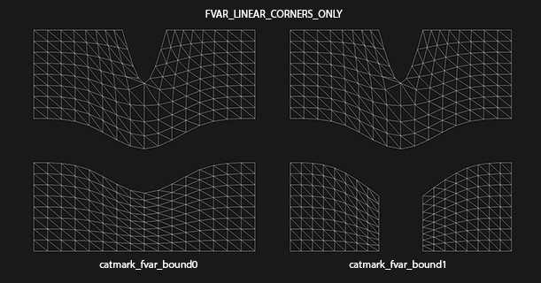
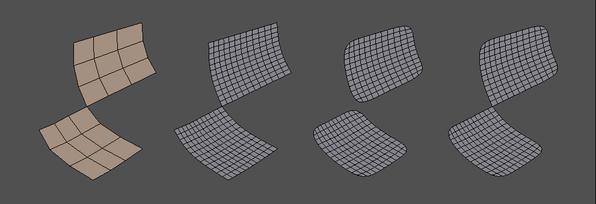
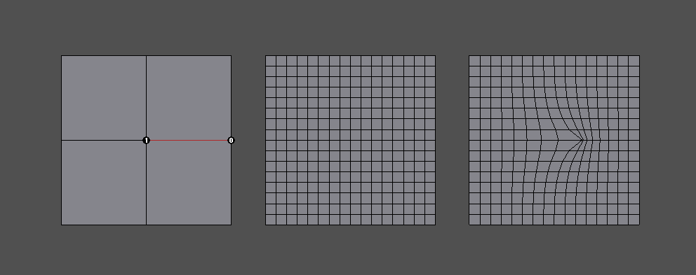
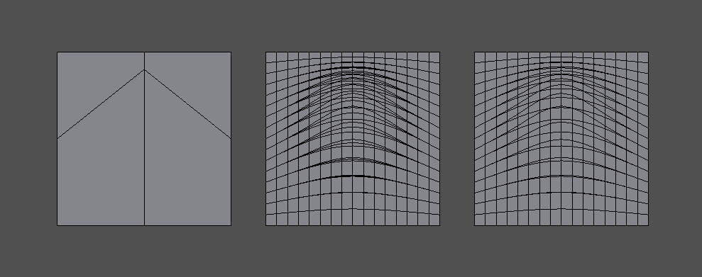

..
     Copyright 2015 Pixar

     Licensed under the Apache License, Version 2.0 (the "Apache License")
     with the following modification; you may not use this file except in
     compliance with the Apache License and the following modification to it:
     Section 6. Trademarks. is deleted and replaced with:

     6. Trademarks. This License does not grant permission to use the trade
        names, trademarks, service marks, or product names of the Licensor
        and its affiliates, except as required to comply with Section 4(c) of
        the License and to reproduce the content of the NOTICE file.

     You may obtain a copy of the Apache License at

         http://www.apache.org/licenses/LICENSE-2.0

     Unless required by applicable law or agreed to in writing, software
     distributed under the Apache License with the above modification is
     distributed on an "AS IS" BASIS, WITHOUT WARRANTIES OR CONDITIONS OF ANY
     KIND, either express or implied. See the Apache License for the specific
     language governing permissions and limitations under the Apache License.

Subdivision Compatibility
-------------------------

.. contents::
   :local:
   :backlinks: none

Subdivision Compatibility
=========================

This document highlights areas of compatibility with other software that makes
use of subdivision surfaces, including previous versions of OpenSubdiv.

The "compatibility" here refers to the choice of subdivision rules that define
the shape of the resulting surfaces.  Different subdivision rules will lead to
different shapes.  Choices affecting shape include:

* the types of subdivision schemes supported (e.g. Catmull-Clark, Loop, etc.)

* the basic rules applied for these schemes

* any extended rules to affect sharpness or creasing

* rules applied separately to face-varying data

Ensuring all of these rules are consistent provides the basis for consistent
shapes, but further approximations to the limit surface create the potential
for subtle deviations.  Even within OpenSubdiv, multiple approximations are
possible and vary.  For now we focus on the compatibility of subdivision rules
and deal with the limit approximations only when noteworthy.

Compatibility with OpenSubdiv 2.x
=================================

The refactoring of OpenSubdiv 3.0 data representations presented a unique
opportunity to revisit some corners of the subdivision specification and
remove or update some legacy features.

**Face-varying Interpolation Options**

Face-varying interpolation options have been consolidated into a single enum
with one additional choice new to 3.0.  No functionality from 2.x has been
removed -- just re-expressed in a simpler and more comprehensible form.

Face-varying interpolation was previously defined by a "boundary interpolation"
enum with four modes and an additional boolean "propagate corners" option,
which was little understood, i.e.:

* void HbrMesh::SetFVarInterpolateBoundarMethod(InterpolateBoundaryMethod) const;

* void HbrMesh::SetFVarPropagateCorners(bool) const;

The latter was only used in conjunction with one
of the four modes ("edge and corner"), so it was effectively a unique fifth
choice.  Closer inspection of all of these modes also revealed some unexpected
and undesirable behavior in some common cases -- to an extent that could not
simply be changed -- and so an additional mode was added to avoid such behavior.

All choices are now provided through a single "linear interpolation" enum,
described and illustrated in more detail in the overview of
`Face-Varying Interpolation <subdivision_surfaces.html#face-varying-interpolation-rules>`__.
The use of "boundary" in the name of the enum was intentionally removed
as the choice also affects interior interpolation.  The new use of "linear"
is now intended to reflect the fact that interpolation is constrained to be
linear where specified by the choice applied.

All five of Hbr's original modes of face-varying interpolation are supported
(with minor modifications where Hbr was found to be incorrect in the presence
of semi-sharp creasing).  An additional mode ("corners only") has also been
added to avoid some of the undesired side-effects of some existing modes
(illustrated below).

The new values for the *"Sdc::Options::FVarLinearInterpolation"* enum and its
equivalents for HbrMesh's InterpolateBoundaryMethod and PropagateCorners flag
are as follows (ordered such that the set of linear constraints applied is
always increasing -- from completely smooth to completely linear):

============================ ================================== =========================
Sdc FVarLinearInterpolation  Hbr FVarInterpolateBoundaryMethod  Hbr FVarPropogateCorners
============================ ================================== =========================
FVAR_LINEAR_NONE             k_InterpolateBoundaryEdgeOnly      N/A (ignored)
FVAR_LINEAR_CORNERS_ONLY     N/A                                N/A
FVAR_LINEAR_CORNERS_PLUS1    k_InterpolateBoundaryEdgeAndCorner false
FVAR_LINEAR_CORNERS_PLUS2    k_InterpolateBoundaryEdgeAndCorner true
FVAR_LINEAR_BOUNDARIES       k_InterpolateBoundaryAlwaysSharp   N/A (ignored)
FVAR_LINEAR_ALL              k_InterpolateBoundaryNone          N/A (ignored)
============================ ================================== =========================

Aside from the two "corners plus" modes that preserve Hbr behavior, all other
modes are designed so that the interpolation of a disjoint face-varying region
is not affected by changes to other regions that may share the same vertex. So
the behavior of a disjoint region should be well understood and predictable
when looking at it in isolation (e.g. with "corners only" one would expect to
see linear constraints applied where there are topological corners or infinitely
sharp creasing applied within the region, and nowhere else).

This is not true of the "plus" modes, and they are named to reflect the fact
that more is taken into account where disjoint regions meet.

The following example illustrates some undesired effects of the "plus" modes,
which in part motivated the addition of the new "corners only" mode.  The
example uses the "catmark_fvar_bound0" and "catmark_fvar_bound1" shapes from
the suite of regression shapes.  Both shapes are a simple regular 4x4 grid of
quads with face-varying UV data partitioned into multiple disjoint regions.
The "bound0" shape has two disjoint UV regions -- an upper and lower region --
while the "bound1" shape further splits the lower region in two.

This first figure illustrates the effect of the original "plus1" mode (which
is also the same for "plus2"):

Note that the effect of splitting the lower UV region in two has the undesired
side effect of sharpening the boundary of the upper region.  This is the result
of the "plus1" mode making collective decisions about the sharpness of all
face-varying boundaries at the vertex rather than decisions local to each
region.  In both the "plus1" and "plus2" cases, all face-varying boundaries
sharing a vertex will be sharpened if there are more than two regions meeting
at that vertex.

The second figure illustrates the effect of the new "corners only" mode:

As expected, the splitting of the lower region does not impact the upper
region.  In this case the decision to sharpen a face-varying boundary is made
based on the local topology of each region.

**Vertex Interpolation Options**

Since the various options are now presented through a new API (Sdc rather than
Hbr), based on the history of some of these options and input from interested
parties, the following changes have been implemented:

* The naming of the standard creasing method has been changed from *Normal*
  to *Uniform*.  Values for *"Sdc::Options::CreasingMethod"* are now:

============== ====================================
CREASE_UNIFORM standard integer subtraction per level (default)
CREASE_CHAIKIN Chaikin (non-uniform) averaging around vertices
============== ====================================

* Legacy modes of the *"smoothtriangle"* rule have been removed (as they
  were never actually enabled in the code). Values for
  *"Sdc::Options::TriangleSubdivision"* are now:

=============== =================
TRI_SUB_CATMARK Catmull-Clark weights (default)
TRI_SUB_SMOOTH  "smooth triangle" weights
=============== =================

These should have little impact since one is a simple change in terminology
as part of a new API while the other was removal of an option that was never
used.

**Change to Chaikin creasing method**

In the process of re-implementing the Chaikin creasing method, observations
lead to a conscious choice to change the behavior of Chaikin creasing in the
presence of infinitely sharp edges (most noticeable at boundaries).

Previously, the inclusion of infinite sharpness values in the Chaikin method's
computation of edge sharpness around a vertex would prevent a
semi-sharp edge from decaying to zero.  Infinitely sharp edges are now
excluded from the Chaikin (non-uniform) averaging yielding a much more
predictable and desirable result.  For example, where the sharpness assignment
is actually uniform at such a vertex, the result will now behave the same as
the Uniform method.

Since this feature has received little use (only recently activated in
RenderMan), now seemed the best time to make the change before more widespread
adoption.

**Hierarchical Edits**

While extremely powerful, Hierarchical Edits come with additional maintenance
and implementation complexity.  Support for them in popular interchange formats
and major DCC applications has either been dropped or was never implemented.
As a result, the need for Hierarchical Edits is too limited to justify the cost
and support for them, and they have therefore been removed from the 3.0 release
of OpenSubdiv. Dropping support for Hierarchical Edits allows for significant
simplifications of many areas of the subdivision algorithms.

While the 3.0 release does not offer direct support for Hierarchical Edits,
the architectural changes and direction of 3.0 still facilitate the application
of the most common value edits for those wishing to use them -- though not
always in the same optimized context.  Of course, support for Hierarchical
Edits in the future will be considered based on demand and resources.

**Non-Manifold Topology**

OpenSubdiv 2.x and earlier was limited to dealing with meshes whose topology
was manifold -- a limitation imposed by the use of Hbr.  With 3.0 no longer
using Hbr, the manifold restriction has also been removed.

OpenSubdiv 3.0, therefore, supports a superset of the meshes supported by 2.x
and earlier versions (with one known exception noted below).

Non-manifold meshes that are acceptable to 3.0 however will likely not work
with 2.x or earlier.

The one known case that 3.0 will not represent the same as 2.x is ironically
a case that is non-manifold, and for which Hbr did make special accommodation.

That case occurs at a non-manifold vertex where two or more faces meet
at a common vertex, but do not share a common edge, *and* when the boundary
interpolation mode is set for smooth corners (i.e. "edge only"), as
illustrated below:

The cage is on the left and is refined to level 2 on the right.  On the immediate
right, boundary interpolation is set to sharp corners and the results appear
the same for 2.x and 3.0.  The center and far right illustrate the affects of
setting boundary interpolation to smooth corners with 2.x and 3.0 respectively.
Note that the 2.x result allows the refined mesh (and so the limit surface) to
split into two while the 3.0 result keeps it connected. 

When Hbr encounters such vertices, regardless of the boundary mode it "splits"
the vertex -- creating a separate instance of it for each face.  So when
building an HbrMesh, after "finalizing" the mesh, it will result in having
more vertices than were originally defined (termed "split vertices").

OpenSubdiv 2.x (and earlier) successfully hid the presence of these extra
vertices from users.

This case behaves in such a way that violates certain properties of the
surface that 3.0 has attempted to emphasize.  One of these relates to the
nature of the limit surface (and becomes more significant in the context of
face varying):  if the cage is connected then so too is its limit surface,
or similarly, if the cage consists of *N* connected regions then the limit
surface similarly consists of *N* connected regions.  Another undesirable
property here is that the vertex *V* at which these faces meet must have
more than one child vertex *V'*.  This makes it difficult to "hide" split
vertices -- OpenSubdiv 2.x tables had an extra level of indirection that
made it possible to do this relatively easily, but 3.0 has dispensed with
such indirection where possible to streamline performance.

Compatibility with RenderMan
============================

Since RenderMan and OpenSubdiv versions prior to 3.0 share a common library
(Hbr), most differences between RenderMan and OpenSubdiv 3.0 are covered in the
preceding section of compatibility with OpenSubdiv 2.x.

In addition to some features between RenderMan and OpenSubdiv that are not
compatible, there are also other differences that may be present due to
differences in the implementations of similar features.

For most use cases, OpenSubdiv 3.0 is largely compatible with RenderMan.  There
are however some cases where some differences can be expected.  These are
highlighted below for completeness.

Incompatibilities
+++++++++++++++++

OpenSubdiv and RenderMan will be incompatible when certain features are used
that are not common to both.  They are fully described in the 2.x compatibility 
section and are listed briefly here.

**OpenSubdiv 3.0 Features Not Supported by RenderMan**

* Non-manifold meshes

* Choice of the "corners only" face varying interpolation option

**RenderMan Features Not Supported by OpenSubdiv 3.0**

* Hierarchical Edits

Other Differences
+++++++++++++++++

Some differences can occur due to the differing implementations of the
feature sets.  Additionally, OpenSubdiv 3.0's implementation fixes some
issues discovered in Hbr.

**Smooth Face-Varying Interpolation with Creasing**

There have been two discrepancies noted in the way that face-varying data is
interpolated smoothly in the presence of creases.  Smooth face-varying
interpolation is expected to match vertex interpolation in the interior and
only differ along the boundaries or discontinuities where the face-varying
topology is intentionally made to differ from the vertex topology.

A simple and effective way to identify discrepancies is to use the X and Y
coordinates of vertex positions as the U and V of texture coordinates.  If
these U and V coordinates are assigned to a face-varying channel, smooth
interpolation of U and V is expected to exactly match interpolation of X
and Y, regardless of the presence of any sharpness and creasing.

Two discrepancies can be seen with Hbr when superimposing the XY vertex
interpolation with the "projected" UV face-varying interpolation.

The first discrepancy occurs with interpolation around dart vertices:

This example shows a simple regular XY grid on the left with an interior sharp
edge creating a dart vertex in the center.  With no asymmetry in the vertices,
the sharpness has no asymmetric affect and the XY vertex interpolation on
the immediate right shows the regular grid expected from refinement.  On the
far right is the UV interpolation from Hbr, which exhibits distortion around
the center dart vertex.

The second discrepancy occurs with interpolation involving any fractional
sharpness values.  Hbr effectively ignores any fractional sharpness value
in its face-varying interpolation.  So edges of vertices with sharpness of
say 2.5, will be treated as though their sharpness is 2.0 when face-varying
values are interpolated.  Similarly, any non-zero sharpness value less than
1.0 is treated as zero by truncation and so is essentially ignored.

This example shows an asymmetric 2x2 grid of quads on the left with the center
vertex progressively sharpened from 0.5 to 1.0.  The three cases of the vertex
smooth and sharpened are superimposed on the immediate right to display the
three distinct interpolation results.  On the far right the interpolation from
Hbr displays the same three cases, but only two are visibly distinct -- the
sharpness of 0.5 being treated the same as if it were 0.0.

Both of these cases are corrected in OpenSubdiv 3.0.  Smooth face-varying
interpolation in the presence of creasing should match the expected behavior
of the vertex interpolation, except where the face-varying topology is
explicitly made to differ.

**The Chaikin Creasing Method**

At least two discrepancies are know to exist between the implementations of
Hbr in RenderMan and OpenSubdiv 3.0:

* Use of Chaikin creasing with boundaries or infinitely sharp edges

* Subtle shape differences due to Hbr's use of "predictive sharpness"

Fortunately, this feature was only recently added to Hbr and RenderMan and is
little used, so it is expected these differences will have little impact.

The first discrepancy is mentioned briefly in the previous section on
compatibility between OpenSubdiv 2.x and 3.0.  A conscious decision was
made to change the averaging of sharpness values involving infinitely
sharp edges in order to make results more predictable and favorable.
The effects can be seen comparing the regression shape "catmark_chaikin2".

The second is more subtle and results from an oversight within Hbr's
implementation that is not easily corrected.

When determining what subdivision rule to apply from one level to the
next, the sharpness values at the next level must be known in order to
determine whether or not a transition between differing rules is required.
If the rule at the next level differs from the previous, a combination of
the two is applied.  Such a change results from the sharpness values of
one or more edges (or the vertex itself) decaying to zero.

Rather than compute the sharpness values at the next level accurately,
Hbr "predicts" it by simply subtracting 1.0 from it, as is done with the
uniform creasing method, and it bases decisions on that predicted result.
This does not work for Chaikin though.  A sharpness value less than 1.0
may not decay to 0 if it is averaged with neighboring sharpness values
greater than 1.0, so this sharpness prediction can result in the wrong
rule being chosen for the next level.

A typical case would have the subdivision rules for Chaikin creasing
transition from Corner to Crease at one level, then from Crease to
Smooth at the next.  Hbr's predictive creasing might mistakenly detect
the transition as Corner to Smooth at one level, then after properly
computing the sharpness values for the next level later, from Crease to
Smooth for the next.  One of the regression shapes ("catmark_chakin1")
was disabled from the regression suite because of this effect.  The
differences in shape that trigger its regression failure were
investigated and determined to be the result of this issue.

From observations thus far these differences are subtle but can be
noticeable.

**Numerical Precision**

Since its inception, OpenSubdiv has sought to produce results that were
numerically consistent to RenderMan.  A regression suite to ensure a
certain level of accuracy was provided to detect any substantial deviation.

At some point in the development of OpenSubdiv, the point was made that
numerical accuracy of Hbr could be improved by changing the order of
operations and combining the vertex with the lowest coefficient first in
one of the subdivision rules.  This was applied more thoroughly in the
independent implementation of 3.0 (there seemed no reason not to).  In
most cases the relative magnitudes of the coefficients of subdivision and
limit masks is clear so no overhead was necessary to detect them.

At a certain point though, this greater accuracy came in conflict with the
regression suite.  It turned out that high-valence vertices could not be
computed to within the desired tolerances set within the suite.  The
summation of many small coefficients for the adjacent vertices first, before
the addition of the much larger coefficient for the primary vertex, allowed
for the accumulation of precision that was being truncated by adding the
much larger coefficient first in the Hbr implementation.  With extremely
high valence vertices, a difference in magnitude between the most and least
significant coefficients of several orders of magnitude is likely, and that
has a significant impact on the single-precision floating point computations.

The improved accuracy of OpenSubdiv 3.0 can reach a magnitude that will
not go undetected.  Whether or not this can lead to visual artifacts is
unclear.
