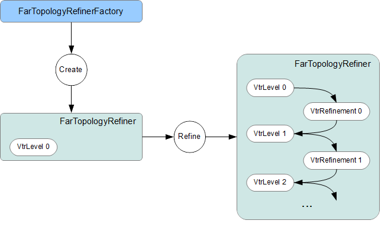
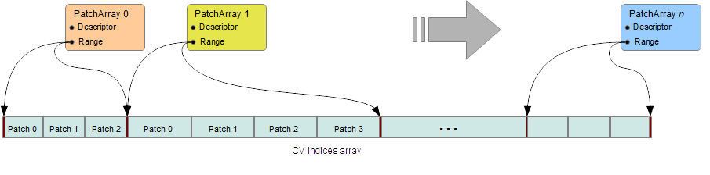
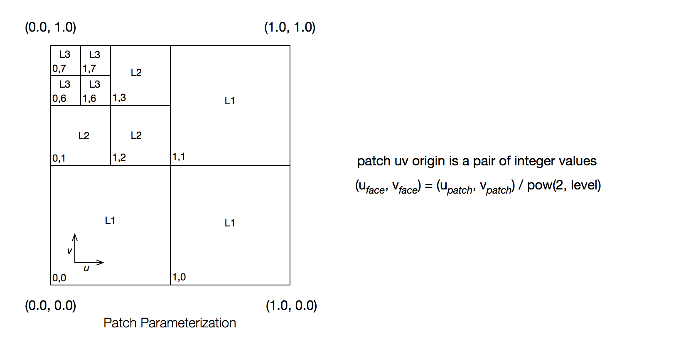
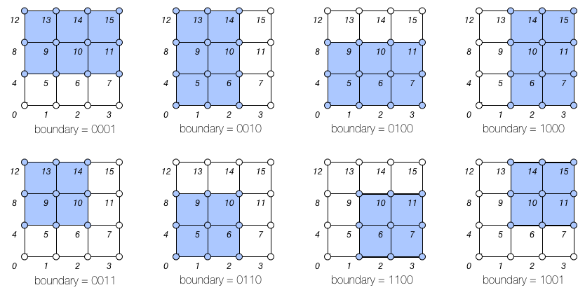
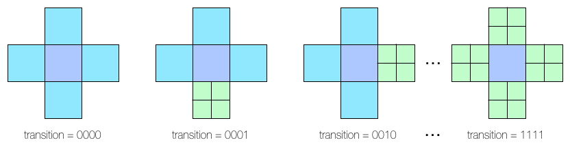
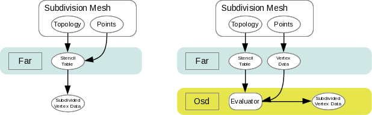
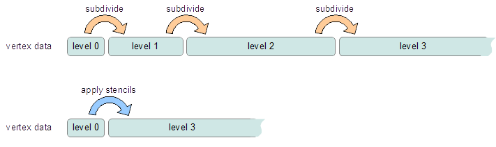
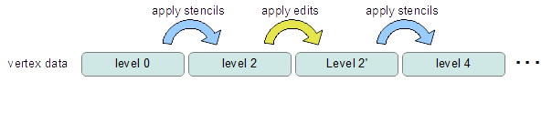
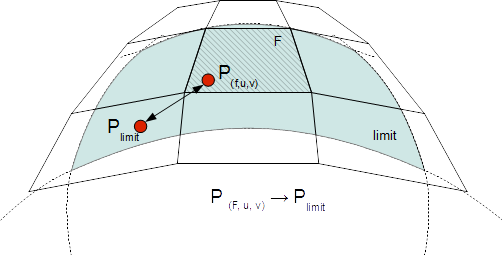
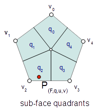

..
     Copyright 2013 Pixar

     Licensed under the Apache License, Version 2.0 (the "Apache License")
     with the following modification; you may not use this file except in
     compliance with the Apache License and the following modification to it:
     Section 6. Trademarks. is deleted and replaced with:

     6. Trademarks. This License does not grant permission to use the trade
        names, trademarks, service marks, or product names of the Licensor
        and its affiliates, except as required to comply with Section 4(c) of
        the License and to reproduce the content of the NOTICE file.

     You may obtain a copy of the Apache License at

         http://www.apache.org/licenses/LICENSE-2.0

     Unless required by applicable law or agreed to in writing, software
     distributed under the Apache License with the above modification is
     distributed on an "AS IS" BASIS, WITHOUT WARRANTIES OR CONDITIONS OF ANY
     KIND, either express or implied. See the Apache License for the specific
     language governing permissions and limitations under the Apache License.

FAR Overview
------------

.. contents::
   :local:
   :backlinks: none

Feature Adaptive Representation (Far)
=====================================

*Far* is the primary API layer for processing client-supplied mesh data
into subdivided surfaces.

The *Far* interface may be used directly and also may be used to prepare
mesh data for further processing by `Osd <osd_overview.html#Osd>`__.

The two main aspects of the subdivision process are *Topology Refinement*
and *Primvar Refinement*.

Topology Refinement
*******************

Topology refinement is the process of splitting the mesh topology
according to the specified subdivison rules to generate new topological
vertices, edges, and faces. This process is purely topological and does
not depend on the speciific values of any primvar data (point positions, etc).

Topology refinement can be either uniform or adaptive, where extraordinary
features are automatically isolated (see
`feature adaptive subdivision <subdivision_surfaces.html#feature-adaptive-subdivision>`__).

The *Far* topology classes present a public interface for the refinement
functionality provided in `Vtr <vtr_overview.html#Vtr>`__,

The main classes in *Far* related to topology refinement are:

+-------------------------------+---------------------------------------------+
| TopologyRefiner               | A class encapsulating mesh refinement.      |
+-------------------------------+---------------------------------------------+
| TopologyLevel                 | A class representing one level of           |
|                               | refinement within a TopologyRefiner.        |
+-------------------------------+---------------------------------------------+
| TopologyRefinerFactory<MESH>  | A factory class template specialized in     |
|                               | terms of the application's mesh             |
|                               | representation used to construct            |
|                               | TopologyRefiner instances.                  |
+-------------------------------+---------------------------------------------+

Primvar Refinement
******************

Primvar refinement is the process of computing values for primvar data (points,
colors, normals, texture coordinates, etc) by applying weights determined by
the specified subdivision rules.  There are many advantages gained by
distinguishing between topology refinement and primvar interpolation
including the ability to apply a single static topological refinement to
multiple primvar instances or to different animated primvar time samples.

*Far* supports methods to refine primvar data at the locations of topological
vertices and at arbitrary locations on the subdivision limit surface.

The main classes in *Far* related to primvar refinement are:

+-----------------------+--------------------------------------------------+
| PrimvarRefiner        | A class implementing refinement of primvar data  |
|                       | at the locations of topological vertices.        |
+-----------------------+--------------------------------------------------+
| PatchTable            | A representation of the refined surface topology |
|                       | that can be used for efficient evaluation of     |
|                       | primvar data at arbitrary locations.             |
+-----------------------+--------------------------------------------------+
| StencilTable          | A representation of refinement weights suitable  |
|                       | for efficient parallel processing of primvar     |
|                       | refinement.                                      |
+-----------------------+--------------------------------------------------+
| LimitStencilTable     | A representation of refinement weights suitable  |
|                       | for efficient parallel processing of primvar     |
|                       | refinement at arbitrary limit surface locations. |
+-----------------------+--------------------------------------------------+

Far::TopologyRefiner
====================

TopologyRefiner is the building block for many other useful classes in
*Far*. It performs refinement of an arbitrary mesh and provides access to
the refined mesh topology. It can be used for primvar refinement directly
using PrimvarRefiner or indirectly by being used to create
a `stencil table <#patch-table>`__, or a `patch table <#patch-table>`__,
etc.

TopologyRefiner provides the public refinement methods
*RefineUniform()* and *RefineAdapative()* which perform refinement
operations using Vtr. TopologyRefiner provides access to the refined
topology via TopologyLevel instances.

Far::TopologyRefinerFactory
===========================

Consistent with other classes in Far, instances of TopologyRefiner are created
by a factory class -- in this case Far::TopologyRefinerFactory.

Here we outline several approaches for converting mesh topology into the
required Far::TopologyRefiner.  Additional documentation is provided with
the Far::TopologyRefinerFactory<MESH> class template used by all, and each
has a concrete example provided in one of the tutorials or in the Far code
itself.

There are three ways to create TopologyRefiners

    * use the existing TopologyRefinerFactory<TopologyDescriptor> with a
      populated instance of TopologyDescriptor
    * specialize TopologyRefinerFactory<class MESH> for more efficient
      conversion, using only face-vertex information
    * fully specialize TopologyRefinerFactor<class MESH> for most control over
      conversion

**Use the Far::TopologyDescriptor**

Far::TopologyDescriptor is a simple struct that can be initialized to refer
to raw mesh topology information -- primarily a face-vertex list -- and then
passed to a provided factory class to create a TopologyRefiner from each.
Topologically, the minimal requirement consists of:

    * the number of vertices and faces of the mesh
    * an array containing the number of vertices per face
    * an array containing the vertices assigned to each face

These last two define one of the six topological relations that are needed
internally by Vtr, but this one relation is sufficient to construct the rest.
Additional members are available to assign sharpness values per edge and/or
vertex, hole tags to faces, or to define multiple sets (channels) of
face-varying data.

Almost all of the Far tutorials (i.e. tutorials/far/tutorial_*) illustrate
use of the TopologyDescriptor and its factory for creating TopologyRefiners,
i.e. TopologyRefinerFactory<TopologyDescriptor>.

For situations when users have raw mesh data and have not yet constructed a
boundary representation of their own, it is hoped that this will suffice.
Options have even been provided to indicate that raw topology information
has been defined in a left-hand winding order and the factory will handle
the conversion to right-hand (counter-clockwise) winding on-the-fly to avoid
unnecessary data duplication.

**Custom Factory for Face Vertices**

If the nature of the TopologyDescriptor's data expectations is not helpful,
and so conversion to large temporary arrays would be necessary to properly
make use of it, it may be worth writing a custom factory.

Specialization of TopologyRefinerFactory<class MESH> should be done with care
as the goal here is to maximize the performance of the conversion and so
minimize overhead due to runtime validation.  The template provides the
high-level construction of the required topology vectors of the underlying
Vtr.  
 
There are two ways to write such a factory:  provide only the face-vertex
information for topology and let the factory infer all edges and other
relationships, or provide the complete edge list and all other topological
relationships directly.  The latter is considerably more involved and
described in a following section.

The definition of TopologyRefinerFactory<TopologyDescriptor> provides a clear
and complete example of constructing a TopologyRefiner with minimal topology
information, i.e. the face-vertex list.  The class template
TopologyRefinerFactory<MESH> documents the needs here and the
TopologyDescriptor instantiation and specialization should illustrate that.

**Custom Factory for Direct Conversion**

Fully specializing a factory for direct conversion is needed only for
those requiring ultimate control and is not generally recommended.  
It is recommended that one of the previous two methods initially be used to 
convert your mesh topology into a TopologyRefiner.  If the conversion 
performance is critical, or significant enough to warrant improvement, then 
it is worth writing a factory for full topological conversion.

Writing a custom factory requires the specification/specialization of two 
methods with the following purpose:

    * specify the sizes of topological data so that vectors can be pre-allocated
    * assign the topological data to the newly allocated vectors

As noted above, the assumption here is that the client's boundary-rep knows 
best how to retrieve the data that we require most efficiently. After the 
factory class gathers sizing information and allocates appropriate memory, the
factory provides the client with locations of the appropriate tables to be 
populated (using the same `Array <vtr_overview.html#arry-type>`__ classes and 
interface used to access the tables).  The client is expected to load a 
complete topological description along with additional optional data, i.e.:

    * the six topological relations required by Vtr, oriented when manifold
    * sharpness values for edges and/or vertices (optional)
    * additional tags related to the components, e.g. holes (optional)
    * values-per-face for face-varying channels (optional)

This approach requires dealing directly with edges, unlike the other two.  In
order to convert edges into a TopologyRefiner's representation, the edges need
to be expressed as a collection of known size N -- each of which is referred to
directly by indices [0,N-1].  This can be awkward for representations such as
half-edge or quad-edge that do not treat the instance of an edge uniquely.

Particular care is also necessary when representing non-manifold features.  The
previous two approaches will construct non-manifold features as required from
the face-vertex list -- dealing with degenerate edges and other non-manifold
features as encountered.  When directly translating full topology it is
necessary to tag non-manifold features, and also to ensure that certain
edge relationships are satisfied in their presence.  More details are
available with the assembly methods of the factory class template.

While there is plenty of opportunity for user error here, that is no different
from any other conversion process.  Given that Far controls the construction
process through the Factory class, we do have ample opportunity to insert
runtime validation, and to vary that level of validation at any time on an
instance of the Factory.  The factory does provide run-time validation on the
topology constructed that can be used for debugging purposes.

A common base class has been created for the factory class, i.e.:

.. code:: c++

    template <class MESH>
    class TopologyRefinerFactory : public TopologyRefinerFactoryBase

both to provide common code independent of <MESH> and also potentially to
protect core code from unwanted specialization.

Far::PrimvarRefiner
===================

PrimvarRefiner supports refinement of arbitrary primvar data at the locations
of topological vertices. A PrimvarRefiner accesses topology data directly
from a TopologyRefiner.

Different methods are provided to support three different classes of primvar
interpolation. These methods may be used to refine primvar data to a specified
refinement level.

+-------------------------------+-------------------------------------------+
| Interpolate(...)              | Interpolate using vertex weights          |
+-------------------------------+-------------------------------------------+
| InterpolateVarying(...)       | Interpolate using linear weights          |
+-------------------------------+-------------------------------------------+
| InterpolateFaceVarying(...)   | Interpolate using face-varying weights    |
+-------------------------------+-------------------------------------------+

Additional methods allow primvar data to be interpolated to the final limit
surface including the calculation of first derivative tangents.

+-------------------------------+-------------------------------------------+
| Limit(dst)                    | Interpolate to the limit surface using    |
|                               | vertex weights                            |
+-------------------------------+-------------------------------------------+
| Limit(dst, dstTan1, dstTan2)  | Interpolate including first derivatives   |
|                               | to the limit surface using vertex weights |
+-------------------------------+-------------------------------------------+
| LimitFaceVarying(...)         | Interpolate to the limit surface using    |
|                               | face-varying weights                      |
+-------------------------------+-------------------------------------------+

PrimarRefiner provides a straightforward interface for refining primvar data,
but depending on the application use case, it can be more efficient to create
and use a `StencilTable <#patch-table>`__, or `PatchTable <#patch-table>`__,
to refine primvar data.

Far::PatchTable
================

PatchTable is the collection of patches derived from the refined faces of a particular mesh topology.

This collection is created using *Far::PatchTableFactory* from an instance
of *Far::TopologyRefiner* after refinement has been applied.

Patch Arrays
************

The PatchTable is organized into patch arrays. All patches in each array have
the same type except for face-varying patch arrays which may have a mix of regular and irregular patch types.

The *PatchDescriptor* provides the fundamental description of a patch, including the number of control points per patch as well as the basis for patch evaluation.

Each patch in the array is associated with a *PatchParam* which
specifies additional information about the individual patch.

Patch Types
***********

The following are the different patch types that can be represented in the
PatchTable:

+---------------------+------+---------------------------------------------+
| Patch Type          | #CVs | Description                                 |
+=====================+======+=============================================+
| NON_PATCH           | n/a  | *"Undefined"* patch type                    |
+---------------------+------+---------------------------------------------+
| POINTS              | 1    | Points : useful for cage drawing            |
+---------------------+------+---------------------------------------------+
| LINES               | 2    | Lines : useful for cage drawing             |
+---------------------+------+---------------------------------------------+
| QUADS               | 4    | Bi-linear quadrilaterals                    |
+---------------------+------+---------------------------------------------+
| TRIANGLES           | 3    | Linear triangles                            |
+---------------------+------+---------------------------------------------+
| LOOP                | 12   | Quartic triangular Box-spline patches       |
+---------------------+------+---------------------------------------------+
| REGULAR             | 16   | Bi-cubic B-spline patches                   |
+---------------------+------+---------------------------------------------+
| GREGORY             | 4    | Legacy Gregory patches                      |
+---------------------+------+---------------------------------------------+
| GREGORY_BOUNDARY    | 4    | Legacy Gregory Boundary patches             |
+---------------------+------+---------------------------------------------+
| GREGORY_BASIS       | 20   | Bi-cubic quadrilateral Gregory patches      |
+---------------------+------+---------------------------------------------+
| GREGORY_TRIANGLE    | 18   | Quartic triangular Gregory patches          |
+---------------------+------+---------------------------------------------+

The type of a patch dictates the number of control vertices expected in the
table as well as the method used to evaluate values.

Patch Parameterization
**********************

Here we describe the encoding of the patch parameterization for
quadrilateral patches. The encoding for triangular patches is similar,
please see the API documentation of Far::PatchParam for details.

Each patch represents a specific portion of the parametric space of the
coarse topological face identified by the PatchParam FaceId. As topological
refinement progresses through successive levels, each resulting patch
corresponds to a smaller and smaller subdomain of the face.
The PatchParam UV origin describes the mapping from the uv domain of the
patch to the uv subdomain of the topological face. We encode this uv
origin using log2 integer values for compactness and efficiency.

It is important to note that this uv parameterization is the intrinsic
parameterization within a given patch or coarse face and is distinct
from any client specified face-varying channel data.

Patches which result from irregular coarse faces (non-quad faces in the
Catmark scheme) are offset by the one additional level needed to
"quadrangulate" the irregular face.  It is the indices of these offset
faces that are stored in the PatchParam and used in other classes such
as the Far::PatchMap.  These offset indices can be identified from the
coarse face using the Far::PtexIndices class when needed.

+--------------------------------------------+--------------------------------------------+
| .. image:: images/ptex_coarse.png          | .. image:: images/ptex_quadrangulated.png  |
|    :align:  center                         |    :align:  center                         |
|    :width:  100%                           |    :width:  100%                           |
|    :target: images/ptex_coarse.png         |    :target: images/ptex_quadrangulated.png |
+--------------------------------------------+--------------------------------------------+

A patch along an interpolated boundary edge is supported by an incomplete
sets of control vertices. For consistency, patches in the PatchTable always
have a full set of control vertex indices and the PatchParam Boundary bitmask
identifies which control vertices are incomplete (the incomplete control
vertex indices are assigned values which duplicate the first valid index).
Each bit in the boundary bitmask corresponds to one edge of the patch
starting from the edge from the first vertex and continuing around the
patch.  With feature adaptive refinement, regular B-spline basis patches
along interpolated boundaries will fall into one of the eight cases
(four boundary and four corner) illustrated below:

Transition edges occur during feature adaptive refinement where a patch
at one level of refinement is adjacent to pairs of patches at the next
level of refinement. These T-junctions do not pose a problem when evaluating
primvar data on patches, but they must be taken into consideration when
tessellating patches (e.g. while drawing) in order to avoid cracks.
The PatchParam Transition bitmask identifies the transition edges of
a patch.  Each bit in the bitmask corresponds to one edge of the patch
just like the encoding of boundary edges.

After refining an arbitrary mesh, any of the 16 possible transition edge
configurations might occur. The method of handling transition edges is
delegated to patch drawing code.

Single-Crease Patches
**************************

Using single-crease patches allows a mesh with creases to be represented
with many fewer patches than would be needed otherwise. A single-crease
patch is a variation of a regular BSpline patch with one additional crease
sharpness parameter.

.. container:: notebox

   **Release Notes (3.x)**

      Evaluation
      of single-crease patches is currently only implemented for OSD patch
      drawing, but we expect to implement support in all of the evaluation
      code paths for future releases.

Local Points
************

The control vertices represented by a PatchTable are primarily refined points,
i.e. points which result from applying the subdivision scheme uniformly or
adaptively to the points of the coarse mesh. However, the final patches
generated from irregular faces, e.g. patches incident on an extraordinary
vertex might have a representation which requires additional local points.

Legacy Gregory Patches
**********************

Using Gregory patches to approximate the surface at the final patches
generated from irregular faces is an alternative representation which does
not require any additional local points to be computed. Instead, when
Legacy Gregory patches are used, the PatchTable must also have an alternative
representation of the mesh topology encoded as a vertex valence table
and a quad offsets table.

Far::StencilTable
==================

The base container for stencil data is the StencilTable class. As with most
other Far entities, it has an associated StencilTableFactory that requires a
TopologyRefiner:

Advantages
**********

Stencils are used to factorize the interpolation calculations that subdivision
schema apply to vertices of smooth surfaces. If the topology being subdivided
remains constant, factorizing the subdivision weights into stencils during a
pre-compute pass yields substantial amortizations at run-time when re-posing
the control cage.

Factorizing the subdivision weights also allows to express each subdivided
vertex as a weighted sum of vertices from the control cage. This step effectively
removes any data inter-dependency between subdivided vertices : the computations
of subdivision interpolation can be applied to each vertex in parallel without
any barriers or constraint. The `Osd <osd_overview.html#Osd>`__ classes leverage
these properties by exploiting CPU and GPU parallelism.

Principles
**********

Iterative subdivision algorithms converge towards the limit surface by
successively refining the vertices of the coarse control cage. Each successive
iteration interpolates the new vertices by applying polynomial weights to a
*basis of supporting vertices*.

The interpolation calculations for any given vertex can be broken down into
sequences of multiply-add operations applied to the supporting vertices.
Stencil table encodes a factorization of these weighted sums : each stencils is
created by combining the list of control vertices from the 1-ring.

With iterative subdivision, each refinement step is dependent upon the previous
subdivision step being completed, and a substantial number of steps may be
required in order approximate the limit : each subdivision step incurs an
O(4\ :superscript:`n`) growing amount of computations.

Instead, once the weights of the contributing coarse control vertices for a
given refined vertex have been factorized, it is possible to apply the stencil
and directly obtain the interpolated vertex data without having to process the
data for the intermediate refinement levels.

Cascading Stencils
******************

Client-code can control the amount of factorization of the stencils : the tables can be
generated with contributions all the way from a basis of coarse vertices, or
reduced only to contributions from vertices from the previous level of
refinement.

The latter mode allows client-code to access and insert modifications to the
vertex data at set refinement levels -- creating what are often referred
to as *hierarchical edits*.  Once the edits have been
applied by the client-code, another set of stencils can be used to smooth the
vertex data to a higher level of refinement.

See implementation details, see the Far cascading stencil `tutorial
<tutorials.html>`_

Limit Stencils
**************

Stencil tables can be trivially extended from discrete subdivided vertices to
arbitrary locations on the limit surface. Aside from extraordinary points, every
location on the limit surface can be expressed as a closed-form weighted
average of a set of coarse control vertices from the 1-ring surrounding the
face.

The weight accumulation process is similar : the control cage is adaptively
subdivided around extraordinary locations. A stencil is then generated for each
limit location simply by factorizing the bi-cubic Bspline patch weights over
those of the contributing basis of control-vertices.

The use of bi-cubic patches also allows the accumulation of analytical
derivatives, so limit stencils carry a set of weights for tangent vectors.

Once the stencil table has been generated, limit stencils are the most direct
and efficient method of evaluation of specific locations on the limit of a
subdivision surface, starting from the coarse vertices of the control cage.

Also: just as discrete stencils, limit stencils that are factorized from coarse
control vertices do not have inter-dependencies and can be evaluated in
parallel.

For implementation details, see the `glStencilViewer <glstencilviewer.html>`_
code example.

Sample Location On Extraordinary Faces
**************************************

Each stencil is associated with a singular parametric location on the coarse
mesh. The parametric location is defined as face location and local [0.0 - 1.0]
(u,v) triplet:

In the case of face that are not quads, a parametric sub-face quadrant needs to
be identified. This can be done either explicitly or implicitly by using the
unique ptex face indices for instance.

Code example
************

When the control vertices (controlPoints) move in space, the limit locations can
be very efficiently recomputed simply by applying the blending weights to the
series of coarse control vertices:

.. code:: c++

    class StencilType {
    public:

        void Clear() {
            memset( &x, 0, sizeof(StencilType));
        }

        void AddWithWeight( StencilType const & cv, float weight  ) {
            x += cv.x * weight;
            y += cv.y * weight;
            z += cv.z * weight;
        }

        float x,y,z;
    };

    std::vector<StencilType> controlPoints,
                             points,
                             utan,
                             vtan;

    // Update points by applying stencils
    controlStencils.UpdateValues<StencilType>( &controlPoints[0], &points[0] );

    // Update tangents by applying derivative stencils
    controlStencils.UpdateDerivs<StencilType>( &controlPoints[0], &utan[0], &vtan[0] );

