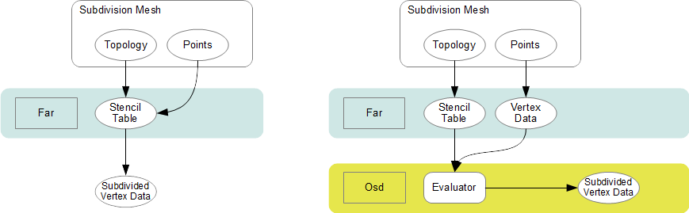

..
     Copyright 2013 Pixar

     Licensed under the Apache License, Version 2.0 (the "Apache License")
     with the following modification; you may not use this file except in
     compliance with the Apache License and the following modification to it:
     Section 6. Trademarks. is deleted and replaced with:

     6. Trademarks. This License does not grant permission to use the trade
        names, trademarks, service marks, or product names of the Licensor
        and its affiliates, except as required to comply with Section 4(c) of
        the License and to reproduce the content of the NOTICE file.

     You may obtain a copy of the Apache License at

         http://www.apache.org/licenses/LICENSE-2.0

     Unless required by applicable law or agreed to in writing, software
     distributed under the Apache License with the above modification is
     distributed on an "AS IS" BASIS, WITHOUT WARRANTIES OR CONDITIONS OF ANY
     KIND, either express or implied. See the Apache License for the specific
     language governing permissions and limitations under the Apache License.

FAR Overview
------------

.. contents::
   :local:
   :backlinks: none

.. image:: images/api_layers_3_0.png
   :width: 100px
   :target: images/api_layers_3_0.png

Feature Adaptive Representation (Far)
=====================================

The *Far* API layer is the central interface that processes client-supplied
geometry and turns it into a `serialized data representation
<api_overview.html#multiple-representations>`__ ready for parallel processing.

First, *Far* provides the tools to refine subdivision topology
(`Far::TopologyRefiner <#far-topologyrefiner>`__). Topology refinement can be
either uniform or sparse, where extraordinary features are automatically
isolated (see `feature adaptive subdivision <subdivision_surfaces.html#feature-adaptive-subdivision>`__).

As a geometry representation, *Far* also provides a set of *"Tables"* classes.
These tables are designed to be static containers for the refined topology
data, after it has been serialized and factorized. This representation is
embodied in the `Far::PatchTables <#far-patchtables>`__  and the
`Far::StencilTables <#far-patchtables>`__ classes.

*Far* is also a fully featured API. Typically *Far* tabular data is targeted at
*Osd*, where it can be processed by an implementation optimized for a specific
hardware. However, for client-code that does not require a dedicated
implementation, *Far* itself provides a fully-featured single-threaded
implementation of subdivision interpolation algorithms, both discrete and at
the limit.

Refining Topology
=================

The *Far* topology classes present a public interface for the refinement
functionality provided in *Vtr*, either directly within Far or indirectly
eventually though *Osd*. The two main topology refinement classes are as
follows:

+-------------------------------+---------------------------------------------------+
| TopologyRefiner               | A class encapsulating the topology of a refined   |
|                               | mesh.                                             |
+-------------------------------+---------------------------------------------------+
| TopologyRefinerFactory<MESH>  | A factory class template specialized by users (in |
|                               | terms of their mesh class) to construct           |
|                               | TopologyRefiner as quickly as possible.           |
+-------------------------------+---------------------------------------------------+

These classes are the least well defined of the API, but given they provide the
public interface to all of the improvements proposed, they potentially warrant
the most attention. Far::TopologyRefiner is purely topological and it is the
backbone used to construct or be associated with the other table classes in Far.

Far::TopologyRefiner
********************

TopologyRefiner is the building block for many other useful classes in
OpenSubdiv, but its purpose is more specific.  It is intended to store the
topology of an arbitrarily refined subdivision hierarchy to support the
construction of `stencil tables <#patch-tables>`__, `patch tables
<#patch-tables>`__,  etc.

Aside from public access to topology, TopologyRefiner has public refinement
methods (currently *RefineUniform()* and *RefineAdapative()*) where simple
specifications of refinement will be translated into refinement operations
within Vtr.  Feature-adaptive refinement is a special case of *"sparse"* or
*"selective"* refinement, and so the feature-adaptive logic exists internal
to TopologyRefiner and translates the feature-analysis into a simpler
topological specification of refinement to Vtr.

The longer term intent is that the public Refine...(...) operations eventually
be overloaded to allow clients more selective control of refinement. While
TopologyRefiner is a purely topological class, and so free of any definitions
of vertex data, the public interface has been extended to include templated
methods that allow clients to interpolate primitive variable data.

Far::TopologyRefinerFactory
***************************

Consistent with other classes in Far, instances of TopologyRefiner are created
by a factory class -- in this case Far::TopologyRefinerFactory.  This class
is an important entry point for clients its task is to map/convert data in a
client's mesh into the internal `Vtr <vtr_overview.html>`__ representation as
quickly as possible.

The TopologyRefinerFactory class is a class template parameterized by and
specialized for the client's mesh class, i.e. TopologyRefinerFactory<MESH>.
Since a client' mesh representation knows best how to identify the topological
neighborhoods required, no generic implementation would provide the most
direct means of conversion possible, and so we rely on specialization.  For
situations where mesh data is not defined in a boundary representation, a
simple container for raw mesh data is provided (TopologyDescriptro) along
with a Factory specialized to construct TopologyRefiners from it.

So there are two ways to create TopologyRefiners:

    * use the existing TopologyRefinerFactory<TopologyDescriptor> with a
      populated instance of TopologyDescriptor
    * specialize TopologyRefinerFactory<class MESH> for more efficient
      conversion

TopologyDescriptor is a simple struct with pointers to raw mesh data in a
form common to mesh constructors.  Topologically, the minimal requirement
consists of:

    * the number of vertices and faces of the mesh
    * an array containing the number of vertices per face
    * an array containing the vertices assigned to each face

These last two define one of the six topological relations that are needed
internally by Vtr, but this one relation is sufficient to construct the rest.
Additional members are available to assign sharpness values per edge and/or
vertex, hole tags to faces, or to define multiple sets (channels) of
face-varying data.

Specialization of TopologyRefinerFactory<class MESH> should be done with care
as the goal here is to maximize the performance of the conversion and so
minimize overhead due to runtime validation.  The template provides the
high-level construction of the required topology vectors of the underlying
Vtr.  It requires the specification/specialization of two methods with the
following purpose:

    * specify the sizes of topological data so that vectors can be pre-allocated
    * assign the topological data to the newly allocated vectors

As noted above, the assumption here is that the client's boundary-rep knows best
how to retrieve the data that we require most efficiently. After the factory class
gathers sizing information and allocates appropriate memory, the factory provides
the client with locations of the appropriate tables to be populated (using the
same `Array <vtr_overview.html#arry-type>`__ classes and interface used to access
the tables).  The client is expected to load a complete topological description
along with additional optional data, i.e.:

    * the six topological relations required by Vtr, oriented when manifold
    * sharpness values for edges and/or vertices (optional)
    * additional tags related to the components, e.g. holes (optional)
    * values-per-face for face-varying channels (optional)

While there is plenty of opportunity for user error here, that is no different
from any other conversion process.  Given that Far controls the construction
process through the Factory class, we do have ample opportunity to insert
runtime validation, and to vary that level of validation at any time on an
instance of the Factory.

A common base class has been created for the factory class, i.e.:

.. code:: c++

    template <class MESH>
    class TopologyRefinerFactory : public TopologyRefinerFactoryBase

both to provide common code independent of <MESH> and also potentially to
protect core code from unwanted specialization.

Far::PatchTables
================

The patch tables are a serialized topology representation. This container is
generated using *Far::PatchTablesFactory* from an instance
*Far::TopologyRefiner* after a refinement has been applied. The
FarPatchTablesFactory traverses the data-structures of the TopologyRefiner and
serializes the sub-faces into collections of bi-linear and bi-cubic patches, as
dictated by the refinement mode (uniform or adaptive). The patches are then
sorted into arrays based on their types.

PatchArray
**********

The patch table is a collection of control vertex indices. Meshes are decomposed
into a collection of sub-patches, which can be of different types. Each type
has different requirements for the internal organization of its
control-vertices. a PatchArray contains a sequence of multiple patches that
share a common set of attributes.

.. image:: images/far_patchtables.png
   :align: center
   :target: images/far_patchtables.png

Each PatchArray contains a patch *Descriptor* that provides the fundamental
description of the patches in the array. This includes the patches *type*,
*pattern* and *rotation*.

The PatchArray *ArrayRange* provides the indices necessary to track the records
of individual patches in the tables.

Patch Types
***********

The following are the different patch types that can be represented in the
PatchTables:

+-------------------------------------------------------------------------+
|                                                                         |
+=====================+===================================================+
| NON_PATCH           | *"Undefined"* patch type                          |
+---------------------+---------------------------------------------------+
|  POINTS             | Points : useful for cage drawing                  |
+---------------------+---------------------------------------------------+
|  LINES              | Lines : useful for cage drawing                   |
+---------------------+---------------------------------------------------+
| QUADS               | Bi-linear quads-only patches                      |
+---------------------+---------------------------------------------------+
| TRIANGLES           | Bi-linear triangles-only mesh                     |
+---------------------+---------------------------------------------------+
|  LOOP               | Loop patch (currently unsupported)                |
+---------------------+---------------------------------------------------+
|  REGULAR            | Feature-adaptive bi-cubic patches                 |
+---------------------+                                                   |
|  SINGLE_CREASE      |                                                   |
+---------------------+                                                   |
|  BOUNDARY           |                                                   |
+---------------------+                                                   |
|  CORNER             |                                                   |
+---------------------+                                                   |
|  GREGORY            |                                                   |
+---------------------+                                                   |
|  GREGORY_BOUNDARY   |                                                   |
+---------------------+                                                   |
|  GREGORY_BASIS      |                                                   |
+---------------------+---------------------------------------------------+

The type of a patch dictates the number of control vertices expected in the
table. The main types are *Regular*, *Boundary*, *Corner* and *Gregory* patches,
with 16, 12, 9 and 4 control vertices respectively.

.. container:: notebox

    **Beta Issues**

    The current ordering of control vertices for *Regular*, *Boundary* and
    *Corner* patches is based on inconsistent legacy implementation of GPU
    shaders.

    We intend to consolidate the code gathering the 0-Ring and the 1-Ring, so
    that we can eventually get rid of the current re-ordering step applied
    to the control vertex indices.

    We also intend to consolidate all bi-cubic patch types into using 16
    control vertices, which will deprecate the *Boundary* and *Corner* types.

Patch Transitions
*****************

.. include:: under_development.rst

Far::StencilTables
==================

The base container for stencil data is the StencilTables class. As with most
other Far entities, it has an associated StencilTablesFactory that requires a
TopologyRefiner:

Advantages
**********

Stencils are used to factorize the interpolation calculations that subdivision
schema apply to vertices of smooth surfaces. If the topology being subdivided
remains constant, factorizing the subdivision weights into stencils during a
pre-compute pass yields substantial amortizations at run-time when re-posing
the control cage.

Factorizing the subdivision weights also allows to express each subdivided
vertex as a weighted sum of vertices from the control cage. This step effectively
removes any data inter-dependency between subdivided vertices : the computations
of subdivision interpolation can be applied to each vertex in parallel without
any barriers or constraint. The Osd::Compute module leverages these properties
on massively parallel GPU architectures to great effect.

Principles
**********

Iterative subdivision algorithms converge towards the limit surface by
successively refining the vertices of the coarse control cage. Each successive
iteration interpolates the new vertices by applying polynomial weights to a
*basis of supporting vertices*.

The interpolation calculations for any given vertex can be broken down into
sequences of multiply-add operations applied to the supporting vertices.
Stencil tables encode a factorization of these weighted sums : each stencils is
created by combining the list of control vertices from the 1-ring.

With iterative subdivision, each refinement step is dependent upon the previous
subdivision step being completed, and a substantial number of steps may be
required in order approximate the limit : each subdivision step incurs an
O(4:superscript:`n`) growing amount of computations.

Instead, once the weights of the contributing coarse control vertices for a
given refined vertex have been factorized, it is possible to apply the stencil
and directly obtain the interpolated vertex data without having to process the
data for the intermediate refinement levels.

Cascading Stencils
******************

Client-code can control the amount of factorization of the stencils : the tables can be
generated with contributions all the way from a basis of coarse vertices, or
reduced only to contributions from vertices from the previous level of
refinement.

The latter mode allows client-code to access and insert modifications to the
vertex data at set refinement levels (see `hierarchical vertex edits
<subdivision_surfaces.html#hierarchical-edits>`_). Once the edits have been
applied by the client-code, another set of stencils can be used to smoothe the
vertex data to a higher level of refinement.

.. image:: images/far_stencil8.png
   :align: center

See implementation details, see the Far cascading stencil `tutorial
<tutorials.html>`_

Limit Stencils
**************

Stencil tables can be trivially extended from discrete subdivided vertices to
arbitrary locations on the limit surface. Aside from extraordinary points, every
location on the limit surface can be expressed as a closed-form weighted
average of a set of coarse control vertices from the 1-ring surrounding the
face.

The weight accumulation process is similar : the control cage is adaptively
subdivided around extraordinary locations. A stencil is then generated for each
limit location simply by  factorizing the bi-cubic Bspline patch weights over
those of the contributing basis of control-vertices.

The use of bi-cubic patches also allows the accumulation of analytical
derivatives, so limit stencils carry a set of weights for tangent vectors.

.. image:: images/far_stencil0.png
   :align: center

Once the stencil tables have been generated, limit stencils are the most direct
and efficient method of evaluation of specific locations on the limit of a
subdivision surface, starting from the coarse vertices of the control cage.

Also: just as discrete stencils, limit stencils that are factorized from coarse
control vertices do not have inter-dependencies and can be evaluated in
parallel.

For implementation details, see the `glStencilViewer <glStencilViewer.html>`_
code example.

Sample Location On Extraordinary Faces
**************************************

Each stencil is associated with a singular parametric location on the coarse
mesh. The parametric location is defined as face location and local [0.0 - 1.0]
(u,v) triplet:

In the case of face that are not quads, a parametric sub-face quadrant needs to
be identified. This can be done either explicitly or implicitly by using the
unique ptex face indices for instance.

Code example
************

When the control vertices (controlPoints) move in space, the limit locations can
be very efficiently recomputed simply by applying the blending weights to the
series of coarse control vertices:

.. code:: c++

    class StencilType {
    public:

        void Clear() {
            memset( &x, 0, sizeof(StencilType));
        }

        void AddWithWeight( StencilType const & cv, float weight  ) {
            x += cv.x * weight;
            y += cv.y * weight;
            z += cv.z * weight;
        }

        float x,y,z;
    };

    std::vector<StencilType> controlPoints,
                             points,
                             utan,
                             vtan;

    // Uppdate points by applying stencils
    controlStencils.UpdateValues<StencilType>( reinterpret_cast<StencilType const *>(
        &controlPoints[0]), &points[0] );

    // Uppdate tangents by applying derivative stencils
    controlStencils.UpdateDerivs<StencilType>( reinterpret_cast<StencilType const *>(
        &controlPoints[0]), &utan[0], &vtan[0] );

