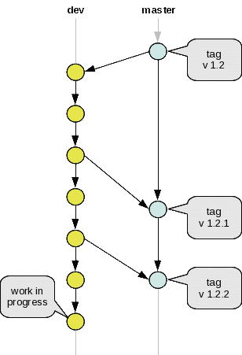

..
     Copyright 2013 Pixar

     Licensed under the Apache License, Version 2.0 (the "Apache License")
     with the following modification; you may not use this file except in
     compliance with the Apache License and the following modification to it:
     Section 6. Trademarks. is deleted and replaced with:

     6. Trademarks. This License does not grant permission to use the trade
        names, trademarks, service marks, or product names of the Licensor
        and its affiliates, except as required to comply with Section 4(c) of
        the License and to reproduce the content of the NOTICE file.

     You may obtain a copy of the Apache License at

         http://www.apache.org/licenses/LICENSE-2.0

     Unless required by applicable law or agreed to in writing, software
     distributed under the Apache License with the above modification is
     distributed on an "AS IS" BASIS, WITHOUT WARRANTIES OR CONDITIONS OF ANY
     KIND, either express or implied. See the Apache License for the specific
     language governing permissions and limitations under the Apache License.

Getting Started
---------------

.. contents::
   :local:
   :backlinks: none

Downloading the code
====================

The code is hosted on a Github public repository. Download and setup information
for Git tools can be found `here <https://help.github.com/articles/set-up-git>`__.

You can access the OpenSubdiv Git repository at https://github.com/PixarAnimationStudios/OpenSubdiv

From there, there are several ways of downloading the OpenSubdiv source code.

    - Zip archive : downloaded from `here <https://github.com/PixarAnimationStudios/OpenSubdiv/archive/release.zip>`__

    - Using a GUI client : you can find a list `here <http://git-scm.com/downloads/guis>`__
      Please refer to the documentation of your preferred application.

    - From the GitShell, Cygwin or the CLI : assuming that you have the Git tools
      installed, you can clone the OpenSubdiv repository directly with the
      following command:

      .. code:: c++

          git clone https://github.com/PixarAnimationStudios/OpenSubdiv.git

These methods only pull static archives, which is are not under the version
control system and therefore cannot pull updates or push changes back. If you
intend on contributing features or fixes to the main trunk of the code, you will
need to create a free Github account and clone a fork of the OpenSubdiv repository.

Submissions to the main code trunk can be sent using Git's pull-request mechanisms.
Please note that we are using the git flow tools so all changes should be made to
our *dev* branch. Before we can accept submissions however, we will need a signed
`Contributor's License Agreement <intro.html#contributing>`__.

----

Branches & Git Flow
===================

Since version 1.1.0, OpenSubdiv has adopted the `Git Flow
<http://nvie.com/posts/a-successful-git-branching-model/>`__ branching model .

Our active development branch is named *dev* : all new features and bug fixes should
be submitted to this branch. The changes submitted to the dev branch are periodically
patched to the 'release' branch as new versions are released.

Checking out branches
_____________________

The Git Flow `tools <https://github.com/nvie/gitflow>`__ are not a requisite for
working with the OpenSubdiv code base, but new work should always be performed in
the *dev* branch, or dedicated feature-branches. By default, a cloned repository
will be pointing to the 'release' branch. You can switch to the *dev* branch using
the following command:

.. code:: c++

    git checkout dev

You can check that the branch has now been switched simply with:

.. code:: c++

    git branch

Which should return:

.. code:: c++

    * dev
      release

API Versions
____________

OpenSubdiv maintains an internal API versioning system. The version number can be
read from the file `./opensubdiv/version.h <https://github.com/PixarAnimationStudios/OpenSubdiv/blob/release/opensubdiv/version.h>`__.
Following the Git-Flow pattern, our releases are indexed using Git's tagging
system.

List of the existing tags:

.. code:: c++

    git tag --list

Checking out version 1.2.0:

.. code:: c++

    git checkout v1_2_0

Making Changes
______________

Direct push access to the OpenSubdiv repository is currently limited to a
small internal development team. External code should be submitted by sending Git
`pull-requests <https://help.github.com/articles/using-pull-requests>`__ from
forks of our *dev* branch.

----

Code Overview
=============

The OpenSubdiv code base contains the following main areas:

+----------------------+---------------------------------------------------------------------------------------+
| Directory            | Contents                                                                              |
+======================+=======================================================================================+
| **./opensubdiv/**    | The main subdivision APIs : Sdc, Vtr, Far and Osd.                                    |
+----------------------+---------------------------------------------------------------------------------------+
| **./examples/**      | A small collection of standalone applications that illustrate how to deploy the       +
|                      | various features and optimizations of the OpenSubdiv APIs. The GL-based examples      |
|                      | rely on the cross-platform GLFW API for interactive window management, while the      |
|                      | DirectX ones are OS-native.                                                           |
+----------------------+---------------------------------------------------------------------------------------+
| **./tutorials/**     | Tutorials showing how to manipulate the APIs of OpenSubdiv.                           |
+----------------------+---------------------------------------------------------------------------------------+
| **./documentation/** | The reStructuredText source files along with python scripts that generate the HTML    |
|                      | documentation site.                                                                   |
+----------------------+---------------------------------------------------------------------------------------+
| **./regression/**    | Standalone regression tests and baseline data to help maintain the integrity of       |
|                      | our APIs. If GPU SDKs are detected, some tests will attempt to run computations       |
|                      | on those GPUs.                                                                        |
+----------------------+---------------------------------------------------------------------------------------+
