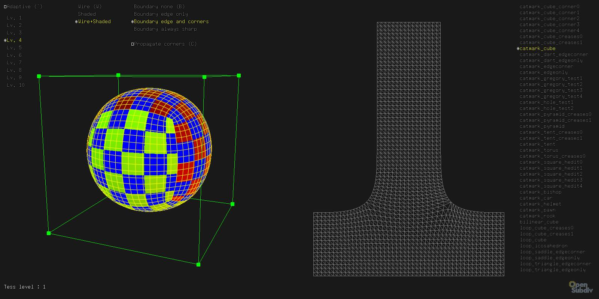

..  
     Copyright 2013 Pixar
  
     Licensed under the Apache License, Version 2.0 (the "Apache License")
     with the following modification; you may not use this file except in
     compliance with the Apache License and the following modification to it:
     Section 6. Trademarks. is deleted and replaced with:
  
     6. Trademarks. This License does not grant permission to use the trade
        names, trademarks, service marks, or product names of the Licensor
        and its affiliates, except as required to comply with Section 4(c) of
        the License and to reproduce the content of the NOTICE file.
  
     You may obtain a copy of the Apache License at
  
         http://www.apache.org/licenses/LICENSE-2.0
  
     Unless required by applicable law or agreed to in writing, software
     distributed under the Apache License with the above modification is
     distributed on an "AS IS" BASIS, WITHOUT WARRANTIES OR CONDITIONS OF ANY
     KIND, either express or implied. See the Apache License for the specific
     language governing permissions and limitations under the Apache License.
  

glFVarViewer
------------

.. contents::
   :local:
   :backlinks: none

SYNOPSIS
========

.. parsed-literal:: 
   :class: codefhead

   **glFVarViewer** [**-f**] [**-u**] [**-a**] [**-l** *refinement level*] [**-c** *animation loops*]
       *objfile(s)* [**-catmark**] [**-loop**] [**-bilinear**]

DESCRIPTION
===========

``glFVarViewer`` is a stand-alone application that allows the inspection of
face-varying data interpolation. The window displays 2 views:

    * left side: regular 3D view of the model, with a procedural (u,v) texture
    * right side: a 2D view of the face-varying (u,v) pair

The HUD allows interactive manipulation of the various face-varying boundary
interpolation rules and tags.

OPTIONS
=======

See the description of the
`common comand line options <code_examples.html#common-command-line-options>`__
for the subset of common options supported here.

.. include:: examples_see_also.rst
