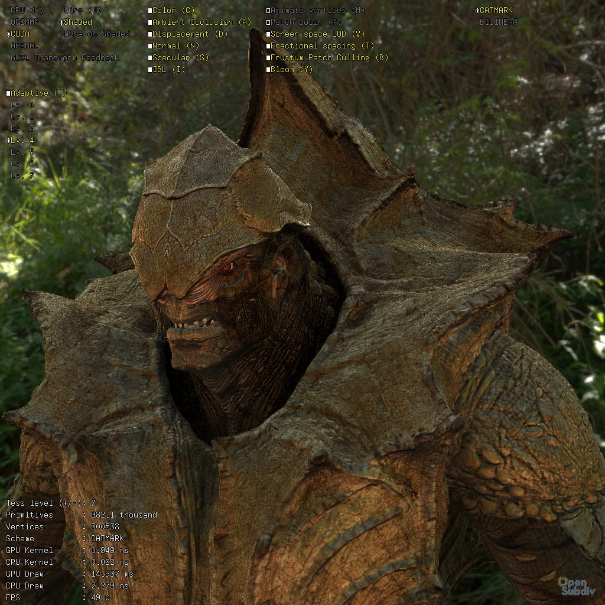

..  
     Copyright 2013 Pixar
  
     Licensed under the Apache License, Version 2.0 (the "Apache License")
     with the following modification; you may not use this file except in
     compliance with the Apache License and the following modification to it:
     Section 6. Trademarks. is deleted and replaced with:
  
     6. Trademarks. This License does not grant permission to use the trade
        names, trademarks, service marks, or product names of the Licensor
        and its affiliates, except as required to comply with Section 4(c) of
        the License and to reproduce the content of the NOTICE file.
  
     You may obtain a copy of the Apache License at
  
         http://www.apache.org/licenses/LICENSE-2.0
  
     Unless required by applicable law or agreed to in writing, software
     distributed under the Apache License with the above modification is
     distributed on an "AS IS" BASIS, WITHOUT WARRANTIES OR CONDITIONS OF ANY
     KIND, either express or implied. See the Apache License for the specific
     language governing permissions and limitations under the Apache License.
  

glPtexViewer
------------

.. contents::
   :local:
   :backlinks: none

SYNOPSIS
========

.. parsed-literal:: 
   :class: codefhead

   **glPtexViewer** [**-f**] [**-yup**] [**-u**] [**-a**] [**-l** *isolation level*] [**-c** *animation loops*]
       [**-e** *environment map*] [**-d** *HDR diffuse map*] [**-s** *HDR specular map*]
       [**--disp** *displacement scale*] [**--bump** *bump scale*]
       *ptex color file*
       *ptex displacement file*
       *ptex occlusion file*
       *ptex specular file*
       *objfile(s)*

DESCRIPTION
===========

``glPtexViewer`` is a stand-alone application that showcases advanced HDR shading
with color, displacement, occlusion and specular ptex maps. Multiple controls 
are available to experiment with the algorithms.

OPTIONS
=======

See the description of the
`common comand line options <code_examples.html#common-command-line-options>`__
for the subset of common options supported here.

**-e** *environment map*
  A low dynamic range spherical environment map used as a background. Ideally,
  a color-normalized version of the HDR light probe.

**-d** *HDR diffuse map*
  An HDR file containing a diffuse environment map (typically they are low
  resolution blurry hemispherical convolutions of the environment light probe).

**-s** *environment map*
  An HDR file containing a specular environment map.

**--disp** *displacement scale*
  A scalar multiplier for the shader displacement values.

**--bump** *displacement scale*
  A scalar multiplier for the shader bump values.

*ptex color file*
  A ptex file containing RGB channels read as material albedo color.
  
*ptex displacement file*
  A single-channel ptex file (preferably float precision) containing the 
  displacement values.

*ptex occlusion file*
  A single-channel ptex file (preferably 8 bits precision) containing a 
  pre-computed ambient occlusion signal.

*ptex specular file*
  A single-channel ptex file (preferably 8 bits precision) applied to modulate
  the specular reflectance of the material
  
KEYBOARD CONTROLS
=================

   .. code:: c++
   
      q      : quit
      esc    : hide GUI
      x      : save screenshot
      f      : fit frame
      +/-    : increase / decrease tessellation rate
      r      : reload and re-compile the shader files
      e      : draw normals

.. include:: examples_see_also.rst
