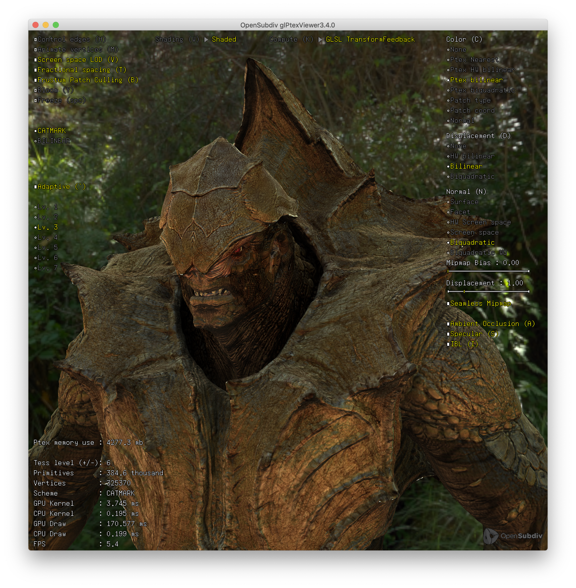

..  
     Copyright 2013 Pixar
  
     Licensed under the terms set forth in the LICENSE.txt file available at
     https://opensubdiv.org/license.
  

glPtexViewer
------------

.. contents::
   :local:
   :backlinks: none

SYNOPSIS
========

.. parsed-literal:: 
   :class: codefhead

   **glPtexViewer** [**-f**] [**-yup**] [**-u**] [**-a**] [**-l** *isolation level*] [**-c** *animation loops*]
       [**-e** *environment map*] [**-d** *HDR diffuse map*] [**-s** *HDR specular map*]
       [**--disp** *displacement scale*] [**--bump** *bump scale*]
       *ptex color file*
       *ptex displacement file*
       *ptex occlusion file*
       *ptex specular file*
       *objfile(s)*

DESCRIPTION
===========

``glPtexViewer`` is a stand-alone application that showcases advanced HDR shading
with color, displacement, occlusion and specular ptex maps. Multiple controls 
are available to experiment with the algorithms.

OPTIONS
=======

See the description of the
`common comand line options <code_examples.html#common-command-line-options>`__
for the subset of common options supported here.

**-e** *environment map*
  A low dynamic range spherical environment map used as a background. Ideally,
  a color-normalized version of the HDR light probe.

**-d** *HDR diffuse map*
  An HDR file containing a diffuse environment map (typically they are low
  resolution blurry hemispherical convolutions of the environment light probe).

**-s** *environment map*
  An HDR file containing a specular environment map.

**--disp** *displacement scale*
  A scalar multiplier for the shader displacement values.

**--bump** *displacement scale*
  A scalar multiplier for the shader bump values.

*ptex color file*
  A ptex file containing RGB channels read as material albedo color.
  
*ptex displacement file*
  A single-channel ptex file (preferably float precision) containing the 
  displacement values.

*ptex occlusion file*
  A single-channel ptex file (preferably 8 bits precision) containing a 
  pre-computed ambient occlusion signal.

*ptex specular file*
  A single-channel ptex file (preferably 8 bits precision) applied to modulate
  the specular reflectance of the material
  
KEYBOARD CONTROLS
=================

   .. code:: c++
   
      q      : quit
      esc    : hide GUI
      x      : save screenshot
      f      : fit frame
      +/-    : increase / decrease tessellation rate
      r      : reload and re-compile the shader files
      e      : draw normals

.. include:: examples_see_also.rst
