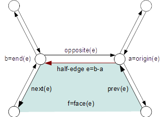
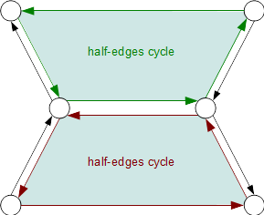

..
     Copyright 2013 Pixar

     Licensed under the Apache License, Version 2.0 (the "Apache License")
     with the following modification; you may not use this file except in
     compliance with the Apache License and the following modification to it:
     Section 6. Trademarks. is deleted and replaced with:

     6. Trademarks. This License does not grant permission to use the trade
        names, trademarks, service marks, or product names of the Licensor
        and its affiliates, except as required to comply with Section 4(c) of
        the License and to reproduce the content of the NOTICE file.

     You may obtain a copy of the Apache License at

         http://www.apache.org/licenses/LICENSE-2.0

     Unless required by applicable law or agreed to in writing, software
     distributed under the Apache License with the above modification is
     distributed on an "AS IS" BASIS, WITHOUT WARRANTIES OR CONDITIONS OF ANY
     KIND, either express or implied. See the Apache License for the specific
     language governing permissions and limitations under the Apache License.

HBR Overview
------------

.. contents::
   :local:
   :backlinks: none

Hierarchical Boundary Representation (Hbr)
==========================================

Hbr is an interconnected topological data representation. The high level of vertex
connectivity information makes this representation well suited for creation and
editing purposes. It is however inefficient for interactive refinement operations:
Separate objects are allocated for each vertex and edge with pointers to neighboring
vertices and edges.

Hbr is also the lowest-level subdivision library in Pixar's `Photorealistic RenderMan`.

.. container:: notebox

   **Note**

       As of OpenSubdiv 3.0, all **Hbr** dependencies have been removed from the
       core APIs (**Sdc**, **Vtr**, **Far**, **Osd**). The legacy source code of
       **Hbr** is provided purely for regression and legacy purposes. If your code
       is currently depending on Hbr functionality, we recommend migrating to the
       newer APIs as we cannot guarantee that this code will be maintained in
       future releases.
       For more information see the `3.0 release notes <release_notes.html>`_

----

Half-edge Data Structure
========================

The current implementation is based on a half-edge data structure.

----

Half-edge cycles and Manifold Topology
======================================

Because half-edges only carry a reference to their opposite half-edge, a given
edge can only access a single neighboring edge cycle.

This is a fundamental limitation of the half-edge data structure, in that it
cannot represent non-manifold geometry, in particular fan-type topologies. A
different approach to topology will probably be necessary in order to accommodate
non-manifold geometry.

----

Templated Vertex Class
======================

The vertex class has been abstracted into a set of templated function accesses.
Providing Hbr with a template vertex class that does not implement these functions
allows client-code to use Hbr as a pure topological analysis tool without having
to pay any costs for data interpolation. It also allows client-code to remain in
complete control of the layout of the vertex data : interleaved or non-interleaved.

----

Boundary Interpolation Rules
============================

**Hbr** recognizes 4 rule-sets of boundary interpolation:

+------------------------------------+
| Interpolation Rule-Sets            |
+====================================+
| k_InterpolateBoundaryNone          |
+------------------------------------+
| k_InterpolateBoundaryEdgeOnly      |
+------------------------------------+
| k_InterpolateBoundaryEdgeAndCorner |
+------------------------------------+
| k_InterpolateBoundaryAlwaysSharp   |
+------------------------------------+

This enum is shared for both vertex and face-varying interpolation,
with the following distinctions:

    - vertex boundaries:
        - the *BoundaryNone* rule skips all boundary vertices (results are ''undefined'')
        - the *AlwaysSharp* rule does not apply

    - face-varying boundaries:
        - the *BoundaryNone* rule selects bilinear face-varying interpolation
