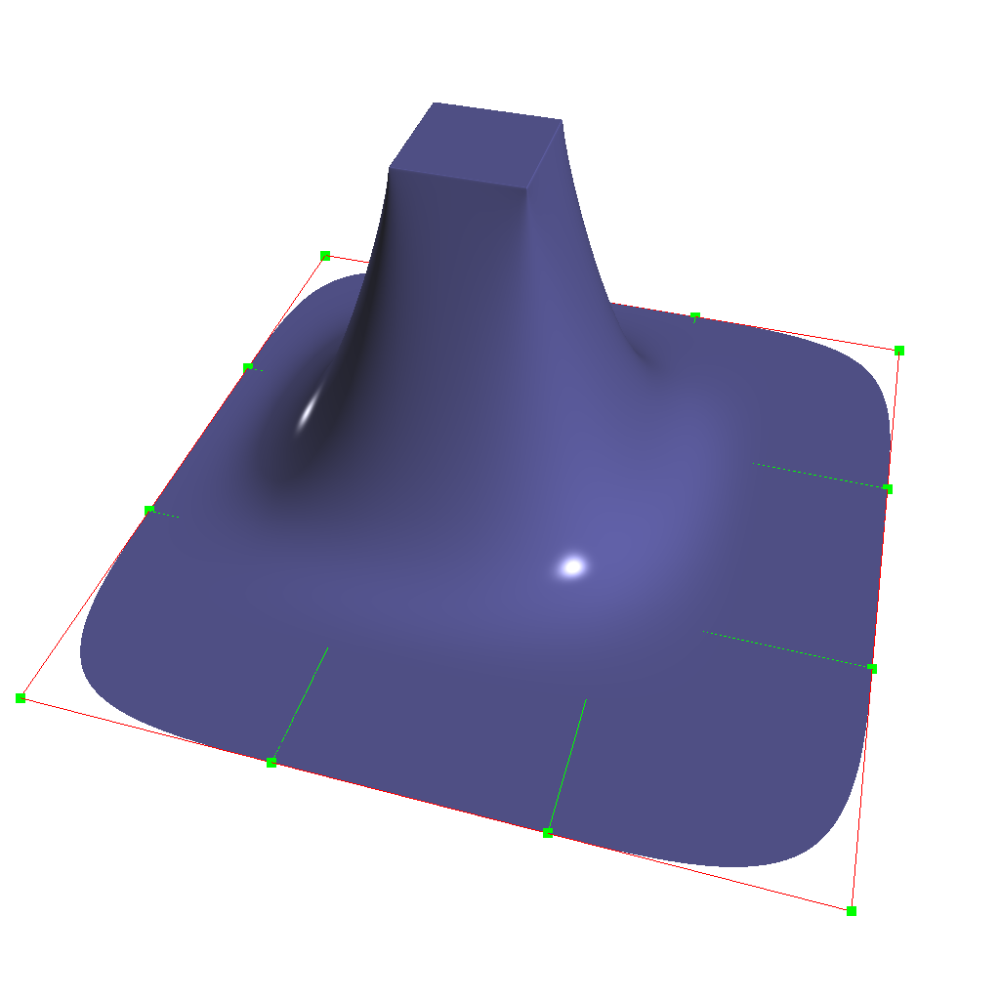

..
     Copyright 2013 Pixar

     Licensed under the Apache License, Version 2.0 (the "Apache License")
     with the following modification; you may not use this file except in
     compliance with the Apache License and the following modification to it:
     Section 6. Trademarks. is deleted and replaced with:

     6. Trademarks. This License does not grant permission to use the trade
        names, trademarks, service marks, or product names of the Licensor
        and its affiliates, except as required to comply with Section 4(c) of
        the License and to reproduce the content of the NOTICE file.

     You may obtain a copy of the Apache License at

         http://www.apache.org/licenses/LICENSE-2.0

     Unless required by applicable law or agreed to in writing, software
     distributed under the Apache License with the above modification is
     distributed on an "AS IS" BASIS, WITHOUT WARRANTIES OR CONDITIONS OF ANY
     KIND, either express or implied. See the Apache License for the specific
     language governing permissions and limitations under the Apache License.

Hierarchical Edits
------------------

.. contents::
   :local:
   :backlinks: none

----

Hierarchical Edits
==================

To understand the hierarchical aspect of subdivision, we realize that
subdivision itself leads to a natural hierarchy: after the first level of
subdivision, each face in a subdivision mesh subdivides to four quads (in the
Catmull-Clark scheme), or four triangles (in the Loop scheme). This creates a
parent and child relationship between the original face and the resulting four
subdivided faces, which in turn leads to a hierarchy of subdivision as each
child in turn subdivides. A hierarchical edit is an edit made to any one of the
faces, edges, or vertices that arise anywhere during subdivision. Normally
these subdivision components inherit values from their parents based on a set
of subdivision rules that depend on the subdivision scheme.

A hierarchical edit overrides these values. This allows for a compact
specification of localized detail on a subdivision surface, without having to
express information about the rest of the subdivision surface at the same level
of detail.

----

.. container:: notebox

    **Release Notes (3.0.0)**

    Hierarchical Edits have been marked as "extended specification" and support for
    hierarchical features has been removed from the 3.0 release. This decision
    allows for great simplifications of many areas of the subdivision algorithms.
    If we can identify legitimate use-cases for hierarchical tags, we will consider
    re-implementing them in future releases, as time and resources allow.

----

Hierarchical Edits Paths
************************

In order to perform a hierarchical edit, we need to be able to name the
subdivision component we are interested in, no matter where it may occur in the
subdivision hierarchy. This leads us to a hierarchical path specification for
faces, since once we have a face we can navigate to an incident edge or vertex
by association. We note that in a subdivision mesh, a face always has incident
vertices, which are labelled (in relation to the face) with an integer index
starting at zero and in consecutive order according to the usual winding rules
for subdivision surfaces. Faces also have incident edges, and these are
labelled according to the origin vertex of the edge.

.. role:: red
.. role:: green
.. role:: blue

In this diagram, the indices of the vertices of the base face are marked in
:red:`red`; so on the left we have an extraordinary Catmull-Clark face with
five vertices (labeled :red:`0-4`) and on the right we have a regular
Catmull-Clark face with four vertices (labelled :red:`0-3`). The indices of the
child faces are :blue:`blue`; note that in both the extraordinary and regular
cases, the child faces are indexed the same way, i.e. the sub-face labeled
:blue:`n` has one incident vertex that is the result of the subdivision of the
parent vertex also labeled :red:`n` in the parent face. Specifically, we note
that the sub-face :blue:`1` in both the regular and extraordinary face is
nearest to the vertex labelled :red:`1` in the parent.

The indices of the vertices of the child faces are labeled :green:`green`, and
this is where the difference lies between the extraordinary and regular case;
in the extraordinary case, vertex to vertex subdivision always results in a
vertex labeled :green:`0`, while in the regular case, vertex to vertex
subdivision assigns the same index to the child vertex. Again, specifically, we
note that the parent vertex indexed :red:`1` in the extraordinary case has a
child vertex :green:`0`, while in the regular case the parent vertex indexed
:red:`1` actually has a child vertex that is indexed :green:`1`. Note that this
indexing scheme was chosen to maintain the property that the vertex labeled 0
always has the lowest u/v parametric value on the face.

.. image:: images/hedit_path.gif
   :align: center
   :target: images/hedit_path.gif

By appending a vertex index to a face index, we can create a vertex path
specification. For example, (:blue:`655` :green:`2` :red:`3` 0) specifies the
1st. vertex of the :red:`3` rd. child face of the :green:`2` nd. child face of
the of the :blue:`655` th. face of the subdivision mesh.

----

Vertex Edits
************

Vertex hierarchical edits can modify the value or the sharpness of primitive
variables for vertices and sub-vertices anywhere in the subdivision hierarchy.

The edits are performed using either an "add" or a "set" operator. "set"
indicates the primitive variable value or sharpness is to be set directly to
the values specified. "add" adds a value to the normal result computed via
standard subdivision rules. In other words, this operation allows value offsets
to be applied to the mesh at any level of the hierarchy.

.. image:: images/hedit_example2.png
   :align: center
   :height: 300
   :target: images/hedit_example2.png

----

Edge Edits
**********

Edge hierarchical edits can only modify the sharpness of primitive variables for edges
and sub-edges anywhere in the subdivision hierarchy.

----

Face Edits
**********

Face hierarchical edits can modify several properties of faces and sub-faces
anywhere in the subdivision hierarchy.

Modifiable properties include:

    * The "set" or "add" operators modify the value of primitive variables
      associated with faces.
    * The "hole" operation introduces holes (missing faces) into the subdivision
      mesh at any level in the subdivision hierarchy. The faces will be deleted,
      and none of their children will appear (you cannot "unhole" a face if any
      ancestor is a "hole"). This operation takes no float or string arguments.

