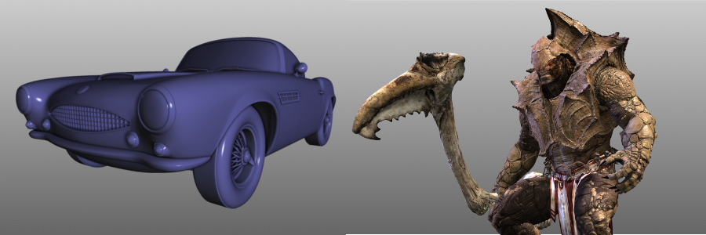

..  
     Copyright 2013 Pixar
  
     Licensed under the terms set forth in the LICENSE.txt file available at
     https://opensubdiv.org/license.
  

Introduction
------------

.. image:: https://opensubdiv.org/docs/images/opensubdiv_splash_v3_7_0.png
   :width: 100%
   :align: center

.. contents::
   :local:
   :backlinks: none

----

Introduction
============

OpenSubdiv is a set of open source libraries that implement high performance 
subdivision surface (subdiv) evaluation on massively parallel CPU and GPU 
architectures. This code path is optimized for drawing deforming surfaces with 
static topology at interactive framerates. 

OpenSubdiv is an API ready to be integrated into 3rd party digital
content creation tools. It is **not** an application, nor a tool that can be 
used directly to create digital assets.

----

Why Fast Subdivision ?
======================

Subdivision surfaces are commonly used for final rendering of character shapes 
for a smooth and controllable limit surfaces. However, subdivision surfaces in 
interactive apps are typically drawn as their polygonal control hulls because of 
performance. The polygonal control hull is an approximation that is offset from 
the true limit surface. Looking at an approximation in the interactive app makes 
it difficult to see exact contact, like fingers touching a potion bottle or hands 
touching a cheek. It also makes it difficult to see poke-throughs in cloth simulation 
if the skin and cloth are both approximations. This problem is particularly bad when 
one character is much larger than another and unequal subdiv face sizes cause 
approximation errors to be magnified.

Maya and Pixar's proprietary Presto animation system can take 100ms to subdivide 
a character of 30,000 polygons to the second level of subdivision (500,000 polygons). 
Being able to perform the same operation in less than 3ms allows the user to interact
with the smooth, accurate limit surface at all times.

----

Research
========

The new GPU technology behind OpenSubdiv is the result of a joint research effort
between Pixar and Microsoft.

    | *Feature Adaptive GPU Rendering of Catmull-Clark Subdivision Surfaces*
    | Matthias Niessner, Charles Loop, Mark Meyer, and Tony DeRose
    | ACM Transactions on Graphics, Vol. 31 No. 1 Article 6 January 2012 
    | `<https://research.pixar.com/docs/2012.SiggraphPapers.NLMD.pdf>`_
    |
    | *Efficient Evaluation of Semi-Smooth Creases in Catmull-Clark Subdivision Surfaces*
    | Matthias Niessner, Charles Loop, and Guenter Greiner.
    | Eurographics Proceedings, Cagliari, 2012
    | `<https://niessnerlab.org/papers/2012/1semismooth/niessner2012efficient.pdf>`_
    |
    | *Analytic Displacement Mapping using Hardware Tessellation*
    | Matthias Niessner, Charles Loop
    | ACM Transactions on Graphics, Vol. 32 No. 3 Article 26 June 2013
    | `<https://niessnerlab.org/papers/2013/3analytic/niessner2013analytic.pdf>`_
    
----

Heritage
========

This is the fifth-generation subdiv library in use by Pixar's proprietary animation 
system in a lineage that started with code written by Tony DeRose and Tien Truong 
for Geri's Game in 1996. Each generation has been a from-scratch rewrite that 
has built upon our experience using subdivision surfaces to make animated films. 
This code is live, so Pixar's changes to OpenSubdiv for current and future films 
will be released as open source at the same time they are rolled out to Pixar 
animation production.

    | *Subdivision for Modeling and Animation*
    | Denis Zorin, Peter Schroder
    | Course Notes of SIGGRAPH 1999
    | `<https://www.multires.caltech.edu/pubs/sig99notes.pdf>`_
    |
    | *Subdivision Surfaces in Character Animation*
    | Tony DeRose, Michael Kass, Tien Truong
    | Proceedings of SIGGRAPH 1998
    | `<https://research.pixar.com/docs/1998.SiggraphPapers.DKT.pdf>`_
    |
    | *Recursively generated B-spline surfaces on arbitrary topological meshes*
    | Catmull, E.; Clark, J. Computer-Aided Design 10 (6) (1978)

----

Licensing
=========

OpenSubdiv is an `open source project
<https://github.com/PixarAnimationStudios/OpenSubdiv>`_
released under the
`TOST license <https://opensubdiv.org/license>`_.

----

Contributing
============

For details on how to contribute to OpenSubdiv, see the page on 
`Contributing <contributing.html>`_

----

External Resources
==================

Pixar Technology Libraries:
    `<https://www.pixar.com/technology-libraries>`_

