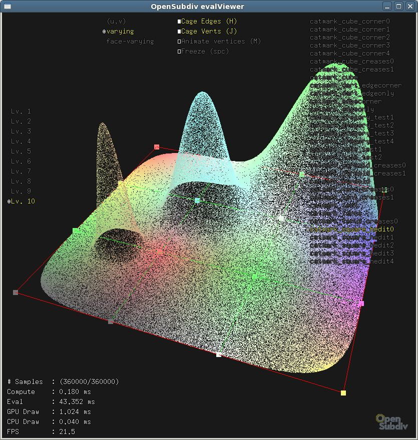

..  
       Copyright 2013 Pixar

       Licensed under the Apache License, Version 2.0 (the "License");
       you may not use this file except in compliance with the License
       and the following modification to it: Section 6 Trademarks.
       deleted and replaced with:

       6. Trademarks. This License does not grant permission to use the
       trade names, trademarks, service marks, or product names of the
       Licensor and its affiliates, except as required for reproducing
       the content of the NOTICE file.

       You may obtain a copy of the License at

       http://www.apache.org/licenses/LICENSE-2.0

       Unless required by applicable law or agreed to in writing,
       software distributed under the License is distributed on an
       "AS IS" BASIS, WITHOUT WARRANTIES OR CONDITIONS OF ANY KIND,
       either express or implied.  See the License for the specific
       language governing permissions and limitations under the
       License.
  

limitEval
---------

.. contents::
   :local:
   :backlinks: none

SYNOPSIS
========

.. parsed-literal:: 
   :class: codefhead

   **limitEval** [**-f**] *objfile(s)*

DESCRIPTION
===========

``limitEval`` is a stand-alone application that showcases the limit surface
Eval module. On the given shape, random samples are generated in local u,v space.
Vertex, varying and face-varying data is then computed on the surface limit and
displayed as colors. Multiple controls are available to experiment with the algorithms.

OPTIONS
=======

**-f**
  Launches the application in full-screen mode (if is supported by GLFW on the
  OS)

SEE ALSO
========

`Code Examples <code_examples.html>`__, \
`glViewer <glviewer.html>`__, \
`glBatchViewer <glbatchviewer.html>`__, \
`ptexViewer <ptexviewer.html>`__, \
`paintTest <painttest.html>`__, \
`limitEval <limiteval.html>`__, \
`dxViewer <dxviewer.html>`__, \

