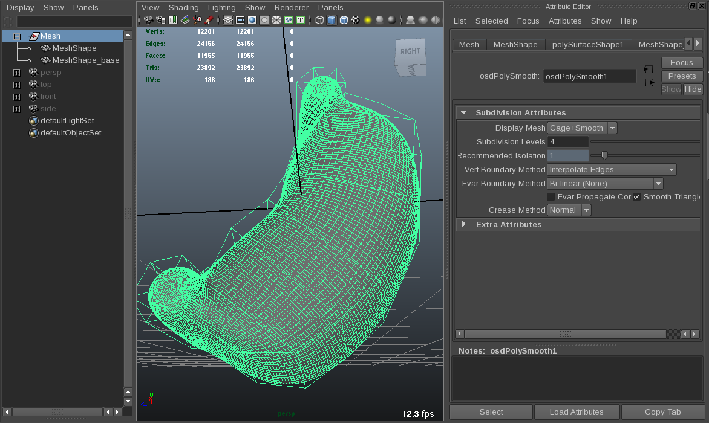

..
     Copyright 2013 Pixar

     Licensed under the Apache License, Version 2.0 (the "Apache License")
     with the following modification; you may not use this file except in
     compliance with the Apache License and the following modification to it:
     Section 6. Trademarks. is deleted and replaced with:

     6. Trademarks. This License does not grant permission to use the trade
        names, trademarks, service marks, or product names of the Licensor
        and its affiliates, except as required to comply with Section 4(c) of
        the License and to reproduce the content of the NOTICE file.

     You may obtain a copy of the Apache License at

         http://www.apache.org/licenses/LICENSE-2.0

     Unless required by applicable law or agreed to in writing, software
     distributed under the Apache License with the above modification is
     distributed on an "AS IS" BASIS, WITHOUT WARRANTIES OR CONDITIONS OF ANY
     KIND, either express or implied. See the Apache License for the specific
     language governing permissions and limitations under the Apache License.

Maya osdPolySmooth
------------------

.. contents::
   :local:
   :backlinks: none

DESCRIPTION
===========

The Maya OsdPolySmooth node takes a base mesh and generates an OpenSubdiv subdivided mesh.

.. container:: notebox

   **Note:**
   This plugin is not representative of actual workflows in the application. The
   intended use is for quick comparisons with Renderman's interpolation settings.

Usage
=====

Once the plugin is loaded in Maya:
    - Select a poly mesh
    - Polygons -> Edit Mesh -> OSD Subdivide Meshes

Attributes (9)
==============

inputPolymesh, output, recommendedIsolation, subdivisionLevels, vertBoundaryMethod, 
fvarBoundaryMethod, fvarPropagateCorners, smoothTriangles, creaseMethod,

+-----------------------------------------------------------------------------------------+------+----------+------------------------------------+
| Long Name (Short Name)                                                                  | Type | Default  | Flags                              |
+=========================================================================================+======+==========+====================================+
| inputPolymesh (ip)                                                                      | mesh |          | input hidden connectable storable  |
|    This is a description for this attribute                                             |      |          |                                    |
+-----------------------------------------------------------------------------------------+------+----------+------------------------------------+
| output (out)                                                                            | mesh |          | hidden connectable storable output |
|    This is a description for this attribute                                             |      |          |                                    |
+-----------------------------------------------------------------------------------------+------+----------+------------------------------------+
| subdivisionLevels (sl)                                                                  | int  |    2     | input connectable storable         |
|    The number of recursive quad subdivisions to perform on each face.                   |      |          |                                    |
+-----------------------------------------------------------------------------------------+------+----------+------------------------------------+
| recommendedIsolation (ri)                                                               | int  |          | output connectable storable        |
|    The recommended levels of subdivision required to account for crease sharpness       |      |          |                                    |
+-----------------------------------------------------------------------------------------+------+----------+------------------------------------+
| vertBoundaryMethod (vbm)                                                                | enum | EdgeOnly | input connectable storable         |
|   Controls how boundary edges and vertices are interpolated.                            |      |          |                                    |
|     - Smooth, Edges: *InterpolateBoundaryEdgeOnly*                                      |      |          |                                    |
|     - Smooth, Edges and Corners: *InterpolateBoundaryEdgeAndCorner*                     |      |          |                                    |
+-----------------------------------------------------------------------------------------+------+----------+------------------------------------+
| fvarBoundaryMethod (fvbm)                                                               | enum |   None   | input connectable storable         |
|   Controls how boundaries are treated for face-varying data (UVs and Vertex Colors).    |      |          |                                    |
|     - Bi-linear (None): *InterpolateBoundaryNone*                                       |      |          |                                    |
|     - Smooth (Edge Only): *InterpolateBoundaryEdgeOnly*                                 |      |          |                                    |
|     - Smooth (Edges and Corners: *InterpolateBoundaryEdgeAndCorner*                     |      |          |                                    |
|     - Smooth (ZBrush and Maya "Smooth Internal Only"): *InterpolateBoundaryAlwaysSharp* |      |          |                                    |
+-----------------------------------------------------------------------------------------+------+----------+------------------------------------+
| fvarPropagateCorners (fvpc)                                                             | bool |  false   | input connectable storable         |
|    Check all faces to see if two edges side by side are facevarying boundary edges      |      |          |                                    |
+-----------------------------------------------------------------------------------------+------+----------+------------------------------------+
| smoothTriangles (stri)                                                                  | bool |   true   | input connectable storable         |
|   Apply a special subdivision rule be applied to all triangular faces that was          |      |          |                                    |
|   empirically determined to make triangles subdivide more smoothly.                     |      |          |                                    |
+-----------------------------------------------------------------------------------------+------+----------+------------------------------------+
| creaseMethod (crm)                                                                      | enum |    0     | input connectable storable         |
|   Controls how boundary edges and vertices are interpolated.                            |      |          |                                    |
|     - Normal: No Crease sharpness smoothing                                             |      |          |                                    |
|     - Chaikin: Improves the appearance of multiedge creases with varying weight         |      |          |                                    |
+-----------------------------------------------------------------------------------------+------+----------+------------------------------------+

.. include:: examples_see_also.rst
