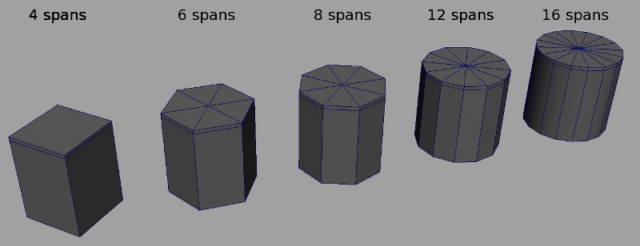
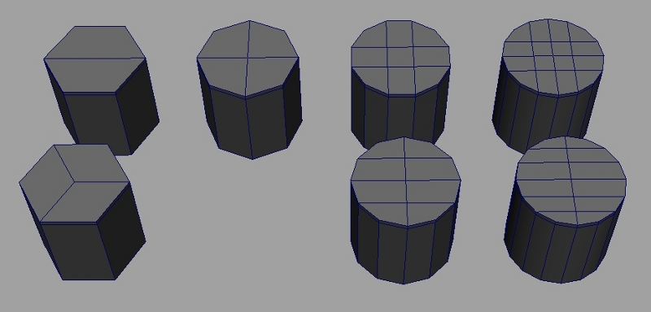
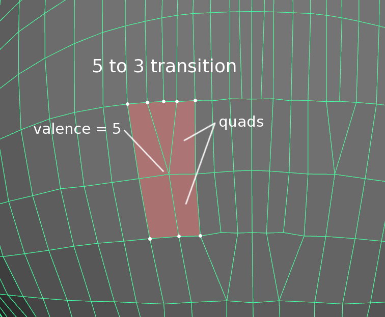
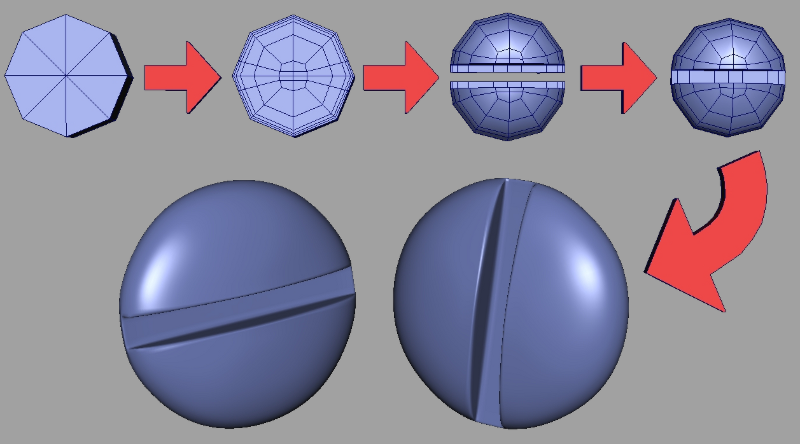
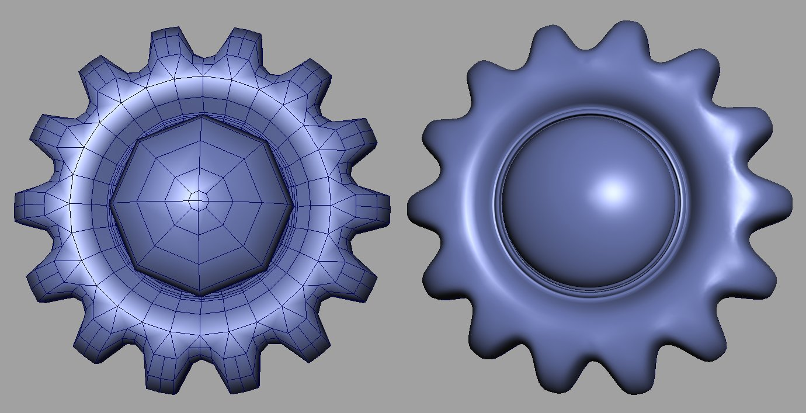
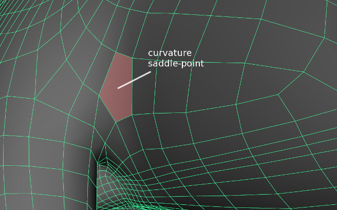
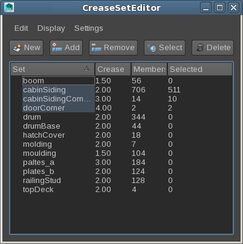

..
     Copyright 2013 Pixar

     Licensed under the Apache License, Version 2.0 (the "Apache License")
     with the following modification; you may not use this file except in
     compliance with the Apache License and the following modification to it:
     Section 6. Trademarks. is deleted and replaced with:

     6. Trademarks. This License does not grant permission to use the trade
        names, trademarks, service marks, or product names of the Licensor
        and its affiliates, except as required to comply with Section 4(c) of
        the License and to reproduce the content of the NOTICE file.

     You may obtain a copy of the Apache License at

         http://www.apache.org/licenses/LICENSE-2.0

     Unless required by applicable law or agreed to in writing, software
     distributed under the Apache License with the above modification is
     distributed on an "AS IS" BASIS, WITHOUT WARRANTIES OR CONDITIONS OF ANY
     KIND, either express or implied. See the Apache License for the specific
     language governing permissions and limitations under the Apache License.

Modeling Tips
-------------

.. contents::
   :local:
   :backlinks: none

----

The following sections describe common techniques specific to modeling with
subdivision surfaces.

.. container:: notebox

    **Note**

    The following information contains techniques specific to the Catmull-Clark
    subdivision scheme. Some elements need to be adjusted for Loop surfaces.

----

Topology
========

Well-constructed subdivision meshes have several important properties:

    * They consist primarily of regular faces (quads for Catmull-Clark, tris for Loop)
    * They contain few extraordinary vertices
    * They efficiently describe the intended shape
    * They are topologically `manifold <subdivision_surfaces.html#non-manifold-topology>`__

----

Use Fewer Spans
+++++++++++++++

While polygon models need to use a large number of spans to approximate smooth
curved surfaces, subdivision models require significantly fewer control points.

In most situations, 6 spans are enough to create accurate circular shapes, and
4 is often enough to approximate background objects.

----

Avoid High Valence vertices
+++++++++++++++++++++++++++

A high valence vertex is a vertex connected to more than 4 adjacent edges.

High valence vertices cause several problems when subdivided:

    * The Catmull-Clark scheme can produce "wavy" surfaces when a revolution
      vertex is surrounded by triangles (see `here <subdivision_surfaces.html#triangle-subdivision-rule>`__):

      .. image:: images/mod_notes.2.png
         :width: 150px
         :align: center
         :target: images/mod_notes.2.png
    * High valence vertices incur fairly large performance hits
    * Currently, OpenSubdiv has a hard constraint imposed by GPU shaders on the
      maximum valence of a vertex (~27 on current hardware)

Instead, here are some topological strategies to cap revolution shapes:

Note that all these cylinders use only quad faces, and all the vertices in the
caps have a valence of 4 (except the bottom left example)

----

Edge-Loop Transitions
+++++++++++++++++++++

It is often necessary to vary the density of control vertices over the surface
mesh: areas around the fingers of a hand require more CVs than the comparatively
simpler region around the palm. It is important to handle the topology around
these transitions efficiently.

One strategy is to use extraordinary vertices, such as this example, using a
valence 5 vertex to expand 3 edge loops into 5.

----

Practical Topology Primer
+++++++++++++++++++++++++

Some real-world examples showing how to produce detailed shapes with sparse
topology, few extraordinary vertices, and no high-valence revolution poles.

----

Triangles and N-Gons
++++++++++++++++++++

Used sparsely, non-quads can be very useful to gather 3 or more diverging
edge-loops. These are often encountered in highly deforming areas with curvature
saddle-points (ex: arm-torso connection). The strategic placement of a pentagon
in one of these critical spots ensures that the surface remains smooth, while
allowing for complex topology to flow around.

----

Semi-Sharp Creases
==================

Semi-sharp creases can be a very powerful tool for hard-surface modeling.

    * Both edges and vertices can be tagged with a sharpness value.
    * Crease sharpness values range from 0 (smooth) to 10 (infinitely sharp)
    * It is generally cheaper to use creases whenever possible, instead of adding
      extra edges/edge-loops. However...
    * Creases introduce extra computation costs that are proportional to the
      sharpness value. So...
    * Sharpness values above 5 should rarely be needed.

The following sections introduce some techniques to best leverage them.

Use crease sets
+++++++++++++++

Complex hard-surface models (giant robots, vehicles, buildings...) are likely to
tag large number of edges : it is extremely useful to organize these edges/edge
loops into logical sets with descriptive names. Edges or vertices in a crease
set group all share the same sharpness value.

If you are modeling with Maya, the CreaseSetEditor implements this type of
workflow. Additionally, for debugging purposes, it is often very helpful if the
name of a set contains the sharpness value (ex: topDeck_2).

Besides authoring convenience, one of the benefits of having many edge-loops
share identical sharpness values is that it enables very powerful performance
optimizations within the feature adaptive algorithm (faster renders & less
memory).

----

Additional Resources
====================

An excellent short tutorial from the Guerrilla CG Project that illustrates many
of the common pitfalls of subdivision modeling, and the strategies to overcome
them:

.. image::  https://graphics.pixar.com/opensubdiv/videothumbnails/subdiv_topology_guerrillacg.png
   :align:  center
   :width:  75%
   :target: https://www.youtube.com/embed/k_S1INdEmdI

----

Ivo Kos, Modelling Technical Director at Pixar Animation Studios, shows some of
the modeling techniques he uses when modeling props and architecture sets for
feature films.

.. image::  https://graphics.pixar.com/opensubdiv/videothumbnails/subdiv_modeling_pixar2013.png
   :align:  center
   :width:  75%
   :target: https://player.vimeo.com/video/70600180

