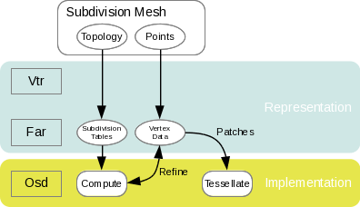
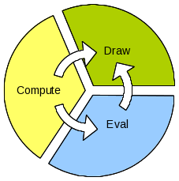
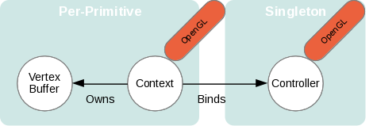
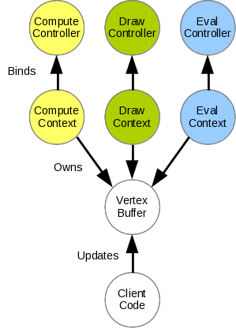
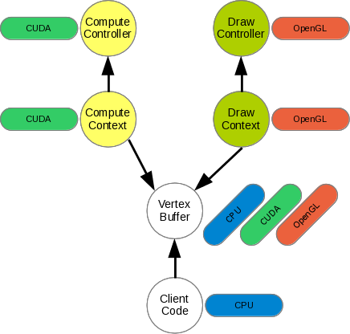

..  
       Copyright 2013 Pixar

       Licensed under the Apache License, Version 2.0 (the "License");
       you may not use this file except in compliance with the License
       and the following modification to it: Section 6 Trademarks.
       deleted and replaced with:

       6. Trademarks. This License does not grant permission to use the
       trade names, trademarks, service marks, or product names of the
       Licensor and its affiliates, except as required for reproducing
       the content of the NOTICE file.

       You may obtain a copy of the License at

       http://www.apache.org/licenses/LICENSE-2.0

       Unless required by applicable law or agreed to in writing,
       software distributed under the License is distributed on an
       "AS IS" BASIS, WITHOUT WARRANTIES OR CONDITIONS OF ANY KIND,
       either express or implied.  See the License for the specific
       language governing permissions and limitations under the
       License.
  

OSD Overview
------------

.. contents::
   :local:
   :backlinks: none

OpenSubdiv (Osd)
================

**Osd** contains client-level code that uses *Far* to create concrete instances of 
meshes. These meshes use precomputed tables from *Hbr* to perform table-driven 
subdivision steps with a variety of massively parallel computational backend 
technologies. **Osd** supports both `uniform subdivision <subdivision_surfaces.html#uniform-subdivision>`__
and `adaptive refinement <subdivision_surfaces.html#feature-adaptive-subdivision>`__ 
with cubic patches. 

----

Modular Architecture
====================

With uniform subdivision the computational backend code performs Catmull-Clark 
splitting and averaging on each face. 

With adaptive subdivision, the Catmull/Clark steps are used to compute the CVs 
of cubic Bezier patches. On modern GPU architectures, bicubic patches can be
drawn directly on screen at very high resolution using optimized tessellation
shader paths. 

Finally, the general manipulation of high-order surfaces also requires functionality 
outside of the scope of pure drawing. 

Following this pattern of general use, **Osd** can be broken down into 3 main 
modules : **Compute**, **Draw** and **Eval**.

The modules are designed so that the data being manipulated can be shared and
interoperated between modules (although not all paths are possible).

These modules are identified by their name spaces (**OsdRefine**, **OsdDraw**,
**OsdEval**) and encapsulate atomic functationality. The vertex data is carried 
in interoperable buffers that can be exchanged between modules. 

The typical use pattern is to pose the coarse vertices of a mesh for a given frame.
The buffer is submitted to the **Refine** module which applies the subdivision rules
and produces refined control vertices. This new buffer can be passed to the **Draw**
module which will draw them on screen.

However, the same buffer of refined control vertices could be passed instead to
the **Eval** module (and be projected onto another surface for instance) before
being sent for display to the **Draw** module.

----

OsdCompute
**********

The Compute module contains the code paths that manage the application of the 
subdivision rules to the vertex data. This module is sufficient for uniform
subdivision applications.

----

OsdDraw
*******

The Draw module manages interactions with discrete display devices and provide
support for interactive drawing of the subdivision surfaces.

----

OsdEval
*******

The Eval module provides computational APIs for the evaluation of vertex data at
the limit, ray intersection and point projection.

OpenSubdiv enforces the same results for the different computation backends with 
a series of regression tests that compare the methods to each other.

.. container:: impnotip

   * **Important**

      Face-varying smooth data interpolation is currently not supported in **Osd**.
      "Smooth UV" modes of various DCC applications are not supported (yet).

----

Cross-Platform Implementation
=============================

One of the key goals of OpenSubdiv is to achieve as much cross-platform flexibility
as possible and leverage all optimized hardware paths where available. This can
be very challenging however, as there is a very large variety of plaftorms and
matching APIs available, with very distinct capabilities. The following chart
illustrates the matrix of back-end APIs supported for each module.

.. image:: images/osd_backends.png
   :align: center

Since the **Compute** module performs mostly specialized interpolation computations,
most GP-GPU and multi-core APIs can be deployed. If the end-goal is to draw the
surface on screen, it can be very beneficial to move as much of these computations 
to the same GPU device in order to minimize data transfers. 

For instance: pairing a CUDA **Compute** back-end to an OpenGL **Draw** backend 
could be a good choice on hardware and OS that supports both. Similarly, a
DX11 HLSL-Compute **Compute** back-end can be paired effectively with a DX11 
HLSL-Shading **Draw** back-end. Some pairings however are not possible, as there
may be no data inter-operation paths available (ex: transferring DX11 compute SRVs
to GL texture buffers).

----

Contexts & Controllers
======================

At the core of **Osd** modularization is the need for inter-operating vertex buffer
data between different APIs. This is achieved through a *"binding"* mechanism.

Binding Vertex Buffers
**********************

Each back-end manages data of 2 types: specific to each primitive manipulated 
(topology, vertex data...), and general state data that is shared by all the 
primitives (compute kernels, device ID...). The first type is contained in a
"Context" object, the latter manipulated through a singleton "Controller".

The Context itself holds the data that is specific to both the primitive and
the operation that needs to be appled (ex: *"drawing"*). It also owns multiple
buffers of vertex data. Contexts and Controller each have a specific back-end
API, so only matching back-ends can be paired (ex: an OpenCL Context cannot be
paired with a CUDA Controller).

Vertex Buffer Inter-Op
**********************

When a Controller needs to perform an operation, it *"binds"* the Context, which 
is the trigger to move the vertex data into the appropriate device memory pool
(CPU to GPU, GPU to GPU...).

In practice, a given application will maintain singletons of the controllers for
each of the modules that it uses, and pair them with the Contexts associated with
each primitive. A given primitive will use one Context for each of the modules that
it uses.

Example
*******

Here is an example of client code implementation for drawing surfaces using a 
CUDA **Compute** module and an OpenGL **Draw** module. 

The client code will construct an OsdCudaComputeController and OsdCudaComputeContext
for the **Compute** stage, along with an OsdGLDrawController and an OsdGLDrawContext.

The critical components are the vertex buffers, which must be of type OsdCudaGLVertexBuffer.
The Contexts and Controllers classes all are specializations of a templated *"Bind"*
function which will leverage API specific code responsible for the inter-operation
of the data between the API-specific back-ends.

