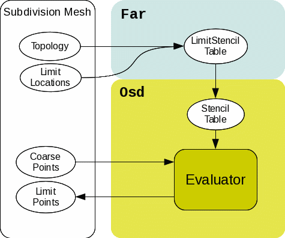
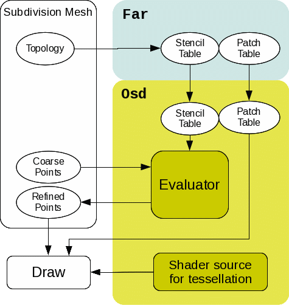

..
     Copyright 2013 Pixar

     Licensed under the Apache License, Version 2.0 (the "Apache License")
     with the following modification; you may not use this file except in
     compliance with the Apache License and the following modification to it:
     Section 6. Trademarks. is deleted and replaced with:

     6. Trademarks. This License does not grant permission to use the trade
        names, trademarks, service marks, or product names of the Licensor
        and its affiliates, except as required to comply with Section 4(c) of
        the License and to reproduce the content of the NOTICE file.

     You may obtain a copy of the Apache License at

         http://www.apache.org/licenses/LICENSE-2.0

     Unless required by applicable law or agreed to in writing, software
     distributed under the Apache License with the above modification is
     distributed on an "AS IS" BASIS, WITHOUT WARRANTIES OR CONDITIONS OF ANY
     KIND, either express or implied. See the Apache License for the specific
     language governing permissions and limitations under the Apache License.

OSD Overview
------------

.. contents::
   :local:
   :backlinks: none

OpenSubdiv (Osd)
================

**Osd** contains device dependent code that makes *Far* structures 
available on various backends such as TBB, CUDA, OpenCL, GLSL, etc.
The main roles of **Osd** are:

 - **Refinement**
    Compute stencil-based uniform/adaptive subdivision on CPU/GPU backends
 - **Limit Stencil Evaluation**
    Compute limit surfaces by limit stencils on CPU/GPU backends
 - **Limit Evaluation with PatchTable**
    Compute limit surfaces by patch evaluation on CPU/GPU backends
 - **OpenGL/DX11/Metal Drawing with hardware tessellation**
    Provide GLSL/HLSL/Metal tessellation functions for patch table
 - **Interleaved/Batched buffer configuration**
    Provide consistent buffer descriptor to deal with arbitrary buffer layout.
 - **Cross-Platform Implementation**
    Provide convenient classes to interop between compute and draw APIs

These are independently used by clients. For example, a client can use only
the limit stencil evaluation, or a client can refine subdivision surfaces
and draw them with the PatchTable and **Osd** tessellation shaders.
All device specific evaluation kernels are implemented in the Evaluator classes.
Since Evaluators don't own vertex buffers, clients should provide their own
buffers as a source and destination. There are some interop classes defined
in **Osd** for convenience.

OpenSubdiv utilizes a series of regression tests to compare and enforce
identical results across different computational devices.

----

Refinement
==========

**Osd** supports both uniform and
`feature adaptive <subdivision_surfaces.html#feature-adaptive-subdivision>`__ subdivision.

.. image:: images/osd_refinement.png
   :align: center

Once clients create a Far::StencilTable for the topology, they can convert it into
device-specific stencil tables if necessary. The following table shows which evaluator
classes and stencil table interfaces can be used together. Note that while **Osd**
provides these stencil table classes which can be easily constructed from Far::StencilTable,
clients aren't required to use these table classes. Clients may have their own entities
as a stencil tables as long as Evaluator::EvalStencils() can access the necessary interfaces.

+-----------------------------+-----------------------+-------------------------+
| Backend                     | Evaluator class       | compatible stencil table|
+=============================+=======================+=========================+
| CPU (CPU single-threaded)   | CpuEvaluator          | Far::StencilTable       |
+-----------------------------+-----------------------+-------------------------+
| TBB (CPU multi-threaded)    | TbbEvaluator          | Far::StencilTable       |
+-----------------------------+-----------------------+-------------------------+
| OpenMP (CPU multi-threaded) | OmpEvaluator          | Far::StencilTable       |
+-----------------------------+-----------------------+-------------------------+
| CUDA (GPU)                  | CudaEvaluator         | CudaStencilTable        |
+-----------------------------+-----------------------+-------------------------+
| OpenCL (CPU/GPU)            | CLEvaluator           | CLStencilTable          |
+-----------------------------+-----------------------+-------------------------+
| GL ComputeShader (GPU)      | GLComputeEvaluator    | GLStencilTableSSBO      |
+-----------------------------+-----------------------+-------------------------+
| GL Transform Feedback (GPU) | GLXFBEvaluator        | GLStencilTableTBO       |
+-----------------------------+-----------------------+-------------------------+
| DX11 ComputeShader (GPU)    | D3D11ComputeEvaluator | D3D11StencilTable       |
+-----------------------------+-----------------------+-------------------------+
| Metal (GPU)                 | MTLComputeEvaluator   | MTLStencilTable         |
+-----------------------------+-----------------------+-------------------------+

Limit Stencil Evaluation
========================

Limit stencil evaluation is quite similar to refinement in **Osd**. At first
clients create Far::LimitStencilTable for the locations to evaluate the limit
surfaces, then convert it into an evaluator compatible stencil table and call
Evaluator::EvalStencils().

Limit Evaluation with PatchTable
================================

Another way to evaluate the limit surfaces is to use the PatchTable.
Once all control vertices and local points are resolved by the stencil evaluation,
**Osd** can evaluate the limit surfaces through the PatchTable.

.. image:: images/osd_limiteval.png
   :align: center

+-----------------------------+-------------------------+-------------------------+
| Backend                     | Evaluator class         | compatible patch   table|
+=============================+=========================+=========================+
| CPU (CPU single-threaded)   | CpuEvaluator            | CpuPatchTable           |
+-----------------------------+-------------------------+-------------------------+
| TBB (CPU multi-threaded)    | TbbEvaluator            | CpuPatchTable           |
+-----------------------------+-------------------------+-------------------------+
| OpenMP (CPU multi-threaded) | OmpEvaluator            | CpuPatchTable           |
+-----------------------------+-------------------------+-------------------------+
| CUDA (GPU)                  | CudaEvaluator           | CudaPatchTable          |
+-----------------------------+-------------------------+-------------------------+
| OpenCL (CPU/GPU)            | CLEvaluator             | CLPatchTable            |
+-----------------------------+-------------------------+-------------------------+
| GL ComputeShader (GPU)      | GLComputeEvaluator      | GLPatchTable            |
+-----------------------------+-------------------------+-------------------------+
| GL Transform Feedback (GPU) | GLXFBEvaluator          | GLPatchTable            |
+-----------------------------+-------------------------+-------------------------+
| DX11 ComputeShader (GPU)    | | D3D11ComputeEvaluator | D3D11PatchTable         |
|                             | | (*)not yet supported  |                         |
+-----------------------------+-------------------------+-------------------------+
| Metal ComputeShader (GPU)   | | MTLComputeEvaluator   | MTLPatchTable           |
+-----------------------------+-------------------------+-------------------------+

.. container:: notebox

 **Release Notes (3.x)**

 * Osd evaluation backends (Evaluator::EvalPatches()) do not support
   evaluation of single-crease or Legacy Gregory patch types.

OpenGL/DX11/Metal Drawing with Hardware Tessellation
====================================================

One of the most interesting use cases of the **Osd** layer is realtime drawing
of subdivision surfaces using hardware tessellation. This is somewhat similar to
limit evaluation with PatchTable described above. Drawing differs from limit
evaluation in that **Osd** provides shader snippets for patch evaluation and
clients will inject them into their own shader source.

See `shader interface <osd_shader_interface.html>`__ for a more detailed discussion of the shader interface.

----

Interleaved/Batched Buffer Configuration
========================================

All **Osd** layer APIs assume that each primitive variables to be computed
(points, colors, uvs ...) are contiguous arrays of 32bit floating point values.
The **Osd** API refers to such an array as a "buffer". A buffer can exist on CPU memory or
GPU memory. **Osd** Evaluators typically take one source buffer and one destination
buffer, or three destination buffers if derivatives are being computed.
**Osd** Evaluators also take BufferDescriptors,
that are used to specify the layout of the source and destination buffers.
A BufferDescriptor is a struct of 3 integers which specify an offset, length and stride.

For example:

 +-----------+-----------+-----------+
 | Vertex 0  |  Vertex 1 | ...       |
 +---+---+---+---+---+---+-----------+
 | X | Y | Z | X | Y | Z | ...       |
 +---+---+---+---+---+---+-----------+

The layout of this buffer can be described as

.. code:: c++

  Osd::BufferDescriptor desc(/*offset = */ 0, /*length = */ 3, /*stride = */ 3);

BufferDescriptor can be used for an interleaved buffer too.

 +---------------------------+---------------------------+-------+
 | Vertex 0                  | Vertex 1                  | ...   |
 +---+---+---+---+---+---+---+---+---+---+---+---+---+---+-------+
 | X | Y | Z | R | G | B | A | X | Y | Z | R | G | B | A | ...   |
 +---+---+---+---+---+---+---+---+---+---+---+---+---+---+-------+

.. code:: c++

  Osd::BufferDescriptor xyzDesc(0, 3, 7);
  Osd::BufferDescriptor rgbaDesc(3, 4, 7);

Although the source and destination buffers don't need to be the same buffer for
EvalStencils(), adaptive patch tables are constructed to first index the coarse
vertices and the refined vertices immediately afterward. In this case, the
BufferDescriptor for the destination should include the offset as the number of coarse
vertices to be skipped.

 +-----------------------------------+-----------------------------------+
 |  Coarse vertices (n) : Src        |  Refined vertices : Dst           |
 +-----------+-----------+-----------+-----------+-----------+-----------+
 | Vertex 0  | Vertex 1  | ...       | Vertex n  | Vertex n+1|           |
 +---+---+---+---+---+---+-----------+---+---+---+---+---+---+-----------+
 | X | Y | Z | X | Y | Z | ...       | X | Y | Z | X | Y | Z | ...       |
 +---+---+---+---+---+---+-----------+---+---+---+---+---+---+-----------+

.. code:: c++

  Osd::BufferDescriptor srcDesc(0, 3, 3);
  Osd::BufferDescriptor dstDesc(n*3, 3, 3);

Also note that the source descriptor doesn't have to start with offset = 0.
This is useful when a client has a big buffer with multiple objects batched together.

----

Cross-Platform Implementation
=============================

One of the key goals of OpenSubdiv is to achieve as much cross-platform flexibility
as possible and leverage all optimized hardware paths where available. This can
be very challenging as there is a very large variety of plaftorms and APIs 
available, with very distinct capabilities.

In **Osd**, Evaluators don't care about interops between those APIs. All Evaluators
have two kinds of APIs for both EvalStencils() and EvalPatches().

 - Explicit signatures which directly take device-specific buffer representation
   (e.g., pointer for CpuEvaluator, GLuint buffer for GLComputeEvaluator, etc.)
 - Generic signatures which take arbitrary buffer classes. The buffer class
   is required to have a certain method to return the device-specific buffer representation.

The later interface is useful if the client supports multiple backends at the same time.
The methods that need to be implemented for the Evaluators are:

+-----------------------+------------------------+------------------+
| Evaluator class       | object                 | method           |
+=======================+========================+==================+
| | CpuEvaluator        | pointer to cpu memory  | BindCpuBuffer()  |
| | TbbEvaluator        |                        |                  |
| | OmpEvaluator        |                        |                  |
+-----------------------+------------------------+------------------+
| CudaEvaluator         | pointer to cuda memory | BindCudaBuffer() |
+-----------------------+------------------------+------------------+
| CLEvaluator           | cl_mem                 | BindCLBuffer()   |
+-----------------------+------------------------+------------------+
| | GLComputeEvaluator  | GL buffer object       | BindVBO()        |
| | GLXFBEvaluator      |                        |                  |
+-----------------------+------------------------+------------------+
| D3D11ComputeEvaluator | D3D11 UAV              | BindD3D11UAV()   |
+-----------------------+------------------------+------------------+
| MTLComputeEvaluator   | MTLBuffer              | BindMTLBuffer()  |
+-----------------------+------------------------+------------------+

The buffers can use these methods as a trigger of interop. **Osd** provides a default
implementation of interop buffer for most of the backend combinations.
For example, if the client wants to use CUDA as a computation backend and use OpenGL
as the drawing API, Osd::CudaGLVertexBuffer fits the case since it implements
BindCudaBuffer() and BindVBO(). Again, clients can implement their own buffer
class and pass it to the Evaluators.
