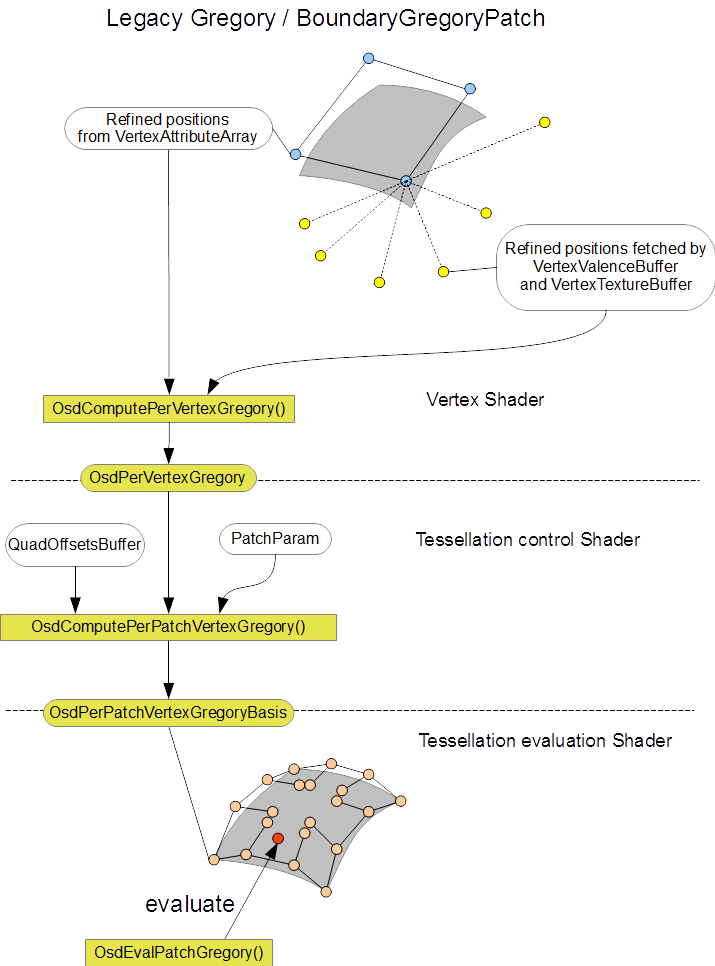

..
     Copyright 2015 Pixar

     Licensed under the Apache License, Version 2.0 (the "Apache License")
     with the following modification; you may not use this file except in
     compliance with the Apache License and the following modification to it:
     Section 6. Trademarks. is deleted and replaced with:

     6. Trademarks. This License does not grant permission to use the trade
        names, trademarks, service marks, or product names of the Licensor
        and its affiliates, except as required to comply with Section 4(c) of
        the License and to reproduce the content of the NOTICE file.

     You may obtain a copy of the Apache License at

         http://www.apache.org/licenses/LICENSE-2.0

     Unless required by applicable law or agreed to in writing, software
     distributed under the Apache License with the above modification is
     distributed on an "AS IS" BASIS, WITHOUT WARRANTIES OR CONDITIONS OF ANY
     KIND, either express or implied. See the Apache License for the specific
     language governing permissions and limitations under the Apache License.

OSD Tessellation shader Interface
---------------------------------

.. contents::
   :local:
   :backlinks: none

Basic
=====

Starting with 3.0, **Osd** tessellation shaders can be used as a set of functions from
client shader code. In order to tessellate **Osd** patches, client shader
code should perform the following steps (regular B-spline patch case):

* In a tessellation control shader
    1. fetch a PatchParam for the current patch
    2. call OsdComputePerPatchVertexBSpline() to compute OsdPerPatchVertexBezier.
    3. compute tessellation level. To prevent cracks on transition patches,
       two vec4 parameters (tessOuterHi, tessOuterLo) will be needed in addition to built-in gl_TessLevelInner/Outers.

* In a tessellation evaluation shader
    1. call OsdGetTessParameterization() to remap gl_TessCoord to a patch parameter at which to evaluate.
    2. call OsdEvalPatchBezier()/OsdEvalPatchGregory() to evaluate the current patch.

The following is a minimal example of GLSL code explaining how client shader code
uses OpenSubdiv shader functions to tessellate patches of a patch table.

Tessellation Control Shader Example (for B-Spline patches)
**********************************************************

.. code:: glsl

    layout (vertices = 16) out;
    in vec3 position[];
    patch out vec4 tessOuterLo, tessOuterHi;
    out OsdPerPatchVertexBezier v;

    void main()
    {
        // Get a patch param from texture buffer.
        ivec3 patchParam = OsdGetPatchParam(gl_PrimitiveID);

        // Compute per-patch vertices.
        OsdComputePerPatchVertexBSpline(patchParam, gl_InvocationID, position, v);

        // Compute tessellation factors.
        if (gl_InvocationID == 0) {
            vec4 tessLevelOuter = vec4(0);
            vec2 tessLevelInner = vec2(0);
            OsdGetTessLevelsUniform(patchParam,
                                    tessLevelOuter, tessLevelInner,
                                    tessOuterLo, tessOuterHi);

            gl_TessLevelOuter[0] = tessLevelOuter[0];
            gl_TessLevelOuter[1] = tessLevelOuter[1];
            gl_TessLevelOuter[2] = tessLevelOuter[2];
            gl_TessLevelOuter[3] = tessLevelOuter[3];

            gl_TessLevelInner[0] = tessLevelInner[0];
            gl_TessLevelInner[1] = tessLevelInner[1];
        }
    }

Tessellation Evaluation Shader Example (for B-Spline patches)
*************************************************************

.. code:: glsl

    layout(quads) in;
    patch in vec4 tessOuterLo, tessOuterHi;
    in OsdPerPatchVertexBezier v[];
    uniform mat4 mvpMatrix;

    void main()
    {
        // Compute tesscoord.
        vec2 UV = OsdGetTessParameterization(gl_TessCoord.xy, tessOuterLo, tessOuterHi);

        vec3 P = vec3(0), dPu = vec3(0), dPv = vec3(0);
        vec3 N = vec3(0), dNu = vec3(0), dNv = vec3(0);
        ivec3 patchParam = inpt[0].v.patchParam;

        // Evaluate patch at the tess coord UV
        OsdEvalPatchBezier(patchParam, UV, v, P, dPu, dPv, N, dNu, dNv);

        // Apply model-view-projection matrix.
        gl_Position = mvpMatrix * vec4(P, 1);
    }

Basis Conversion
================

B-spline Patch
**************

The following diagram shows how the **Osd** shaders process b-spline patches.

While regular patches are expressed as b-spline patches in Far::PatchTable,
the **Osd** shader converts them into Bezier basis patches for simplicity and efficiency.
This conversion is performed in the tessellation control stage. The boundary edge evaluation
and single crease matrix evaluation are also resolved during this conversion.
OsdComputePerPatchVertexBSpline() can be used for this process.
The resulting Bezier control vertices are stored in OsdPerPatchVertexBezier struct.

.. code:: glsl

  void  OsdComputePerPatchVertexBSpline(
      ivec3 patchParam, int ID, vec3 cv[16], out OsdPerPatchVertexBezier result);

The tessellation evaluation shader takes an array of OsdPerPatchVertexBezier struct,
and then evaluates the patch using the OsdEvalPatchBezier() function.

.. code:: glsl

  void OsdEvalPatchBezier(ivec3 patchParam, vec2 UV,
                          OsdPerPatchVertexBezier cv[16],
                          out vec3 P, out vec3 dPu, out vec3 dPv,
                          out vec3 N, out vec3 dNu, out vec3 dNv)

Gregory Basis Patch
*******************

In a similar way, Gregory basis patches are processed as follows:

OsdComputePerPatchVertexGregoryBasis() can be used for the Gregory patches
(although no basis conversion involved for the Gregory patches) and the resulting vertices
are stored in a OsdPerPatchVertexGreogryBasis struct.

.. code:: glsl

  void
  OsdComputePerPatchVertexGregoryBasis(
      ivec3 patchParam, int ID, vec3 cv, out OsdPerPatchVertexGregoryBasis result)

The tessellation evaluation shader takes an array of OsdPerPatchVertexGregoryBasis struct,
and then evaluates the patch using the OsdEvalPatchGregory() function.

.. code:: glsl

  void
  OsdEvalPatchGregory(ivec3 patchParam, vec2 UV, vec3 cv[20],
                      out vec3 P, out vec3 dPu, out vec3 dPv,
                      out vec3 N, out vec3 dNu, out vec3 dNv)

Box-spline Triangle Patch
*************************

While regular triangle patches are expressed as triangular box-spline patches in Far::PatchTable,
the **Osd** shader converts them into triangular Bezier patches for consistency.
This conversion is performed in the tessellation control stage. The boundary edge evaluation is resolved during this conversion.
OsdComputePerPatchVertexBoxSplineTriangle() can be used for this process.
The resulting Bezier control vertices are stored in OsdPerPatchVertexBezier struct.

.. code:: glsl

  void
  OsdComputePerPatchVertexBoxSplineTriangle(
      ivec3 patchParam, int ID, vec3 cv[12], out OsdPerPatchVertexBezier result);

The tessellation evaluation shader takes an array of OsdPerPatchVertexBezier struct,
and then evaluates the patch using the OsdEvalPatchBezierTriangle() function.

.. code:: glsl

  void OsdEvalPatchBezierTriangle(ivec3 patchParam, vec2 UV,
                                  OsdPerPatchVertexBezier cv[15],
                                  out vec3 P, out vec3 dPu, out vec3 dPv,
                                  out vec3 N, out vec3 dNu, out vec3 dNv)

Gregory Triangle Patch
**********************

OsdComputePerPatchVertexGregoryBasis() can be used for the quartic triangular Gregory patches (although no basis conversion involved for the Gregory triangle patches) and the resulting vertices are stored in a OsdPerPatchVertexGreogryBasis struct.

.. code:: glsl

  void
  OsdComputePerPatchVertexGregoryBasis(
      ivec3 patchParam, int ID, vec3 cv, out OsdPerPatchVertexGregoryBasis result)

The tessellation evaluation shader takes an array of OsdPerPatchVertexGregoryBasis struct,
and then evaluates the patch using the OsdEvalPatchGregoryTriangle() function.

.. code:: glsl

  void
  OsdEvalPatchGregoryTriangle(ivec3 patchParam, vec2 UV, vec3 cv[18],
                              out vec3 P, out vec3 dPu, out vec3 dPv,
                              out vec3 N, out vec3 dNu, out vec3 dNv)

Legacy Gregory Patch (2.x compatibility)
****************************************

OpenSubdiv 3.0 also supports 2.x style Gregory patch evaluation (see far_overview).
In order to evaluate a legacy Gregory patch, client needs to bind extra buffers and
to perform extra steps in the vertex shader as shown in the following diagram:

Tessellation levels
===================

**Osd** provides both uniform and screen-space adaptive tessellation level computation.

Because of the nature of `feature adaptive subdivision <far_overview.html>`__,
we need to pay extra attention for a patch's outer tessellation level for the screen-space
adaptive case so that cracks don't appear.

An edge of the patch marked as a transition edge is split into two segments (Hi and Lo).

The **Osd** shaders uses these two segments to ensure the same tessellation along the
edge between different levels of subdivision. In the following example, suppose the left hand side
patch has determined the tessellation level of its right edge to be 5. gl_TessLevelOuter is set to
5 for the edge, and at the same time we also pass 2 and 3 to the tessellation evaluation shader
as separate levels for the two segments of the edge split at the middle.

Tessellation levels at each tessellated vertex
**********************************************

The tessellation evaluation shader takes gl_TessCoord and those two values, and remaps
gl_TessCoord using OsdGetTessParameterization() or OsdGetTessLevelParameterizationTriangle() to ensure the parameters are consistent
across adjacent patches.

.. code:: glsl

  vec2 OsdGetTessParameterization(vec2 uv, vec4 tessOuterLo, vec4 tessOuterHi);

.. code:: glsl

  vec2 OsdGetTessParameterizationTriangle(vec3 uvw, vec4 tessOuterLo, vec4 tessOuterHi);

Tessellation levels computed at each patch
******************************************

These tessellation levels can be computed the corresponding method in the tesselation control shader. Note that these functions potentially requires all bezier control
points, you need to call barrier() to ensure the conversion is done for all invocations.
See osd/glslPatchBSpline.glsl for more details.

Uniform
~~~~~~~

.. code:: glsl

    void
    OsdGetTessLevelsUniform(ivec3 patchParam,
                     out vec4 tessLevelOuter, out vec2 tessLevelInner,
                     out vec4 tessOuterLo, out vec4 tessOuterHi)

.. code:: glsl

    void
    OsdGetTessLevelsUniformTriangle(ivec3 patchParam,
                     out vec4 tessLevelOuter, out vec2 tessLevelInner,
                     out vec4 tessOuterLo, out vec4 tessOuterHi)

Screenspace
~~~~~~~~~~~

.. code:: glsl

  void OsdEvalPatchBezierTessLevels(
        OsdPerPatchVertexBezier cpBezier[16],
        ivec3 patchParam,
        out vec4 tessLevelOuter, out vec2 tessLevelInner,
        out vec4 tessOuterLo, out vec4 tessOuterHi);

.. code:: glsl

  void OsdEvalPatchBezierTriangleTessLevels(
        vec3 cv[15],
        ivec3 patchParam,
        out vec4 tessLevelOuter, out vec2 tessLevelInner,
        out vec4 tessOuterLo, out vec4 tessOuterHi);
