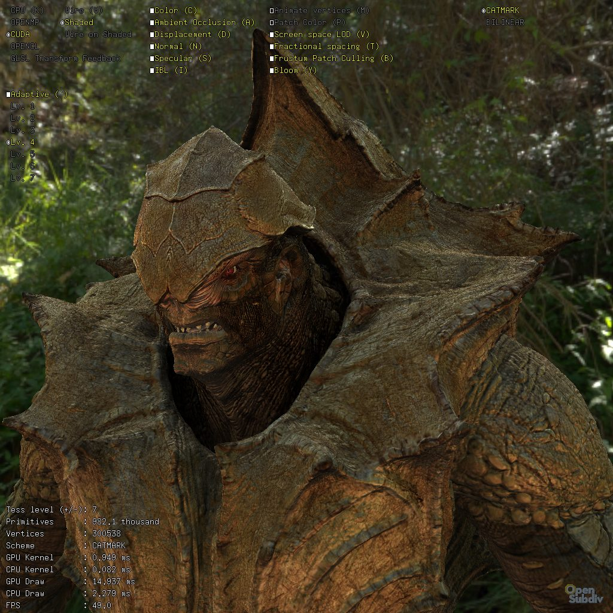

..  
       Copyright 2013 Pixar

       Licensed under the Apache License, Version 2.0 (the "License");
       you may not use this file except in compliance with the License
       and the following modification to it: Section 6 Trademarks.
       deleted and replaced with:

       6. Trademarks. This License does not grant permission to use the
       trade names, trademarks, service marks, or product names of the
       Licensor and its affiliates, except as required for reproducing
       the content of the NOTICE file.

       You may obtain a copy of the License at

       http://www.apache.org/licenses/LICENSE-2.0

       Unless required by applicable law or agreed to in writing,
       software distributed under the License is distributed on an
       "AS IS" BASIS, WITHOUT WARRANTIES OR CONDITIONS OF ANY KIND,
       either express or implied.  See the License for the specific
       language governing permissions and limitations under the
       License.
  

ptexViewer
----------

.. contents::
   :local:
   :backlinks: none

SYNOPSIS
========

.. parsed-literal:: 
   :class: codefhead

   **ptexViewer** 
   [**-e** *environment map*]
   [**-d** *HDR diffuse map*]
   [**-s** *HDR specular map*]
   [**-y**]
   [**--disp** *displacement scale*]
   [**--bump** *bump scale*]
   [**-l** *isolation level*] 
   [**-c** *animation loops*] 
   [**-f**] 
   *ptex color file*
   *ptex displacement file*
   *ptex occlusion file*
   *ptex specular file*
   *objfile(s)*

DESCRIPTION
===========

``ptexViewer`` is a stand-alone application that showcases advanced HDR shading
with color, displacement, occlusion and specular ptex maps. Multiple controls 
are available to experiment with the algorithms.

OPTIONS
=======

**-e** *environment map*
  A low dynamic range spherical environment map used as a background. Ideally,
  a color-normalized version of the HDR light probe.

**-d** *HDR diffuse map*
  An HDR file containing a diffuse environment map (typically they are low
  resolution blurry hemispherical convolutions of the environment light probe).

**-s** *environment map*
  An HDR file containing a specular environment map.

**--disp** *displacement scale*
  A scalar multiplier for the shader displacement values.

**--bump** *displacement scale*
  A scalar multiplier for the shader bump values.

**-y**
  Swap Z-up geometry to Y-UP.

**-l** *isolation level*
  Select the desired isolation level of adaptive feature isolation. This can be 
  useful when trying to load large pieces of geometry.

**-c** *animation frequency*
  Number of repetitions of the animtion loop (default=0 is infinite)

**-f**
  Launches the application in full-screen mode (if is supported by GLFW on the
  OS)

*ptex color file*
  A ptex file containing RGB channels read as material albedo color.
  
*ptex displacement file*
  A single-channel ptex file (preferrably float precision) containing the 
  displacement values.

*ptex occlusion file*
  A single-channel ptex file (preferrably 8 bits precision) containing a 
  pre-computed ambient occlusion signal.

*ptex specular file*
  A single-channel ptex file (preferrably 8 bits precision) applied to modulate
  the specular reflectance of the material
  
*objfile(s)*
  A sequence of obj files used as an animation loop (the topology has to match
  the data contained in all the ptex files !)

Keyboard Controls
=================

   .. code:: c++
   
      e      : draw normals
      g      : toggle ptex texel guttering
      r      : reload and re-compile the shader files

SEE ALSO
========

`Code Examples <code_examples.html>`__, \
`glViewer <glviewer.html>`__, \
`glBatchViewer <glbatchviewer.html>`__, \
`paintTest <painttest.html>`__, \
`limitEval <limiteval.html>`__, \
`dxViewer <dxviewer.html>`__, \

