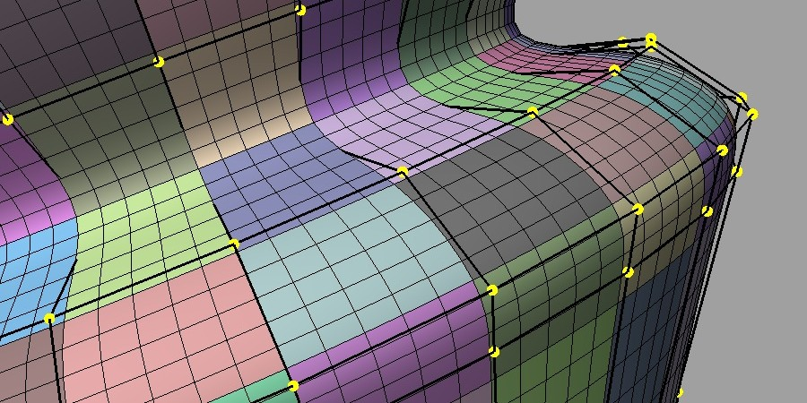

..
     Copyright 2022 Pixar

     Licensed under the Apache License, Version 2.0 (the "Apache License")
     with the following modification; you may not use this file except in
     compliance with the Apache License and the following modification to it:
     Section 6. Trademarks. is deleted and replaced with:

     6. Trademarks. This License does not grant permission to use the trade
        names, trademarks, service marks, or product names of the Licensor
        and its affiliates, except as required to comply with Section 4(c) of
        the License and to reproduce the content of the NOTICE file.

     You may obtain a copy of the Apache License at

         http://www.apache.org/licenses/LICENSE-2.0

     Unless required by applicable law or agreed to in writing, software
     distributed under the Apache License with the above modification is
     distributed on an "AS IS" BASIS, WITHOUT WARRANTIES OR CONDITIONS OF ANY
     KIND, either express or implied. See the Apache License for the specific
     language governing permissions and limitations under the Apache License.

Overview of Release 3.5
=======================

.. contents::
   :local:
   :backlinks: none

New Features
------------

Simplified Surface Evaluation
~~~~~~~~~~~~~~~~~~~~~~~~~~~~~
The new *Bfr* interface provides an alternative to *Far* and *Osd* for
evaluating the limit surface -- treating a subdivision mesh as a
`piecewise parameteric surface primitive
<subdivision_surfaces.html#piecewise-parametric-surfaces>`__.

The *Bfr* interface is named for *Base Face Representation* as all
concepts and classes relate to the individual faces of the original
unrefined mesh, i.e. its "base faces". Each base face has a piece of
limit surface associated with it (*Bfr::Surface*) that is parameterized
(*Bfr::Parameterization*) and so can be evaluated and tessellated:

The limit surface for each face can be identified and evaluated
independently of any other faces without any global pre-processing of
a connected mesh. The resulting evaluation interface is much simpler, more
flexible and more scalable than those assembled with the table-based
class in *Far* -- providing a preferable alternative for many CPU-based
use cases (though not all).

See the `Bfr Overview <bfr_overview.html>`__ documentation for more
details.

Tessellation Patterns
~~~~~~~~~~~~~~~~~~~~~
In addition to evaluation, the *Bfr* interface includes a *Tessellation*
class that provides tessellation patterns for all faces of a base mesh.
A *Tessellation* does not encapsulate the entire tessellation process but
simply provides topological patterns to assemble such a process.

All faces of a mesh have a *Parameterization* which can be used to define
a *Tessellation* with the specification of one or more tessellation rates.
A single tessellation rate defines simple uniform tessellations:

+-------------------------------------------+-------------------------------------------+-------------------------------------------+
| .. image:: images/bfr_tess_quad_tris.png  | .. image:: images/bfr_tess_pent_tris.png  | .. image:: images/bfr_tess_uni_tri_5.png  |
|    :align:  center                        |    :align:  center                        |    :align:  center                        |
|    :width:  100%                          |    :width:  100%                          |    :width:  100%                          |
|    :target: images/bfr_tess_quad_tris.png |    :target: images/bfr_tess_pent_tris.png |    :target: images/bfr_tess_uni_tri_5.png |
+-------------------------------------------+-------------------------------------------+-------------------------------------------+

while tessellation rates for each edge provide more complex non-uniform
patterns:

+-----------------------------------------------+-----------------------------------------------+-----------------------------------------------+
| .. image:: images/bfr_tess_nonuni_quad_A.png  | .. image:: images/bfr_tess_nonuni_pent_A.png  | .. image:: images/bfr_tess_nonuni_tri_A.png   |
|    :align:  center                            |    :align:  center                            |    :align:  center                            |
|    :width:  100%                              |    :width:  100%                              |    :width:  100%                              |
|    :target: images/bfr_tess_nonuni_quad_A.png |    :target: images/bfr_tess_nonuni_pent_A.png |    :target: images/bfr_tess_nonuni_tri_A.png  |
+-----------------------------------------------+-----------------------------------------------+-----------------------------------------------+

A small set of options is also available to define the resulting patterns
(e.g. the preservation of quad faces with quad-based subdivision schemes
(*above left and center*)) and to generate its output in a more favorable
form.

Tessellation patterns do not support the full flexibility of typical
hardware tessellation (e.g. no fractional tessellation) but do provide
some useful alternatives to hardware tessellation (e.g. the quad
preservation previously noted, and more uniform triangles for triangular
patches (*above right*)).

The *Tessellation* class is also completely independent of evaluation
in *Bfr*, and so can be used with any other evaluation interface.

See the `Tessellation <bfr_overview.html#bfr-navlink-tessellation>`__
subsection of the *Bfr Overview* for more details.

API Additions
-------------

See associated `Doxygen <doxy_html/index.html>`__ for full details.

New classes in namespace Bfr
~~~~~~~~~~~~~~~~~~~~~~~~~~~~
    - class Parameterization
    - class Surface
    - class SurfaceFactory
    - class SurfaceFactoryCache
    - class SurfaceFactoryMeshAdapter
    - class RefinerSurfaceFactory
    - class Tessellation

Additions to Far::TopologyLevel
~~~~~~~~~~~~~~~~~~~~~~~~~~~~~~~
    - TopologyLevel::IsVertexCorner()
    - TopologyLevel::IsVertexRegular()
    - TopologyLevel::IsVertexInfSharp()
    - TopologyLevel::IsVertexSemiSharp()
    - TopologyLevel::IsEdgeInfSharp()
    - TopologyLevel::IsEdgeSemiSharp()

Additions to nested Options classes in Far
~~~~~~~~~~~~~~~~~~~~~~~~~~~~~~~~~~~~~~~~~~
    - PatchTableFactory::Options::SetMaxIsolationLevel()
    - TopologyRefiner::UniformOptions::SetRefinementLevel()
    - TopologyRefiner::AdaptiveOptions::SetMaxIsolationLevel()
    - TopologyRefiner::AdaptiveOptions::SetMaxSecondaryLevel()

Other Changes
-------------

Deprecation Announcements
~~~~~~~~~~~~~~~~~~~~~~~~~
    - Hbr is deprecated and will be removed from subsequent releases

Improvements
~~~~~~~~~~~~
    - Suppression of GCC compiler warnings (GitHub #1253, #1254, #1270)
    - Additional methods for Far::TopologyLevel (GitHub #1227, #1255)
    - Improved mixed partial derivative at Gregory patch corners (GitHub #1252)
    - Minor improvements to Far tutorials (GitHub #1226, #1241)
    - Added CMake config (GitHub #1242)
    - Updated CMake minimum version to 3.12 (GitHub #1237, #1261)
    - Updated documentation build scripts for Python 3 (#1265, #1266)
    - Updated 'stringify' build tool for improved cross compilation support
      (GitHub #1267)
    - Added 'NO_MACOS_FRAMEWORKS' build option (GitHub #1238)
    - Updated Azure pipelines agents for Unbuntu and macOS (GitHub #1247, #1256)
    - Removed obsolete AppVeyor and Travis CI scripts (GitHub #1259)

Bug Fixes
~~~~~~~~~
    - Cache active program for Osd::GLComputeEvaluator (GitHub #1244)
    - Fixed member initialization warnings in Osd::D3D11ComputeEvaluator
      (GitHub #1239)
    - Fixed GLSL shader source to remove storage qualifiers from struct members
      (GitHub #1271)
    - Fixed use of CMake variables for Apple builds (GitHub #1235)
    - Fixed build errors when using OpenGL without GLFW (GitHub #1257)
    - Fixed links to embedded videos (GitHub #1231)
