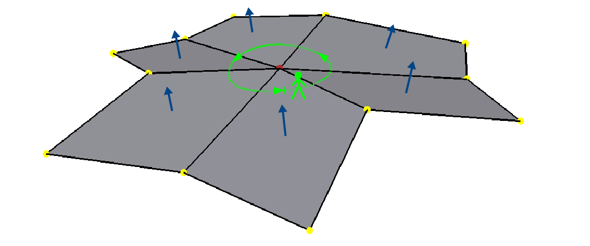
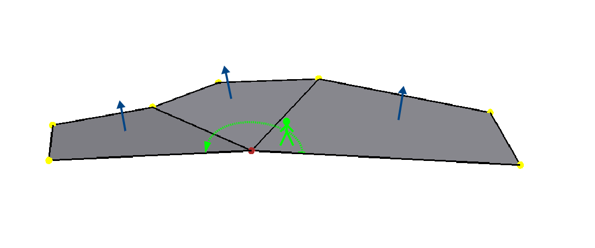
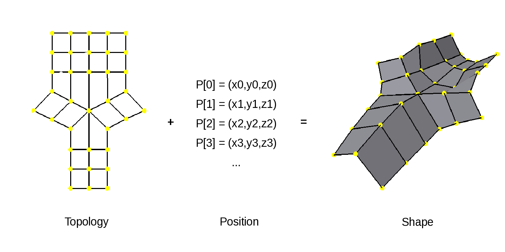
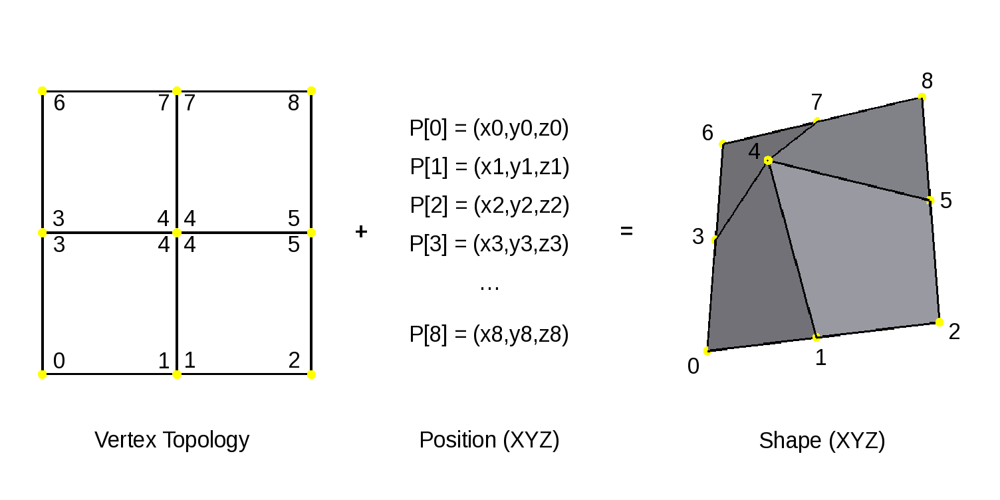
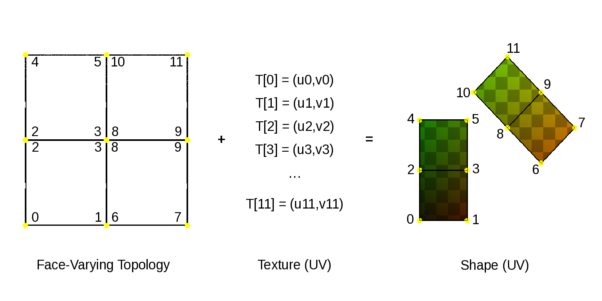
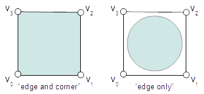
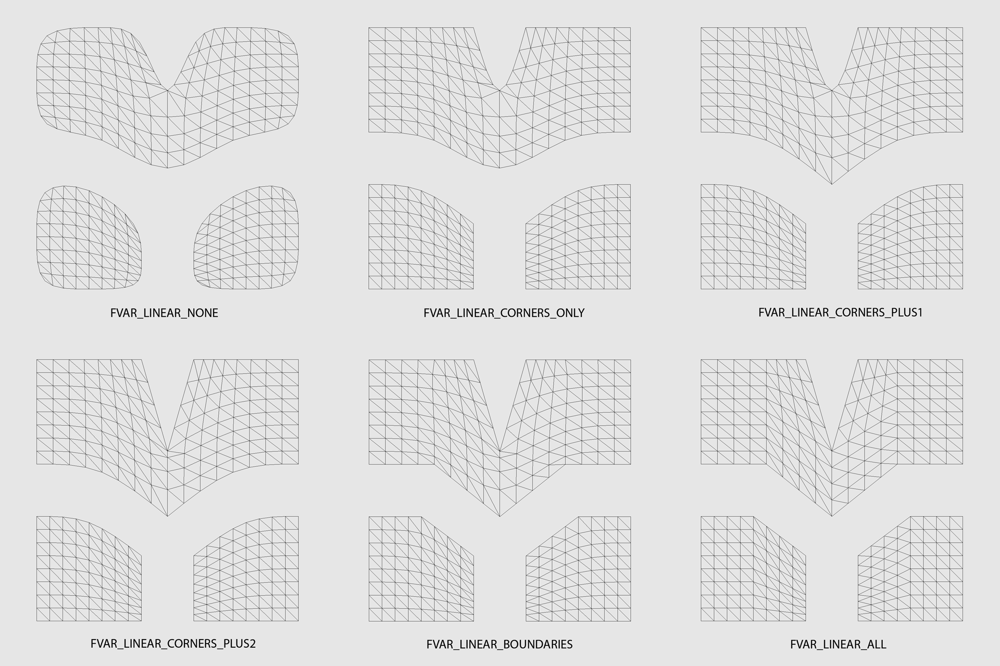
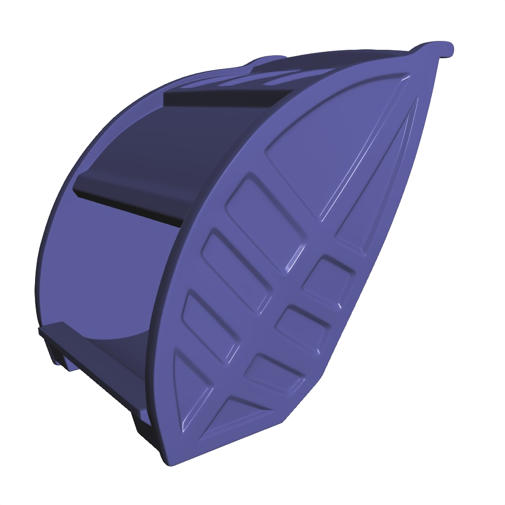
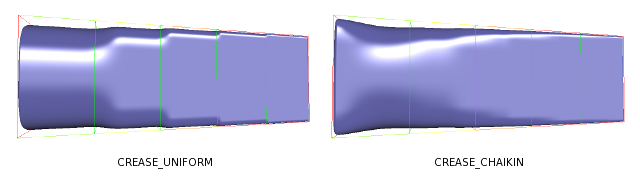
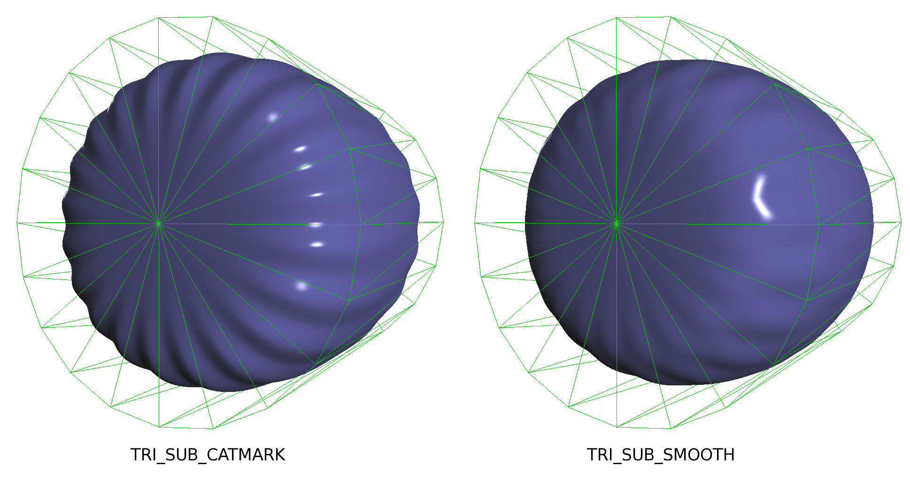

..
     Copyright 2013 Pixar

     Licensed under the Apache License, Version 2.0 (the "Apache License")
     with the following modification; you may not use this file except in
     compliance with the Apache License and the following modification to it:
     Section 6. Trademarks. is deleted and replaced with:

     6. Trademarks. This License does not grant permission to use the trade
        names, trademarks, service marks, or product names of the Licensor
        and its affiliates, except as required to comply with Section 4(c) of
        the License and to reproduce the content of the NOTICE file.

     You may obtain a copy of the Apache License at

         http://www.apache.org/licenses/LICENSE-2.0

     Unless required by applicable law or agreed to in writing, software
     distributed under the Apache License with the above modification is
     distributed on an "AS IS" BASIS, WITHOUT WARRANTIES OR CONDITIONS OF ANY
     KIND, either express or implied. See the Apache License for the specific
     language governing permissions and limitations under the Apache License.

Subdivision Surfaces
--------------------

.. contents::
   :local:
   :backlinks: none

----

Overview
========

Subdivision surfaces are a common modeling primitive that has gained popularity in
animation and visual effects over the past decades.

.. raw:: html

    

      

        
        
        
        
      

    

As the name suggests, subdivision surfaces are fundamentally *surfaces*.

More specifically, subdivision surfaces are *piecewise parametric surfaces* defined over
meshes of *arbitrary topology* -- both concepts that will be described in the sections
that follow.

Subdivision is both an operation that can be applied to a polygonal mesh to refine it, and
a mathematical tool that defines the underlying smooth surface to which repeated subdivision
of the mesh converges.  Explicit subdivision is simple to apply some number of
times to provide a smoother mesh, and that simplicity has historically lead to many tools
representing the shape this way.  In contrast, deriving the smooth surface that ultimately
defines the shape -- its "limit surface" -- is considerably more complex but provides greater
accuracy and flexibility.  These differences have led to confusion in how some tools
expose subdivision surfaces.

The ultimate goal is to have all tools use subdivision surfaces as true surface primitives.
The focus here is therefore less on subdivision and more on the nature
of the surface that results from it.  In addition to providing a consistent implementation of
subdivision -- one that includes a number of widely used feature extensions -- a significant
value of OpenSubdiv is that it makes the limit surface more accessible.

Since its introduction, OpenSubdiv has received interest from users and developers
with a wide variety of skills, interests and backgrounds.  This document is
intended to present subdivision surfaces from a perspective helpful in making use
of OpenSubdiv.  One purpose it serves is to provide a high level overview for those
with less experience with the algorithms or mathematics of subdivision.  The other
is to provide an overview of the feature set available with OpenSubdiv, and to
introduce those capabilities with the terminology used by OpenSubdiv (as much of it
is overloaded).

----

Piecewise Parametric Surfaces
=============================

Piecewise parametric surfaces are arguably the most widely used geometric representation
in industrial design, entertainment and many other areas.  Many of the objects we deal
with everyday -- cars, mobile phones, laptops -- were all designed and visualized first
as piecewise parametric surfaces before those designs were approved and pursued.

Piecewise parametric surfaces are ultimately just collections of simpler modeling primitives
referred to as patches.  Patches constitute the "pieces" of the larger surface in much the
same way as a face or polygon constitutes a piece of a polygonal mesh.

----

Parametric Patches
******************

Patches are the building blocks of piecewise smooth surfaces, and many different kinds of
patches have evolved to meet the needs of geometric modeling.  Two of the more effective
and common patches are illustrated below:

+--------------------------------------+--------------------------------------+
| .. image:: images/patch_bspline.jpg  | .. image:: images/patch_bezier.jpg   |
|    :align:  center                   |    :align:  center                   |
|    :width:  95%                      |    :width:  95%                      |
|    :target: images/patch_bspline.jpg |    :target: images/patch_bezier.jpg  |
|                                      |                                      |
| Single bicubic B-Spline patch        | Single bicubic Bezier patch          |
+--------------------------------------+--------------------------------------+

Patches consist of a set of points or vertices that affect a rectangular piece of smooth
surface (triangular patches also exist).  That rectangle is "parameterized" in its two
directions, transforming a simple 2D rectangle into the 3D surface:

+--------------------------------------+--------------------------------------+
| .. image:: images/param_uv.png       | .. image:: images/param_uv2xyz.png   |
|    :align:  center                   |    :align:  center                   |
|    :width:  80%                      |    :width:  80%                      |
|    :target: images/param_uv.png      |    :target: images/param_uv2xyz.png  |
|                                      |                                      |
| (u,v) 2D domain of a patch           | Mapping from (u,v) to (x,y,z)        |
+--------------------------------------+--------------------------------------+

The points that control the shape of the surface are usually referred to as control
points or control vertices, and the collection of the entire set defining a patch as
the control mesh, the control hull, the control cage or simply the hull, the cage,
etc.  For the sake of brevity we will frequently use the term "cage", which serves us
more generally later.

So a patch essentially consist of two entities:  its control points and the surface
affected by them.

The way the control points affect the surface is what makes the different types of
patches unique.  Even patches defined by the same number of points can have different
behavior.  Note that all 16 points of the B-Spline patch above are relatively far from
the surface they define compared to the similar Bezier patch.  The two patches in
that example actually represent exactly the same piece of surface -- each with a set
of control points having different effects on it.  In mathematical terms, each control
point has a "basis function" associated with it that affects the surface in a particular
way when only that point is moved:

+--------------------------------------+--------------------------------------+
| .. image:: images/basis_bspline.jpg  | .. image:: images/basis_bezier.jpg   |
|    :align:  center                   |    :align:  center                   |
|    :width:  80%                      |    :width:  80%                      |
|    :target: images/basis_bspline.jpg |    :target: images/basis_bezier.jpg  |
|                                      |                                      |
| Bicubic B-Spline basis function      | Bicubic Bezier basis funciton        |
+--------------------------------------+--------------------------------------+

It is these basis functions that often give rise to the names of the different patches.

There are pros and cons to these different properties of the control points of patches,
which become more apparent as we assemble patches into piecewise surfaces.

----

Piecewise Surfaces
******************

Piecewise parametric surfaces are collections of patches.

For rectangular patches, one of the simplest ways to construct a collection is to define
a set of patches using a rectangular grid of control points:

+----------------------------------------+----------------------------------------+
| .. image:: images/surface_bspline.jpg  | .. image:: images/surface_bezier.jpg   |
|    :align:  center                     |    :align:  center                     |
|    :width:  95%                        |    :width:  95%                        |
|    :target: images/surface_bspline.jpg |    :target: images/surface_bezier.jpg  |
|                                        |                                        |
| Piecewise B-Spline surface             | Piecewise Bezier surface               |
+----------------------------------------+----------------------------------------+

Note that we can overlap the points of adjacent B-spline patches.  This overlapping
means that moving one control point affects multiple patches -- but it also ensures
that those patches always meet smoothly (this was a design intention and not true
for other patch types).  Adjacent Bezier patches only share points at their boundaries
and coordinating the points across those boundaries to keep the surface smooth is
possible, but awkward.  This makes B-splines a more favorable surface representation
for interactive modeling, but Bezier patches serve many other useful purposes.

A more complicated B-spline surface:

+------------------------------------------------+
| .. image:: images/surface_bspline_complex.jpg  |
|    :align:  center                             |
|    :width:  95%                                |
|    :target: images/surface_bspline_complex.jpg |
|                                                |
| Part of a more complicated B-Spline surface    |
+------------------------------------------------+

Just as a patch consisted of a cage and a surface, the same is now true of the
collection.  The control cage is manipulated by a designer and the surface of each
of the patches involved is displayed so they can assess its effect.

----

Arbitrary Topology
==================

Piecewise surfaces discussed thus far have been restricted to collections of patches
over regular grids of control points.  There is a certain simplicity with rectangular
parametric surfaces that is appealing, but a surface representation that supports
arbitrary topology has many other advantages.

Rectangular parametric surfaces gained widespread adoption despite their topological
limitations, and their popularity continues today in some areas.  Complex objects often
need many such surfaces to represent them and a variety of techniques have evolved to
assemble them effectively, including "stitching" multiple surfaces together or cutting
holes into them ("trimming").  These are complicated techniques, and while effective in
some contexts (e.g. industrial design) they become cumbersome in others (e.g. animation
and visual effects).

A single polygonal mesh can represent shapes with far more complexity than a single
rectangular piecewise surface, but its faceted nature eventually becomes a problem.

Subdivision surfaces combine the topological flexibility of polygonal meshes with the
underlying smoothness of piecewise parametric surfaces.  Just as rectangular piecewise
parametric surfaces have a collection of control points (its cage stored as a grid)
and an underlying surface, subdivision surfaces also have a collection of control points
(its cage stored as a mesh) and an underlying surface (often referred as its "limit
surface").

----

Regular versus Irregular Features
*********************************

A mesh contains the vertices and faces that form the cage for the underlying
surface, and the topology of that mesh can be arbitrarily complex.

In areas where the faces and vertices of the mesh are connected to form rectangular
grids, the limit surface becomes one of the rectangular piecewise parametric
surfaces previously mentioned.  These regions of the mesh are said to be "regular":
they provide behavior familiar from the use of similar rectangular surfaces and
their limit surface is relatively simple to deal with.  All other areas are
considered "irregular": they provide the desired topological flexibility and so
are less familiar (and less predictable in some cases) and their limit surface
can be much more complicated.

Irregular features come in a number of forms.  The most widely referred to is
an extra-ordinary vertex, i.e. a vertex which, in the case of a quad subdivision
scheme like Catmull-Clark, does not have four incident faces.

+-------------------------------------+-------------------------------------+
| .. image:: images/val6_cage.jpg     | .. image:: images/val6_surface.jpg  |
|    :align:  center                  |    :align:  center                  |
|    :width:  95%                     |    :width:  95%                     |
|    :target: images/val6_cage.jpg    |    :target: images/val6_surface.jpg |
|                                     |                                     |
| Irregular vertex and incident       | Regular and irregular regions of    |
| faces                               | the surface                         |
+-------------------------------------+-------------------------------------+

The presence of these irregular features makes the limit surface around them
similarly irregular, i.e. it cannot be represented as simply as it can for regular
regions.

.. Explicit target to preserve external links:
.. _feature-adaptive-subdivision:

It's worth noting that irregular regions shrink in size and become more "isolated"
as subdivision is applied.  A face with a lot of extra-ordinary vertices around it
makes for a very complicated surface, and isolating these features is a way to
help deal with that complexity:

+--------------------------------------+--------------------------------------+--------------------------------------+
| .. image:: images/val5_iso_cage.jpg  | .. image:: images/val5_iso_sub1.jpg  | .. image:: images/val5_iso_sub2.jpg  |
|    :align:  center                   |    :align:  center                   |    :align:  center                   |
|    :width:  95%                      |    :width:  95%                      |    :width:  95%                      |
|    :target: images/val5_iso_cage.jpg |    :target: images/val5_iso_sub1.jpg |    :target: images/val5_iso_sub2.jpg |
|                                      |                                      |                                      |
| Two valence-5 vertices nearby        | Isolation subdivided once            | Isolation subdivided twice           |
+--------------------------------------+--------------------------------------+--------------------------------------+

It's generally necessary to perform some kind of local subdivision in these areas
to break these pieces of surface into smaller, more manageable pieces, and the
term "feature adaptive subdivision" has become popular in recent years to describe
this process.  Whether this is done explicitly or implicitly, globally or locally,
what matters most is that there is an underlying piece of limit surface for each
face -- albeit a potentially complicated one at an irregular feature -- that can
be evaluated in much the same way as rectangular piecewise surfaces.

+---------------------------------------+---------------------------------------+
| .. image:: images/val6_regular.jpg    | .. image:: images/val6_irregular.jpg  |
|    :align:  center                    |    :align:  center                    |
|    :width:  95%                       |    :width:  95%                       |
|    :target: images/val6_regular.jpg   |    :target: images/val6_irregular.jpg |
|                                       |                                       |
| Patches of the regular regions        | Patches of the irregular region       |
+---------------------------------------+---------------------------------------+

While supporting a smooth surface in these irregular areas is the main advantage
of subdivision surfaces, both the complexity of the resulting surfaces and their
quality are reasons to use them with care.  When the topology is largely irregular,
there is a higher cost associated with its surface, so minimizing irregularities
is advantageous.  And in some cases the surface quality, i.e. the perceived
smoothness, of the irregular surfaces can lead to undesirable artefacts.

An arbitrary polygonal mesh will often not make a good subdivision cage, regardless
of how good that polygonal mesh appears.

As with rectangular piecewise parametric surfaces, the cage should be shaped to
affect the underlying surface it is intended to represent.  See
`Modeling Tips <mod_notes.html>`__ for related recommendations.

----

Non-manifold Topology
*********************

Since the cage of a subdivision surface is stored in a mesh, and often
manipulated in the same context as polygonal meshes, the topic of manifold
versus non-manifold topology warrants some attention.

There are many definitions or descriptions of what distinguishes a manifold
mesh from one that is not.
These range from concise but abstract mathematical definitions to sets of
examples showing manifold and non-manifold meshes -- all have their value
and an appropriate audience.
The following is not a strict definition but serves
well to illustrate most local topological configurations that cause a mesh
to be non-manifold.

Consider "standing" on the faces of a mesh and "walking" around each vertex
in turn.  Assuming a right-hand winding order of faces, stand on the side of
the face in the positive normal direction. And when walking, step across each
incident edge in a counter-clockwise direction to the next incident face.

For an interior vertex:

* start at the corner of any incident face
* walk around the vertex across each incident edge to the next unvisited face; repeat
* if you arrive back where you started and any incident faces or edges were not visited,
  the mesh is non-manifold

Similarly, for a boundary vertex:

* start at the corner of the face containing the leading boundary edge
* walk around the vertex across each incident edge to the next unvisited face; repeat
* if you arrive at another boundary edge and any incident faces or edges were not visited,
  the mesh is non-manifold

If you can walk around all vertices this way and don't encounter any non-manifold
features, the mesh is likely manifold.

Obviously if a vertex has no faces,
there is nothing to walk around and this test can't succeed, so it is again
non-manifold.  All of the faces around a vertex should also be in the same
orientation, otherwise two adjacent faces have normals in opposite directions
and the mesh will be considered non-manifold, so we should really include that
constraint when stepping to the next face to be more strict.

Consider walking around the indicated vertices of the following non-manifold meshes:

+-----------------------------------------+-----------------------------------------+
| .. image:: images/nonman_fan_cage.jpg   | .. image:: images/nonman_vert_cage.jpg  |
|    :align:  center                      |    :align:  center                      |
|    :width:  95%                         |    :width:  95%                         |
|    :target: images/nonman_fan_cage.jpg  |    :target: images/nonman_vert_cage.jpg |
|                                         |                                         |
| Edges with > 2 incident faces           | Faces sharing a vertex but no edges     |
+-----------------------------------------+-----------------------------------------+

As mentioned earlier, many tools do not support non-manifold meshes, and in
some contexts, e.g. 3D printing, they should be strictly avoided.  Sometimes
a manifold mesh may be desired and enforced as an end result, but the mesh
may temporarily become non-manifold due to a particular sequence of modeling
operations.

Rather than supporting or advocating the use of non-manifold meshes, OpenSubdiv
strives to be robust in the presence of non-manifold features to simplify the
usage of its clients -- sparing them the need for topological analysis to
determine when OpenSubdiv can or cannot be used.  Although subdivision rules
are not as well standardized in areas where the mesh is not manifold, OpenSubdiv
provides simple rules and a reasonable limit surface in most cases.

+--------------------------------------------+--------------------------------------------+
| .. image:: images/nonman_fan_surface.jpg   | .. image:: images/nonman_vert_surface.jpg  |
|    :align:  center                         |    :align:  center                         |
|    :width:  95%                            |    :width:  95%                            |
|    :target: images/nonman_fan_surface.jpg  |    :target: images/nonman_vert_surface.jpg |
|                                            |                                            |
| Surface around edges with > 2 incident     | Surface for faces sharing a vertex but no  |
| faces                                      | edges                                      |
+--------------------------------------------+--------------------------------------------+

As with the case of regular versus irregular features, since every face has a
corresponding piece of surface associated with it -- whether locally manifold or
not -- the term "arbitrary topology" can be said to include non-manifold topology.

----

Subdivision versus Tessellation
===============================

The preceding sections illustrate subdivision surfaces as piecewise parametric surfaces of
arbitrary topology.  As piecewise parametric surfaces, they consist of a cage and the
underlying surface defined by that cage.

Two techniques used to display subdivision surfaces are subdivision and tessellation.
Both have their legitimate uses, but there is an important distinction between them:

  * **subdivision** operates on a **cage** and produces a refined **cage**
  * **tessellation** operates on a **surface** and produces a discretization of that **surface**

The existence and relative simplicity of the subdivision algorithm makes it easy to
apply repeatedly to approximate the shape of the surface, but with the result being
a refined cage, that approximation is not always very accurate.  When compared to a
cage refined to a different level, or a tessellation that uses points evaluated directly
on the limit surface, the discrepancies can be confusing.

Subdivision
***********

Subdivision is the process that gives "subdivision surfaces" their name, but it is not
unique to them.  Being piecewise parametric surfaces, let's first look at subdivision in
the context of the simpler parametric patches that comprise them.

Subdivision is a special case of *refinement*, which is key to the success of some of the
most widely used types of parametric patches and their aggregate surfaces.  A surface can
be "refined" when an algorithm exists such that more control points can be introduced
*while keeping the shape of the surface exactly the same*.  For interactive and design
purposes, this allows a designer to introduce more resolution for finer control without
introducing undesired side effects in the shape.  For more analytical purposes, it allows
the surface to be broken into pieces, often adaptively, while being faithful to the
original shape.

One reason why both B-spline and Bezier patches are so widely used is that both of them
can be refined.  Uniform subdivision -- the process of splitting each of the patches
in one or both of its directions -- is a special case of refinement that both of
these patch types support:

+---------------------------------------------+---------------------------------------------+---------------------------------------------+
| .. image:: images/surface_bspline_cage.jpg  | .. image:: images/surface_bspline_sub1.jpg  | .. image:: images/surface_bspline_sub2.jpg  |
|    :align:  center                          |    :align:  center                          |    :align:  center                          |
|    :width:  95%                             |    :width:  95%                             |    :width:  95%                             |
|    :target: images/surface_bspline_cage.jpg |    :target: images/surface_bspline_sub1.jpg |    :target: images/surface_bspline_sub2.jpg |
|                                             |                                             |                                             |
| B-Spline surface and its cage               | Cage subdivided 1x                          | Cage subdivided 2x                          |
+---------------------------------------------+---------------------------------------------+---------------------------------------------+

In the cases illustrated above for B-Splines, the uniformly refined cages produce the same
limit surface as the original (granted in more pieces).  So it is fair to say that both
uniform B-splines and Bezier surfaces are subdivision surfaces.

The limit surface remains the same with the many more control points (roughly 4x with each
iteration of subdivision), and those points are closer to (but not on) the surface.  It
may be tempting to use these new control points to represent the surface, but using the same
number of points evaluated at corresponding uniformly spaced parametric locations on the
surface is usually simpler and more effective.

Note also that points of the cage typically do not have any normal vectors associated with
them, though we can evaluate normals explicitly for arbitrary locations on the surface just
as we do for position.  So if displaying a cage as a shaded surface, normal vectors at each
of the control points must be contrived.  Both the positions and normals of the points on
the finer cage are therefore both approximations.

For more general subdivision surfaces, the same is true.  Subdivision will refine a mesh of
arbitrary topology, but the resulting points will not lie on the limit surface and any normal
vectors contrived from and associated with these points will only be approximations to those
of the limit surface.

Tessellation
************

There is little need to use subdivision to approximate a parametric surface when it can be
computed directly, i.e. it can be tessellated.  We can evaluate at arbitrary locations on the
surface and connect the resulting points to form a tessellation -- a discretization of the
limit surface -- that is far more flexible than the results achieved from  uniform subdivision:

+----------------------------------------------+----------------------------------------------+
| .. image:: images/surface_bspline_tess1.jpg  | .. image:: images/surface_bspline_tess2.jpg  |
|    :align:  center                           |    :align:  center                           |
|    :width:  95%                              |    :width:  95%                              |
|    :target: images/surface_bspline_tess1.jpg |    :target: images/surface_bspline_tess2.jpg |
|                                              |                                              |
| Uniform (3x3) tessellation of B-spline       | Curvature-adaptive tessellation of B-spline  |
| surface                                      | surface                                      |
+----------------------------------------------+----------------------------------------------+

For a simple parametric surface, the direct evaluation of the limit surface is also simple,
but for more complicated subdivision surfaces of arbitrary topology, this is less the case.
The lack of a clear understanding of the relationship between the limit surface and the
cage has historically lead to many applications avoiding tessellation.

It's worth mentioning that subdivision can be used to generate a tessellation even when the
limit surface is not available for direct evaluation.  The recursive nature of subdivision
does give rise to formulae that allow a point on the limit surface to be computed that
corresponds to each point of the cage.  This process is often referred to as "snapping"
or "pushing" the points of the cage onto the limit surface.

+--------------------------------------------+--------------------------------------------+
| .. image:: images/tess_snap1.jpg           | .. image:: images/tess_snap2.jpg           |
|    :align:  center                         |    :align:  center                         |
|    :width:  95%                            |    :width:  95%                            |
|    :target: images/tess_snap1.jpg          |    :target: images/tess_snap2.jpg          |
|                                            |                                            |
| Subdivided 1x and snapped to limit surface | Subdivided 2x and snapped to limit surface |
+--------------------------------------------+--------------------------------------------+

Since the end result is a
connected set of points on the limit surface, this forms a tessellation of the limit
surface, and we consider it a separate process to subdivision (though it does make use
of it).  The fact that such a tessellation might have been achieved using subdivision is
indistinguishable from the final result -- the same tessellation might just as easily have
been generated by evaluating limit patches of the cage uniformly 2x, 4x, 8x, etc. along
each edge.

Which to Use?
*************

Subdivision is undeniably useful in creating finer cages to manipulate the surface,
but tessellation is preferred for displaying the surface when the patches are available
for direct evaluation.  There was a time when global refinement was pursued in limited
circles as a way of rapidly evaluating parametric surfaces along isoparametric lines,
but patch evaluation, i.e. tessellation, generally prevails.

Considerable confusion has arisen due the way the two techniques have been employed and
presented when displaying the shape in end-user applications.  One can argue that if an
application displays a representation of the surface that is satisfactory for its
purposes, then it is not necessary to burden the user with additional terminology and
choices.  But when two representations of the same surface differ considerably between
two applications, the lack of any explanation or control leads to confusion.

As long as applications make different choices on how to display the surface, we seek a
balance between simplicity and control.  Since subdivided points do not lie on the limit
surface, it is important to make it clear to users when subdivision is being used instead
of tessellation.  This is particularly true in applications where the cage and the
surface are displayed in the same style as there is no visual cue for users to make that
distinction.

----

Mesh Data and Topology
======================

The ability of subdivision surfaces to support arbitrary topology leads to the use of
meshes to store both the topology of the cage and the data values associated with its
control points, i.e. its vertices.  The shape of a mesh, or the subdivision surface
that results from it, is a combination of the topology of the mesh and the position
data associated with its vertices.

When dealing with meshes there are advantages to separating the topology from the data,
and this is even more important when dealing with subdivision surfaces.  The "shape"
referred to above is not just the shape of the mesh (the cage in this case) but could
be the shape of a refined cage or the limit surface.  By observing the roles that both
the data and topology play in operations such as subdivision and evaluation, significant
advantages can be gained by managing data, topology and the associated computations
accordingly.

While the main purpose of subdivision surfaces is to use position data associated with
the vertices to define a smooth, continuous limit surface, there are many cases where
non-positional data is associated with a mesh.  That data may often be interpolated
smoothly like position, but often it is preferred to interpolate it linearly or even
make it discontinuous along edges of the mesh.  Texture coordinates and color are common
examples here.

Other than position, which is assigned to and associated with vertices, there are no
constraints on how arbitrary data can or should be associated or interpolated.  Texture
coordinates, for example, can be assigned to create a completely smooth limit surface
like the position, linearly interpolated across faces, or even made discontinuous between
them.  There are, however, consequences to consider -- both in terms of data management
and performance -- which are described below as the terminology and techniques used to
achieve each are defined.

----

Separating Data from Topology
*****************************

While the topology of meshes used to store subdivision surfaces is arbitrarily complex
and variable, the topology of the parametric patches that make up its limit surface are
simple and fixed.  Bicubic B-Spline and Bezier patches are both defined by a simple 4x4
grid of control points and a set of basis functions for each point that collectively
form the resulting surface.

For such a patch, the position at a given parametric location is the result of the
combination of position data associated with its control points and the weights of the
corresponding basis functions (*weights* being the values of basis functions evaluated
at a parametric location).  The topology and the basis functions remain the same, so we
can make use of the weights independent of the data.  If the positions of the control
points change, we can simply recombine the new position data with the weights that we
just used and apply the same combination.

+----------------------------------------+----------------------------------------+----------------------------------------+
| .. image:: images/data_patch_top.png   | .. image:: images/data_patch_1.jpg     | .. image:: images/data_patch_2.jpg     |
|    :align:  center                     |    :align:  center                     |    :align:  center                     |
|    :width:  70%                        |    :width:  95%                        |    :width:  95%                        |
|    :target: images/data_patch_top.png  |    :target: images/data_patch_1.jpg    |    :target: images/data_patch_2.jpg    |
+----------------------------------------+----------------------------------------+----------------------------------------+
| The fixed topology of a parametric patch and two shapes resulting from two sets of positions.                            |
+----------------------------------------+----------------------------------------+----------------------------------------+

Similarly, for a piecewise surface, the position at a given parametric location is the
result of the single patch containing that parametric location evaluated at the given
position.  The control points involved are the subset of control points associated with
that particular patch.  If the topology of the surface is fixed, so too is the topology
of the collection of patches that comprise that surface.  If the positions of those
control points change, we can recombine the new position data with the same weights for
the subset of points associated with the patch.

+----------------------------------------+----------------------------------------+----------------------------------------+
| .. image:: images/data_mesh_top.png    | .. image:: images/data_mesh_1.jpg      | .. image:: images/data_mesh_2.jpg      |
|    :align:  center                     |    :align:  center                     |    :align:  center                     |
|    :width:  70%                        |    :width:  95%                        |    :width:  95%                        |
|    :target: images/data_mesh_top.png   |    :target: images/data_mesh_1.jpg     |    :target: images/data_mesh_2.jpg     |
+----------------------------------------+----------------------------------------+----------------------------------------+
| More complex but fixed topology of a surface and two shapes resulting from two sets of positions.                        |
+----------------------------------------+----------------------------------------+----------------------------------------+

This holds for a piecewise surface of arbitrary topology.  Regardless of how complex
the topology, as long as it remains fixed (i.e. relationships between vertices, edges
and faces does not change (or anything other settings affecting subdivision rules)),
the same techniques apply.

This is just one example of the value of separating computations involving topology from
those involving the data.  Both subdivision and evaluation can be factored into steps
involving topology (computing the weights) and combining the data separately.

+---------------------------------------+---------------------------------------+---------------------------------------+
| .. image:: images/data_pose_1.jpg     | .. image:: images/data_pose_2.jpg     | .. image:: images/data_pose_3.jpg     |
|    :align:  center                    |    :align:  center                    |    :align:  center                    |
|    :width:  95%                       |    :width:  95%                       |    :width:  95%                       |
|    :target: images/data_pose_1.jpg    |    :target: images/data_pose_2.jpg    |    :target: images/data_pose_3.jpg    |
+---------------------------------------+---------------------------------------+---------------------------------------+
| Three shapes resulting from three sets of positions for a mesh of fixed topology.                                     |
+---------------------------------------+---------------------------------------+---------------------------------------+
    
When the topology is fixed, enormous savings are possible by pre-computing information
associated with the topology and organizing the data associated with the control points in
a way that can be efficiently combined with it.  This is key to understanding some of
the techniques used to process subdivision surfaces.

For a mesh of arbitrary topology, the control points of the underlying surface are the
vertices, and position data associated with them is most familiar.  But there is nothing
that requires that the control points of a patch have to represent position -- the same
techniques apply regardless of the type of data involved.

----

Vertex and Varying Data
***********************

The most typical and fundamental operation is to evaluate a position on the surface, i.e.
evaluate the underlying patches of the limit surface using the (x,y,z) positions at the
vertices of the mesh.  Given a parametric (u,v) location on one such patch, the data-independent
evaluation method first computes the weights and then combines the (x,y,z) vertex positions
resulting in an (x,y,z) position at that location.  But the weights and their combination
can be applied to any data at the vertices, e.g. color, texture coordinates or anything
else.

Data associated with the vertices that is interpolated this way, including position, is said
to be "vertex" data or to have "vertex" interpolation.  Specifying other data as "vertex"
data will result in it being smoothly interpolated in exactly the same way (using exactly the
same weights) as the position.  So to capture a simple 2D projection of the surface for
texture coordinates, 2D values matching the (x,y) of the positions would be used.

If linear interpolation of data associated with vertices is desired instead, the data is said
to be "varying" data or to have "varying" interpolation.  Here the non-linear evaluation of
the patches defining the smooth limit surface is ignored and weights for simple linear
interpolation are used.  This is a common choice for texture coordinates as evaluation of
texture without the need of bicubic patches is computationally cheaper.  The linear
interpolation will not capture the smoothness required of a true projection between the
vertices, but both vertex and varying interpolation have their uses.

+------------------------------------------+------------------------------------------+
| .. image:: images/data_vertex_uv.jpg     | .. image:: images/data_varying_uv.jpg    |
|    :align:  center                       |    :align:  center                       |
|    :width:  95%                          |    :width:  95%                          |
|    :target: images/data_vertex_uv.jpg    |    :target: images/data_varying_uv.jpg   |
|                                          |                                          |
| Projected texture smoothly interpolated  | Projected texture linearly interpolated  |
| from vertex data                         | from varying data                        |
+------------------------------------------+------------------------------------------+

Since both vertex and varying data is associated with vertices (a unique value assigned
to each), the resulting surface will be continuous -- piecewise smooth in the case of
vertex data and piecewise linear in the case of varying.

----

Face-Varying Data and Topology
******************************

In order to support discontinuities in data on the surface, unlike vertex and varying data,
there must be multiple values associated with vertices, edges and/or faces, in order for
a discontinuity to exist.

Discontinuities are made possible by assigning values to the corners of faces, similar
to the way in which vertices are assigned to the corners of faces when defining the
topology of the mesh.  Recalling the assignment of vertices to faces:

Vertex indices are assigned to all corners of each face as part of mesh construction and
are often referred to as the face-vertices of an individual face or the mesh.  All
face-vertices that share the same vertex index will be connected by that vertex and share
the same vertex data associated with it.

By assigning a different set of indices to the face-vertices -- indices not referring to
the vertices but some set of data to be associated with the corners of each face -- corners
that share the same vertex no longer need to share the same data value and the data can be
made discontinuous between faces:

This method of associating data values with the face-vertices of the mesh is said to be
assigning "face-varying" data for "face-varying" interpolation.  An interpolated value
will vary continuously within a face (i.e. the patch of the limit surface associated
with the face) but not necessarily across the edges or vertices shared with adjacent
faces.

+---------------------------------------------------------------+
| .. image:: images/data_fvar_xyz.jpg                           |
|    :align:  center                                            |
|    :width:  60%                                               |
|    :target: images/data_fvar_xyz.jpg                          |
|                                                               |
| Disjoint face-varying UV regions applied to the limit surface |
+---------------------------------------------------------------+

The combination of associating data values not with the vertices (the control points)
but the face corners, and the resulting data-dependent discontinuities that result,
make this a considerably more complicated approach than vertex or varying.  The added
complexity of the data alone is reason to only use it when necessary, i.e. when
discontinuities are desired and present.

Part of the complexity of dealing with face-varying data and interpolation is the way in
which the interpolation behavior can be defined.  Where the data is continuous, the
interpolation can be specified to be as smooth as the underlying limit surface of vertex
data or simply linear as achieved with varying data.
Where the data is discontinuous -- across interior edges and around vertices -- the
discontinuities create boundaries for the data, and partition the underlying surface into
disjoint regions.  The interpolation along these boundaries can also be specified as
smooth or linear in a number of ways (many of which have a historical basis).

A more complete description of the different linear interpolation options with face-varying
data and interpolation is given later.  These options make it possible to treat the data as
either vertex or varying, but with the added presence of discontinuities.

An essential point to remember with face-varying interpolation is that each set of data
is free to have its own discontinuities -- this leads to each data set having both unique
topology and size.

The topology specified for a collection of face-varying data is referred to as a
*channel* and is unique to face-varying interpolation.  Unlike vertex and varying
interpolation, which both associate a data value with a vertex, the number of values in
a face-varying channel is not fixed by the number of vertices or faces.  The number of
indices assigned to the face-corners will be the same for all channels, but the number
of unique values referred to by these indices may not.  We can take advantage of the
common mesh topology in areas where the data is continuous, but we lose some of those
advantages around the discontinuities.  This results in the higher complexity and cost
of a face-varying channel compared to vertex or varying data.  If the topology for a
channel is fixed, though, similar techniques can be applied to factor computation
related to the topology so that changes to the data can be processed efficiently.

----

Schemes and Options
===================

While previous sections have described subdivision surfaces in more general terms, this
section describes a number of common variations (often referred to as *extensions* to
the subdivision algorithms) and the ways that they are represented in OpenSubdiv.

The number and nature of the extensions here significantly complicate what are otherwise
fairly simple subdivision algorithms.  Historically applications have supported either a
subset or have had varying implementations of the same feature.  OpenSubdiv strives to
provide a consistent and efficient implementation of this feature set.

Given the varying presentations of some of these features elsewhere, the naming chosen
by OpenSubdiv is emphasized here.

Subdivision Schemes
*******************

OpenSubdiv provides two well known subdivision surface types -- Catmull-Clark (often referred
to more tersely as "Catmark") and Loop subdivision.  Catmull-Clark is more widely used and
suited to quad-dominant meshes, while Loop is preferred for (and requires) purely triangulated
meshes.

The many examples from previous sections have illustrated the more popular Catmull-Clark
scheme.  For an example of Loop:

+------------------------------------+------------------------------------+------------------------------------+------------------------------------+
| .. image:: images/loop_cage.jpg    | .. image:: images/loop_sub1.jpg    | .. image:: images/loop_sub2.jpg    | .. image:: images/loop_surface.jpg |
|    :align:  center                 |    :align:  center                 |    :align:  center                 |    :align:  center                 |
|    :width:  95%                    |    :width:  95%                    |    :width:  95%                    |    :width:  95%                    |
|    :target: images/loop_cage.jpg   |    :target: images/loop_sub1.jpg   |    :target: images/loop_sub2.jpg   |    :target: images/loop_surface.jpg|
+------------------------------------+------------------------------------+------------------------------------+------------------------------------+

----

Boundary Interpolation Rules
****************************

Boundary interpolation rules control how subdivision and the limit surface behave for faces
adjacent to boundary edges and vertices.

The following choices are available via the enumeration *Sdc::Options::VtxBoundaryInterpolation*:

+----------------------------------+----------------------------------------------------------+
| Mode                             | Behavior                                                 |
+==================================+==========================================================+
| **VTX_BOUNDARY_NONE**            | No boundary edge interpolation is applied by default;    |
|                                  | boundary faces are tagged as holes so that the boundary  |
|                                  | vertices continue to support the adjacent interior       |
|                                  | faces, but no surface corresponding to the boundary      |
|                                  | faces is generated; boundary faces can be selectively    |
|                                  | interpolated by sharpening all boundary edges incident   |
|                                  | the vertices of the face                                 |
+----------------------------------+----------------------------------------------------------+
| **VTX_BOUNDARY_EDGE_ONLY**       | A sequence of boundary vertices defines a smooth curve   |
|                                  | to which the limit surface along boundary faces extends  |
+----------------------------------+----------------------------------------------------------+
| **VTX_BOUNDARY_EDGE_AND_CORNER** | Similar to edge-only but the smooth curve resulting on   |
|                                  | the boundary is made to interpolate corner vertices      |
|                                  | (vertices with exactly one incident face)                |
+----------------------------------+----------------------------------------------------------+

On a grid example:

In practice, it is rare to use no boundary interpolation at all -- this feature has
its uses in allowing separate meshes to be seamlessly joined together by replicating
the vertices along boundaries, but these uses are limited.  Given the global nature
of the setting, it is usually preferable to explicitly make the boundary faces holes
in the areas where surfaces from separate meshes are joined, rather than sharpening
edges to interpolate the desired boundaries everywhere else.

The remaining "edge only" and "edge and corner" choices are then solely distinguished
by whether or not the surface at corner vertices is smooth or sharp.

----

Face-varying Interpolation Rules
********************************

Face-varying interpolation rules control how face-varying data is interpolated both in the
interior of face-varying regions (smooth or linear) and at the boundaries where it is
discontinuous (constrained to be linear or "pinned" in a number of ways).  Where the
topology is continuous and the interpolation chosen to be smooth, the behavior of
face-varying interpolation will match that of the vertex interpolation.

Choices for face-varying interpolation are most commonly available in the context of UVs
for texture coordinates and a number of names for such choices have evolved in different
applications over the years.  The choices offered by OpenSubdiv cover a wide range of popular
applications.  The feature is named face-varying *linear* interpolation -- rather than
*boundary* interpolation commonly used -- to emphasize that it can be applied
to the entire surface (not just boundaries) and that the effects are to make the surface
behave more linearly in various ways.

The following choices are available for the *Sdc::Options::FVarLinearInterpolation* enum --
the ordering here applying progressively more linear constraints:

+--------------------------------+-------------------------------------------------------------+
| Mode                           | Behavior                                                    |
+================================+=============================================================+
| **FVAR_LINEAR_NONE**           | smooth everywhere the mesh is smooth                        |
+--------------------------------+-------------------------------------------------------------+
| **FVAR_LINEAR_CORNERS_ONLY**   | linearly interpolate (sharpen or pin) corners only          |
+--------------------------------+-------------------------------------------------------------+
| **FVAR_LINEAR_CORNERS_PLUS1**  | CORNERS_ONLY + sharpening of junctions of 3 or more regions |
+--------------------------------+-------------------------------------------------------------+
| **FVAR_LINEAR_CORNERS_PLUS2**  | CORNERS_PLUS1 + sharpening of darts and concave corners     |
+--------------------------------+-------------------------------------------------------------+
| **FVAR_LINEAR_BOUNDARIES**     | linear interpolation along all boundary edges and corners   |
+--------------------------------+-------------------------------------------------------------+
| **FVAR_LINEAR_ALL**            | linear interpolation everywhere (boundaries and interior)   |
+--------------------------------+-------------------------------------------------------------+

These rules cannot make the interpolation of the face-varying data smoother than
that of the vertices.  The presence of sharp features of the mesh created by
sharpness values, boundary interpolation rules, or the subdivision scheme itself
(e.g. Bilinear) take precedence.

All face-varying interpolation modes illustrated in UV space using a simple 4x4
grid of quads segmented into three UV regions (their control point locations implied
by interpolation in the FVAR_LINEAR_ALL case):

(For those familiar, this shape and its assigned UV sets are available for inspection
in the "catmark_fvar_bound1" shape of OpenSubdiv's example and regression shapes.)

----

Semi-Sharp Creases
******************

Just as some types of parametric surfaces support additional shaping controls to
affect creasing along the boundaries between surface elements, OpenSubdiv provides
additional sharpness values or "weights" associated with edges and vertices to
achieve similar results over arbitrary topology.

Setting sharpness values to a maximum value (10 in this case -- a number chosen for
historical reasons) effectively modifies the subdivision rules so that the boundaries
between the piecewise smooth surfaces are infinitely sharp or discontinuous.

But since real world surfaces never really have infinitely sharp edges, especially
when viewed sufficiently close, it is often preferable to set the sharpness
lower than this value, making the crease "semi-sharp".  A constant weight value
assigned to a sequence of edges connected edges therefore enables the creation of
features akin to fillets and blends without adding extra rows of vertices (though
that technique still has its merits):

Sharpness values range from 0-10, with a value of 0 (or less) having no effect on the
surface and a value of 10 (or more) making the feature completely sharp.

It should be noted that infinitely sharp creases are really tangent
discontinuities in the surface, implying that the geometric normals are also
discontinuous there. Therefore, displacing along the normal will likely tear
apart the surface along the crease. If you really want to displace a surface at
a crease, it may be better to make the crease semi-sharp.

----

Other Options
*************

While the preceding options represent features available in a wide-variety of tools
and modeling formats, a few others exist whose recognition and adoption is more limited.
In some cases, they offer improvements to undesirable behavior of the subdivision
algorithms, but their effects are less than ideal.

Given both their limited effectiveness and lack of recognition, these options should be
used with caution.

----

Chaikin Rule
~~~~~~~~~~~~

The "Chaikin Rule" is a variation of the semi-sharp creasing method that attempts to
improve the appearance of creases along a sequence of connected edges when the sharpness
values differ.  This choice modifies the subdivision of sharpness values using Chaikin's
curve subdivision algorithm to consider all sharpness values of edges around a common
vertex when determining the sharpness of child edges.

The creasing method can be set using the values defined in the enumeration
*Sdc::Options::CreasingMethod*:

+---------------------+---------------------------------------------+
| Mode                | Behavior                                    |
+=====================+=============================================+
| **CREASE_UNIFORM**  | Apply regular semi-sharp crease rules       |
+---------------------+---------------------------------------------+
| **CREASE_CHAIKIN**  | Apply "Chaikin" semi-sharp crease rules     |
+---------------------+---------------------------------------------+

Example of contiguous semi-sharp creases interpolation:

----

"Triangle Subdivision" Rule
~~~~~~~~~~~~~~~~~~~~~~~~~~~

The triangle subdivision rule is a rule added to the Catmull-Clark scheme that
modifies the behavior at triangular faces to improve the undesirable surface
artefacts that often result in such areas.

+---------------------+---------------------------------------------+
| Mode                | Behavior                                    |
+=====================+=============================================+
| **TRI_SUB_CATMARK** | Default Catmark scheme weights              |
+---------------------+---------------------------------------------+
| **TRI_SUB_SMOOTH**  | "Smooth triangle" weights                   |
+---------------------+---------------------------------------------+

Cylinder example :

This rule was empirically determined to make triangles subdivide more smoothly.
However, this rule breaks the nice property that two separate meshes can be
joined seamlessly by overlapping their boundaries; i.e. when there are triangles
at either boundary, it is impossible to join the meshes seamlessly

