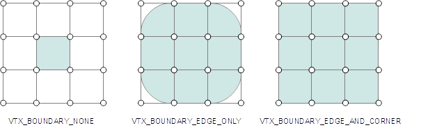
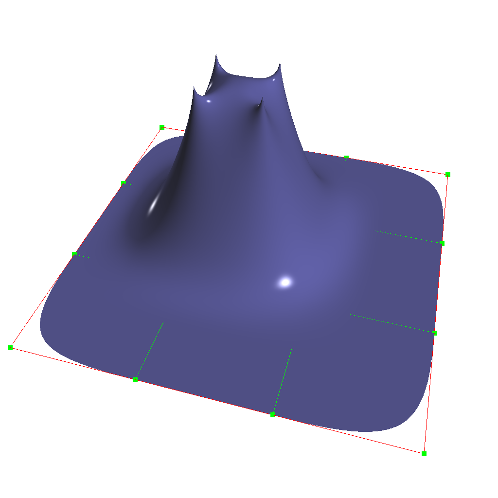

..
     Copyright 2013 Pixar

     Licensed under the Apache License, Version 2.0 (the "Apache License")
     with the following modification; you may not use this file except in
     compliance with the Apache License and the following modification to it:
     Section 6. Trademarks. is deleted and replaced with:

     6. Trademarks. This License does not grant permission to use the trade
        names, trademarks, service marks, or product names of the Licensor
        and its affiliates, except as required to comply with Section 4(c) of
        the License and to reproduce the content of the NOTICE file.

     You may obtain a copy of the Apache License at

         http://www.apache.org/licenses/LICENSE-2.0

     Unless required by applicable law or agreed to in writing, software
     distributed under the Apache License with the above modification is
     distributed on an "AS IS" BASIS, WITHOUT WARRANTIES OR CONDITIONS OF ANY
     KIND, either express or implied. See the Apache License for the specific
     language governing permissions and limitations under the Apache License.

Subdivision Surfaces
--------------------

.. contents::
   :local:
   :backlinks: none

----

Introduction
============

The most common way to model complex smooth surfaces is by using a patchwork of
bicubic patches such as BSplines or NURBS.

.. image:: images/torus.png
   :align: center
   :height: 200

However, while they do provide a reliable smooth limit surface definition,
bi-cubic patch surfaces are limited to 2-dimensional topologies, which only
describes a very small fraction of real-world shapes. This fundamental
parametric limitation requires authoring tools to implement at least the
following functionalities:

    - smooth trimming
    - seams stitching

Both trimming and stitching need to guarantee the smoothness of the model both
spatially and temporally as the model is animated. Attempting to meet these
requirements introduces a lot of expensive computations and complexity.

Subdivision surfaces on the other hand can represent arbitrary topologies, and
therefore are not constrained by these difficulties.

----

Arbitrary Topology
==================

A subdivision surface, like  a parametric surface, is described by its control
mesh of points. The surface itself can approximate or interpolate this control
mesh while being piecewise smooth. But where polygonal surfaces require large
numbers of data points to approximate being smooth, a subdivision surface is
smooth - meaning that polygonal artifacts are never present, no matter how the
surface animates or how closely it is viewed.

Ordinary cubic B-spline surfaces are rectangular grids of tensor-product
patches. Subdivision surfaces generalize these to control grids with arbitrary
connectivity.

.. raw:: html

    

      

        
        
        
        
      

    

----

Manifold Geometry
*****************

Continuous limit surfaces require that the topology be a two-dimensional
manifold. It is therefore possible to model non-manifold geometry that cannot
be represented with a smooth C2 continuous limit. The following examples show
typical cases of non-manifold topological configurations.

----

Non-Manifold Fan
++++++++++++++++

This "fan" configuration shows an edge shared by 3 distinct faces.

.. image:: images/nonmanifold_fan.png
   :align: center
   :target: images/nonmanifold_fan.png

With this configuration, it is unclear which face should contribute to the
limit surface, as three of them share the same edge (which incidentally breaks
half-edge cycles in said data-structures). Fan configurations are not limited
to three incident faces: any configuration where an edge is shared by more than
two faces incurs the same problem.

----

Non-Manifold Disconnected Vertex
++++++++++++++++++++++++++++++++

A vertex is disconnected from any edge and face.

.. image:: images/nonmanifold_vert.png
   :align: center
   :target: images/nonmanifold_vert.png

This case is fairly trivial: there is no possible way to exact a limit surface
here, so the vertex simply has to be flagged as non-contributing, or discarded
gracefully.

.. container:: notebox

    **Beta Issues**

    As of 3.0.0 Beta release, non-manifold topology has limited support.  Most
    non-manifold configurations (with the exception of degenerate edges) are
    supported for refinement and subdivision.  But some factories, such as the
    patch tables, do not support them.  The interpolation associated with
    non-manifold features currently treats them as infinitely sharp features --
    smooth rules are possible but exactly what they should be is unclear.  We
    intend to fully specify and implement a set of interpolation rules in a
    future release of OpenSubdiv.  Until then the results should be considered
    undefined.

----

Boundary Interpolation Rules
============================

Boundary interpolation rules control how boundary edges and vertices are interpolated.

The following rule sets can be applied to vertex data interpolation:

+----------------------------------+----------------------------------------------------------+
| Mode                             | Behavior                                                 |
+==================================+==========================================================+
| **VTX_BOUNDARY_NONE**            | No boundary interpolation behavior should occur          |
|                                  | (debug mode - boundaries are undefined)                  |
+----------------------------------+----------------------------------------------------------+
| **VTX_BOUNDARY_EDGE_ONLY**       | All the boundary edge-chains are sharp creases; boundary |
|                                  | vertices are not affected                                |
+----------------------------------+----------------------------------------------------------+
| **VTX_BOUNDARY_EDGE_AND_CORNER** | All the boundary edge-chains are sharp creases and       |
|                                  | boundary vertices with exactly one incident face are     |
|                                  | sharp corners                                            |
+----------------------------------+----------------------------------------------------------+

On a quad example:

----

Face-Varying Interpolation Rules
================================

Face-varying data can follow the same interpolation behavior as vertex data, or it
can be constrained to interpolate linearly around selective features from corners,
boundaries to the entire interior of the mesh.

The following rules can be applied to face-varying data interpolation:

+--------------------------------+-----------------------------------------------+
| Mode                           | Behavior                                      |
+================================+===============================================+
| **FVAR_LINEAR_NONE**           | smooth everywhere the mesh is smooth          |
+--------------------------------+-----------------------------------------------+
| **FVAR_LINEAR_CORNERS_ONLY**   | sharpen corners only                          |
+--------------------------------+-----------------------------------------------+
| **FVAR_LINEAR_CORNERS_PLUS1**  | sharpen corners plus some junctions           |
+--------------------------------+-----------------------------------------------+
| **FVAR_LINEAR_CORNERS_PLUS2**  | sharpen corners plus more junctions and darts |
+--------------------------------+-----------------------------------------------+
| **FVAR_LINEAR_BOUNDARIES**     | piecewise linear boundary edges and corners   |
+--------------------------------+-----------------------------------------------+
| **FVAR_LINEAR_ALL**            | linear interpolation everywhere               |
+--------------------------------+-----------------------------------------------+

These rules cannot make the interpolation of the face-varying data smoother than
that of the vertices.  The presence of sharp features of the mesh created by
sharpness values, boundary interpolation rules, or the subdivision scheme itself
(e.g. Bilinear) take precedence.

Unwrapped cube example:

.. image:: images/fvar_boundaries.png
   :align: center
   :target: images/fvar_boundaries.png

----

"Triangle Subdivision" Rule
===========================

The triangle subdivision rule is a rule added to the Catmull-Clark scheme that
can be applied to all triangular faces; this rule was empirically determined to
make triangles subdivide more smoothly. However, this rule breaks the nice
property that two separate meshes can be joined seamlessly by overlapping their
boundaries; i.e. when there are triangles at either boundary, it is impossible
to join the meshes seamlessly

+---------------------+---------------------------------------------+
| Mode                | Behavior                                    |
+=====================+=============================================+
| **TRI_SUB_CATMARK** | Default Catmark scheme weights              |
+---------------------+---------------------------------------------+
| **TRI_SUB_SMOOTH**  | "Smooth triangle" weights                   |
+---------------------+---------------------------------------------+

Cylinder example :

.. image:: images/smoothtriangles.png
   :align: center
   :height: 300
   :target: images/smoothtriangles.png

----

Semi-Sharp Creases
==================

It is possible to modify the subdivision rules to create piecewise smooth
surfaces containing infinitely sharp features such as creases and corners. As a
special case, surfaces can be made to interpolate their boundaries by tagging
their boundary edges as sharp.

However, we've recognized that real world surfaces never really have infinitely
sharp edges, especially when viewed sufficiently close. To this end, we've
added the notion of semi-sharp creases, i.e. rounded creases of controllable
sharpness. These allow you to create features that are more akin to fillets and
blends. As you tag edges and edge chains as creases, you also supply a
sharpness value that ranges from 0-10, with sharpness values >=10 treated as
infinitely sharp.

It should be noted that infinitely sharp creases are really tangent
discontinuities in the surface, implying that the geometric normals are also
discontinuous there. Therefore, displacing along the normal will likely tear
apart the surface along the crease. If you really want to displace a surface at
a crease, it may be better to make the crease semi-sharp.

.. image:: images/gtruck.jpg
   :align: center
   :height: 300
   :target: images/gtruck.jpg

----

Chaikin Rule
============

Chaikin's curve subdivision algorithm improves the appearance of multi-edge
semi-sharp creases with varying weights. The Chaikin rule interpolates the
sharpness of incident edges.

+---------------------+---------------------------------------------+
| Mode                | Behavior                                    |
+=====================+=============================================+
| **CREASE_UNIFORM**  | Apply regular semi-sharp crease rules       |
+---------------------+---------------------------------------------+
| **CREASE_CHAIKIN**  | Apply "Chaikin" semi-sharp crease rules     |
+---------------------+---------------------------------------------+

Example of contiguous semi-sharp creases interpolation:

.. image:: images/chaikin.png
   :align: center
   :target: images/chaikin.png

----

Hierarchical Edits
==================

To understand the hierarchical aspect of subdivision, we realize that
subdivision itself leads to a natural hierarchy: after the first level of
subdivision, each face in a subdivision mesh subdivides to four quads (in the
Catmull-Clark scheme), or four triangles (in the Loop scheme). This creates a
parent and child relationship between the original face and the resulting four
subdivided faces, which in turn leads to a hierarchy of subdivision as each
child in turn subdivides. A hierarchical edit is an edit made to any one of the
faces, edges, or vertices that arise anywhere during subdivision. Normally
these subdivision components inherit values from their parents based on a set
of subdivision rules that depend on the subdivision scheme.

A hierarchical edit overrides these values. This allows for a compact
specification of localized detail on a subdivision surface, without having to
express information about the rest of the subdivision surface at the same level
of detail.

.. image:: images/hedit_example1.png
   :align: center
   :height: 300
   :target: images/hedit_example1.png

----

.. container:: notebox

    **Release Notes (3.0.0)**

    Hierarchical Edits have been marked as "extended specification" and support for
    hierarchical features has been removed from the 3.0 release. This decision
    allows for great simplifications of many areas of the subdivision algorithms.
    If we can identify legitimate use-cases for hierarchical tags, we will consider
    re-implementing them in future releases, as time and resources allow.

----

Hierarchical Edits Paths
************************

In order to perform a hierarchical edit, we need to be able to name the
subdivision component we are interested in, no matter where it may occur in the
subdivision hierarchy. This leads us to a hierarchical path specification for
faces, since once we have a face we can navigate to an incident edge or vertex
by association. We note that in a subdivision mesh, a face always has incident
vertices, which are labelled (in relation to the face) with an integer index
starting at zero and in consecutive order according to the usual winding rules
for subdivision surfaces. Faces also have incident edges, and these are
labelled according to the origin vertex of the edge.

.. image:: images/face_winding.png
   :align: center
   :target: images/face_winding.png

.. role:: red
.. role:: green
.. role:: blue

In this diagram, the indices of the vertices of the base face are marked in
:red:`red`; so on the left we have an extraordinary Catmull-Clark face with
five vertices (labeled :red:`0-4`) and on the right we have a regular
Catmull-Clark face with four vertices (labelled :red:`0-3`). The indices of the
child faces are :blue:`blue`; note that in both the extraordinary and regular
cases, the child faces are indexed the same way, i.e. the sub-face labeled
:blue:`n` has one incident vertex that is the result of the subdivision of the
parent vertex also labeled :red:`n` in the parent face. Specifically, we note
that the sub-face :blue:`1` in both the regular and extraordinary face is
nearest to the vertex labelled :red:`1` in the parent.

The indices of the vertices of the child faces are labeled :green:`green`, and
this is where the difference lies between the extraordinary and regular case;
in the extraordinary case, vertex to vertex subdivision always results in a
vertex labeled :green:`0`, while in the regular case, vertex to vertex
subdivision assigns the same index to the child vertex. Again, specifically, we
note that the parent vertex indexed :red:`1` in the extraordinary case has a
child vertex :green:`0`, while in the regular case the parent vertex indexed
:red:`1` actually has a child vertex that is indexed :green:`1`. Note that this
indexing scheme was chosen to maintain the property that the vertex labeled 0
always has the lowest u/v parametric value on the face.

.. image:: images/hedit_path.gif
   :align: center
   :target: images/hedit_path.gif

By appending a vertex index to a face index, we can create a vertex path
specification. For example, (:blue:`655` :green:`2` :red:`3` 0) specifies the
1st. vertex of the :red:`3` rd. child face of the :green:`2` nd. child face of
the of the :blue:`655` th. face of the subdivision mesh.

----

Vertex Edits
************

Vertex hierarchical edits can modify the value or the sharpness of primitive
variables for vertices and sub-vertices anywhere in the subdivision hierarchy.

.. image:: images/hedit_example1.png
   :align: center
   :height: 300
   :target: images/hedit_example1.png

The edits are performed using either an "add" or a "set" operator. "set"
indicates the primitive variable value or sharpness is to be set directly to
the values specified. "add" adds a value to the normal result computed via
standard subdivision rules. In other words, this operation allows value offsets
to be applied to the mesh at any level of the hierarchy.

----

Edge Edits
**********

Edge hierarchical edits can only modify the sharpness of primitive variables for edges
and sub-edges anywhere in the subdivision hierarchy.

.. image:: images/hedit_example4.png
   :align: center
   :height: 300
   :target: images/hedit_example4.png

----

Face Edits
**********

Face hierarchical edits can modify several properties of faces and sub-faces
anywhere in the subdivision hierarchy.

Modifiable properties include:

    * The "set" or "add" operators modify the value of primitive variables
      associated with faces.
    * The "hole" operation introduces holes (missing faces) into the subdivision
      mesh at any level in the subdivision hierarchy. The faces will be deleted,
      and none of their children will appear (you cannot "unhole" a face if any
      ancestor is a "hole"). This operation takes no float or string arguments.

.. image:: images/hedit_example5.png
   :align: center
   :height: 300
   :target: images/hedit_example5.png

----

Uniform Subdivision
===================

Applies a uniform refinement scheme to the coarse faces of a mesh. This is the most
common solution employed to apply subdivision schemes to a control cage. The mesh
converges closer to the limit surface with each iteration of the algorithm.

.. image:: images/uniform.gif
   :align: center
   :width: 300
   :target: images/uniform.gif

----

Feature Adaptive Subdivision
============================

Generates bi-cubic patches on the limit surface and applies a progressive refinement
scheme in order to isolate non-C2 continuous extraordinary features.

----

Uniform or Adaptive ?
=====================

Main features comparison:

+-------------------------------------------------------+--------------------------------------------------------+
| Uniform                                               | Feature Adaptive                                       |
+=======================================================+========================================================+
|                                                       |                                                        |
| * Bi-linear approximation                             | * Bi-cubic limit patches                               |
|     * No tangents / no normals                        |     * Analytical tangents / normals                    |
|     * No smooth shading around creases                |                                                        |
|     * No animated displacements                       |                                                        |
|                                                       |                                                        |
+-------------------------------------------------------+--------------------------------------------------------+
| * Exponential geometry Growth                         | * Feature isolation growth close to linear             |
|                                                       |                                                        |
+-------------------------------------------------------+--------------------------------------------------------+
| * Boundary interpolation rules supported:             | * Boundary interpolation rules supported:              |
|     * All vertex & varying rules supported dynamically|     * All vertex & varying rules supported dynamically |
|     * All face-varying rules supported \              |     * Bilinear face-varying interpolation \            |
|       statically at vertex locations (there is no \   |       supported statically                             |
|       surface limit)                                  |     * Bi-cubic face-varying interpolation \            |
|                                                       |       currently not supported                          |
|                                                       |                                                        |
+-------------------------------------------------------+--------------------------------------------------------+
| * No GPU shading implications                         | * Requires GPU composable shading                      |
|                                                       |                                                        |
+-------------------------------------------------------+--------------------------------------------------------+

