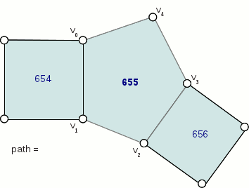

..  
       Copyright (C) Pixar. All rights reserved.
  
       This license governs use of the accompanying software. If you
       use the software, you accept this license. If you do not accept
       the license, do not use the software.
  
       1. Definitions
       The terms "reproduce," "reproduction," "derivative works," and
       "distribution" have the same meaning here as under U.S.
       copyright law.  A "contribution" is the original software, or
       any additions or changes to the software.
       A "contributor" is any person or entity that distributes its
       contribution under this license.
       "Licensed patents" are a contributor's patent claims that read
       directly on its contribution.
  
       2. Grant of Rights
       (A) Copyright Grant- Subject to the terms of this license,
       including the license conditions and limitations in section 3,
       each contributor grants you a non-exclusive, worldwide,
       royalty-free copyright license to reproduce its contribution,
       prepare derivative works of its contribution, and distribute
       its contribution or any derivative works that you create.
       (B) Patent Grant- Subject to the terms of this license,
       including the license conditions and limitations in section 3,
       each contributor grants you a non-exclusive, worldwide,
       royalty-free license under its licensed patents to make, have
       made, use, sell, offer for sale, import, and/or otherwise
       dispose of its contribution in the software or derivative works
       of the contribution in the software.
  
       3. Conditions and Limitations
       (A) No Trademark License- This license does not grant you
       rights to use any contributor's name, logo, or trademarks.
       (B) If you bring a patent claim against any contributor over
       patents that you claim are infringed by the software, your
       patent license from such contributor to the software ends
       automatically.
       (C) If you distribute any portion of the software, you must
       retain all copyright, patent, trademark, and attribution
       notices that are present in the software.
       (D) If you distribute any portion of the software in source
       code form, you may do so only under this license by including a
       complete copy of this license with your distribution. If you
       distribute any portion of the software in compiled or object
       code form, you may only do so under a license that complies
       with this license.
       (E) The software is licensed "as-is." You bear the risk of
       using it. The contributors give no express warranties,
       guarantees or conditions. You may have additional consumer
       rights under your local laws which this license cannot change.
       To the extent permitted under your local laws, the contributors
       exclude the implied warranties of merchantability, fitness for
       a particular purpose and non-infringement.
  

Subdivision Surfaces
--------------------

.. contents::
   :local:
   :backlinks: none

----

Introduction
============

The most common way to model complex smooth surfaces is by using a patchwork of 
bicubic patches such as BSplines or NURBS. 

.. image:: images/torus.png
   :align: center
   :height: 200

However, while they do provide a reliable smooth limit surface definition, bicubic 
patch surfaces are limited to 2-dimensional topologies, which only describes a 
very small fraction of real-world shapes. This fundamental parametric limitation 
requires authoring tools to implementat at least the following functionalities:

    1. smooth trimming
    2. seams stitching
    
Both trimming and stitching need to guarantee the smoothness of the model both
spatially and temporally as the model is animated. Attempting to meet these 
requirements introduces a lot of expensive computations and complexity.

Subdivision surfaces on the other hand can represent arbitrary topologies, and
therefore are not constrained by these difficulties. 

----

Arbitrary Topology
==================

A subdivision surface, like  a parametric surface, is described by its control mesh 
of points. The surface itself can approximate or interpolate this control mesh 
while being piecewise smooth. But where polygonal surfaces require large numbers 
of data points to approximate being smooth, a subdivision surface is smooth - 
meaning that polygonal artifacts are never present, no matter how the surface 
animates or how closely it is viewed. 

Ordinary cubic B-spline surfaces are rectangular grids of tensor-product patches. 
Subdivision surfaces generalize these to control grids with arbitrary connectivity.

   .. image:: images/tetra.0.jpg
      :width: 20%

   .. image:: images/tetra.1.jpg
      :width: 20%

   .. image:: images/tetra.2.jpg
      :width: 20%

   .. image:: images/tetra.3.jpg
      :width: 20%

----

Manifold Geometry
*****************

Continuous limit surfaces require that the topology be a two-dimensional 
manifold. It is therefore possible to model non-manifold geometry that cannot
be subdivided to a smooth limit.

----

Fan
+++

This "fan" configuration shows an edge shared by 3 distinct faces.

.. image:: images/nonmanifold_fan.png
   :align: center
   :target: images/nonmanifold_fan.png

----

Disconnected Vertex
+++++++++++++++++++

A vertex is disconnected from any edge and face.

.. image:: images/nonmanifold_vert.png
   :align: center
   :target: images/nonmanifold_vert.png

----

Boundary Interpolation Rules
============================

XXXX

----

Semi-Sharp Creases
==================

XXXX

----

Hierarchical Edits
==================

To understand the hierarchical aspect of subdivision, we realize that subdivision 
itself leads to a natural hierarchy: after the first level of subdivision, each 
face in a subdivision mesh subdivides to four quads (in the Catmull-Clark scheme), 
or four triangles (in the Loop scheme). This creates a parent and child relationship 
between the original face and the resulting four subdivided faces, which in turn 
leads to a hierarchy of subdivision as each child in turn subdivides. A hierarchical 
edit is an edit made to any one of the faces, edges, or vertices that arise anywhere 
during subdivision. Normally these subdivision components inherit values from their 
parents based on a set of subdivision rules that depend on the subdivision scheme.

A hierarchical edit overrides these values. This allows for a compact specification 
of localized detail on a subdivision surface, without having to express information 
about the rest of the subdivision surface at the same level of detail.

.. container:: fourcol

    .. image:: images/hedit_example1.png
       :align: center
       :height: 300
       :target: images/hedit_example1.png

----

Hierarchical Edits Paths
************************

In order to perform a hierarchical edit, we need to be able to name the subdivision 
component we are interested in, no matter where it may occur in the subdivision 
hierarchy. This leads us to a hierarchical path specification for faces, since 
once we have a face we can navigate to an incident edge or vertex by association. 
We note that in a subdivision mesh, a face always has incident vertices, which are 
labelled (in relation to the face) with an integer index starting at zero and in 
consecutive order according to the usual winding rules for subdivision surfaces. 
Faces also have incident edges, and these are labelled according to the origin 
vertex of the edge. 

.. image:: images/face_winding.png
   :align: center
   :target: images/face_winding.png

.. role:: red
.. role:: green
.. role:: blue
    
In this diagram, the indices of the vertices of the base face are marked in :red:`red`; 
so on the left we have an extraordinary Catmull-Clark face with five vertices 
(labeled :red:`0-4`) and on the right we have a regular Catmull-Clark face with four 
vertices (labelled :red:`0-3`). The indices of the child faces are :blue:`blue`; note that in 
both the extraordinary and regular cases, the child faces are indexed the same 
way, i.e. the subface labeled :blue:`n` has one incident vertex that is the result of the 
subdivision of the parent vertex also labeled :red:`n` in the parent face. Specifically,
we note that the subface :blue:`1` in both the regular and extraordinary face is nearest 
to the vertex labelled :red:`1` in the parent. 

The indices of the vertices of the child faces are labeled :green:`green`, and 
this is where the difference lies between the extraordinary and regular case; 
in the extraordinary case, vertex to vertex subdivision always results in a vertex 
labeled :green:`0`, while in the regular case, vertex to vertex subdivision 
assigns the same index to the child vertex. Again, specifically, we note that the 
parent vertex indexed :red:`1` in the extraordinary case has a child vertex :green:`0`, 
while in the regular case the parent vertex indexed :red:`1` actually has a child 
vertex that is indexed :green:`1`. Note that this indexing scheme was chosen to 
maintain the property that the vertex labeled 0 always has the lowest u/v 
parametric value on the face.

By appending a vertex index to a face index, we can create a vertex path 
specification. For example, (:blue:`655` :green:`2` :red:`3` 0) specifies the 1st. 
vertex of the :red:`3` rd. child face of the :green:`2` nd. child face of the of 
the :blue:`655` th. face of the subdivision mesh. 

----

Vertex Edits
************

XXXX

----

Edge Edits
**********

XXXX

----

Face Edits
**********

XXXX

----

Limitations
***********

XXXX

----

Uniform Subdivision
===================

Applies a uniform refinement scheme to the coarse faces of a mesh. 

.. image:: images/uniform.gif
   :align: center
   :width: 300
   :target: images/uniform.gif

----

Feature Adaptive Subdivision
============================

Isolates extraordinary features by applying progressive refinement.

.. image:: images/adaptive.gif
   :align: center
   :width: 300
   :target: images/adaptive.gif

