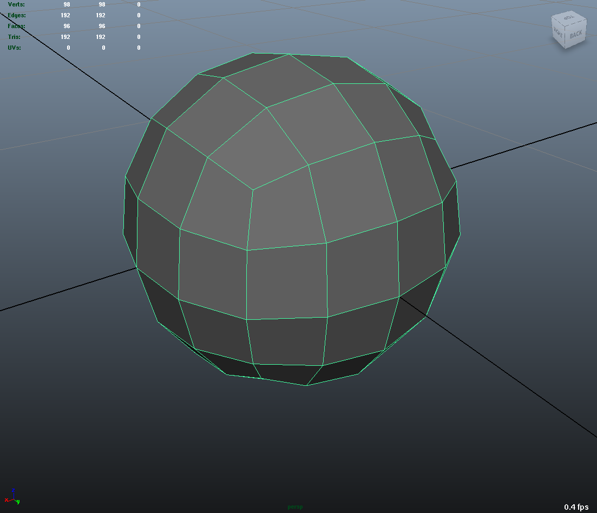
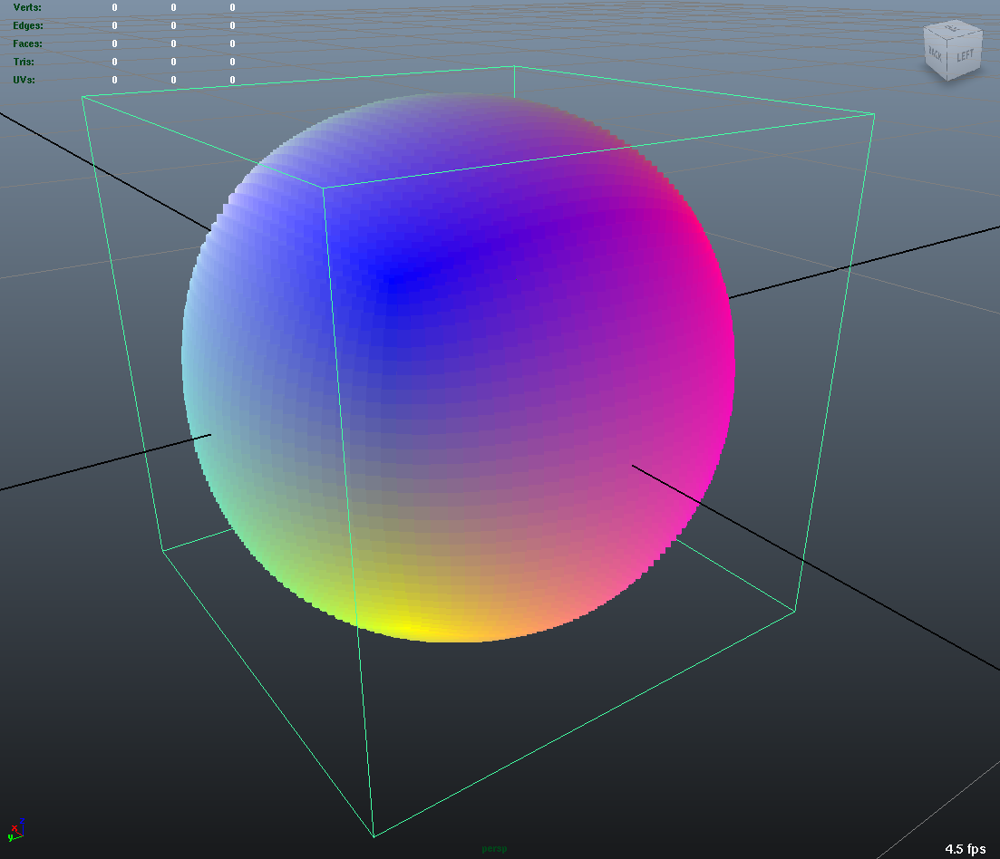
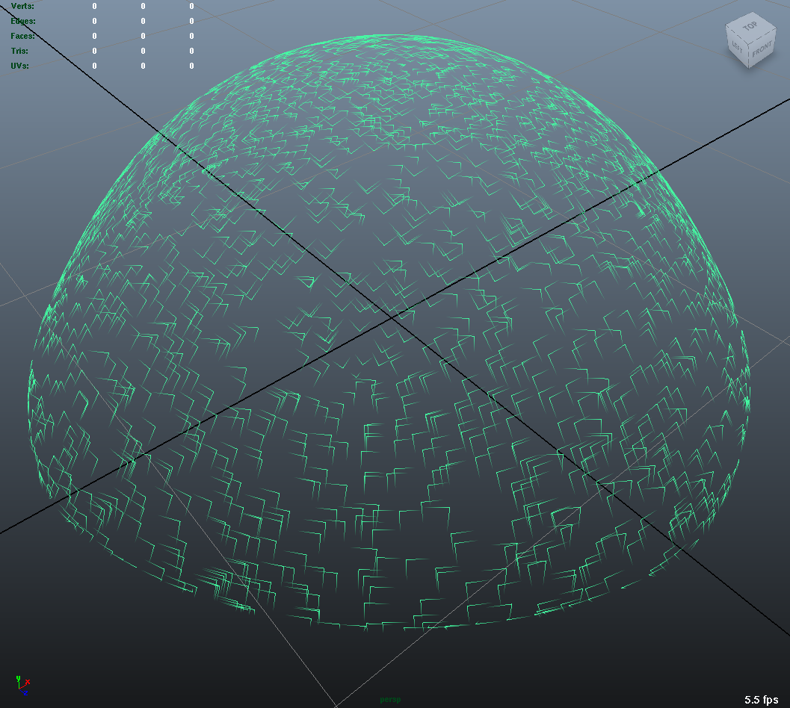
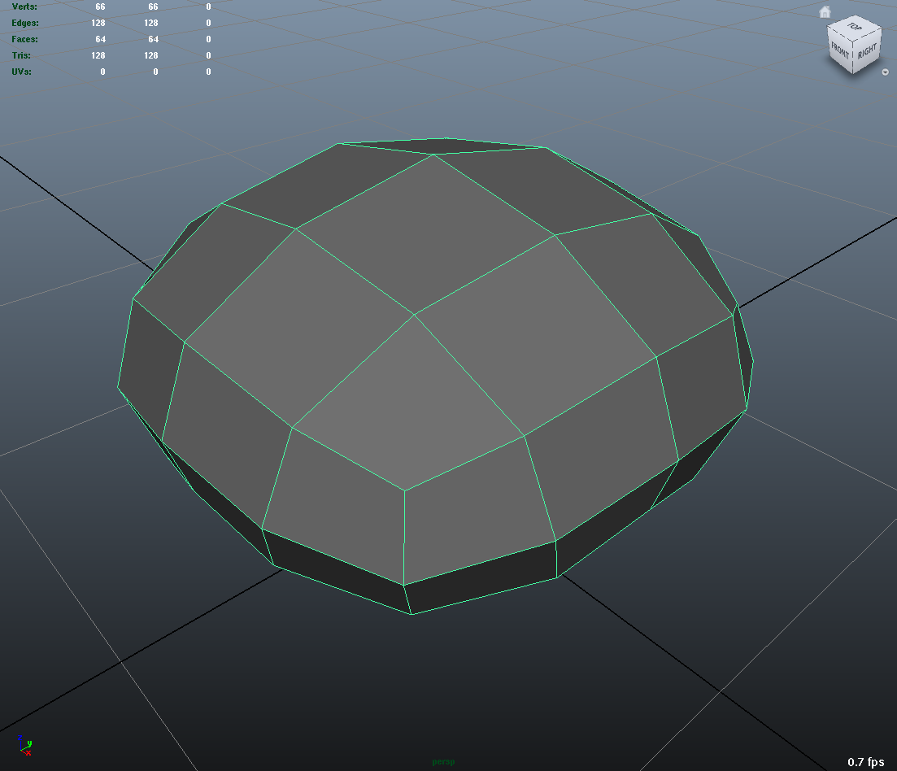

..
     Copyright 2013 Pixar

     Licensed under the Apache License, Version 2.0 (the "Apache License")
     with the following modification; you may not use this file except in
     compliance with the Apache License and the following modification to it:
     Section 6. Trademarks. is deleted and replaced with:

     6. Trademarks. This License does not grant permission to use the trade
        names, trademarks, service marks, or product names of the Licensor
        and its affiliates, except as required to comply with Section 4(c) of
        the License and to reproduce the content of the NOTICE file.

     You may obtain a copy of the Apache License at

         http://www.apache.org/licenses/LICENSE-2.0

     Unless required by applicable law or agreed to in writing, software
     distributed under the Apache License with the above modification is
     distributed on an "AS IS" BASIS, WITHOUT WARRANTIES OR CONDITIONS OF ANY
     KIND, either express or implied. See the Apache License for the specific
     language governing permissions and limitations under the Apache License.

Tutorials
---------

.. contents::
   :local:
   :backlinks: none

----

The tutorial source code can be found in the `github.com repository
<https://github.com/PixarAnimationStudios/OpenSubdiv/tree/release/tutorials>`__
or in your local ``<repository root>/tutorials``.

Bfr Tutorials
=============

All tutorials for the Bfr interface follow a similar pattern:  without any
command line arguments, a default mesh (usually a cube) is used and the
results printed to standard output in Obj format. Command line arguments
can be used to specify an alternate mesh for input, as well as directing
the output to a specified Obj file.

Some tutorials may offer additional command line options to trigger internal
options relevant to the topic, e.g. those illustrating tessellation may
support a -quads option to use the option to tessellate quad-bases subdivision
meshes with quads.

1. Basic Evaluation and Tessellation
************************************

Tutorial 1.1
^^^^^^^^^^^^
 This tutorial illustrates the use of Bfr::SurfaceFactory and Bfr::Surface
 to evaluate points on the limit of each face. The limit positions at all
 corners of the face are evaluated and connected to the limit position in
 the center of the face -- creating a simple triangular tessellation.
 `[code] <bfr_tutorial_1_1.html>`__

   .. image:: images/bfr_tutorial_1_1.png
      :height: 100px
      :target: images/bfr_tutorial_1_1.png

Tutorial 1.2
^^^^^^^^^^^^
 This tutorial shows the added use of Bfr::Tessellation to identify the
 set of points and connectivity for a uniform tessellation. Both a Surface
 and Tessellation is identified for each face, with the Tessellation
 indicating which points are to be evaluated by the Surface.
 `[code] <bfr_tutorial_1_2.html>`__

 Tessellation patterns for quad-based subdivision schemes can optionally
 preserve quads (left) or be fully triangulated (center), while triangular
 schemes always yield triangles (right):

   .. image:: images/bfr_tutorial_1_2_a.png
      :height: 100px
      :target: images/bfr_tutorial_1_2_a.png

   .. image:: images/bfr_tutorial_1_2_b.png
      :height: 100px
      :target: images/bfr_tutorial_1_2_b.png

   .. image:: images/bfr_tutorial_1_2_c.png
      :height: 100px
      :target: images/bfr_tutorial_1_2_c.png

Tutorial 1.3
^^^^^^^^^^^^
 This tutorial extends the previous tutorial on uniform Tessellation by
 adding face-varying Surfaces to compute corresponding UVs for each
 evaluated position.  `[code] <bfr_tutorial_1_3.html>`__

Tutorial 1.4
^^^^^^^^^^^^
 This tutorial extends the previous tutorial on uniform tessellation of
 position and UV by illustrating how additional mesh data interleaved with
 the position and UV data is easily handled.  `[code] <bfr_tutorial_1_4.html>`__

Tutorial 1.5
^^^^^^^^^^^^
 This tutorial is similar to the first tutorial showing uniform tessellation
 of position but makes use of limit stencils for its evaluation of points of
 the tessellation pattern. `[code] <bfr_tutorial_1_5.html>`__

2. More on Tessellation
***********************

Tutorial 2.1
^^^^^^^^^^^^
 This tutorial extends the use of Tessellation to illustrate the use of
 non-uniform tessellation rates per edge. A simple edge-length metric is
 used to determine the tessellation rate for each edge of a face.
 `[code] <bfr_tutorial_2_1.html>`__

 The following contrasts uniform tessellation (left) with the resulting
 length-based tessellations -- preserving quads (center) and fully
 triangulated (right):

   .. image:: images/bfr_tutorial_2_1_a.png
      :height: 100px
      :target: images/bfr_tutorial_2_1_a.png

   .. image:: images/bfr_tutorial_2_1_b.png
      :height: 100px
      :target: images/bfr_tutorial_2_1_b.png

   .. image:: images/bfr_tutorial_2_1_c.png
      :height: 100px
      :target: images/bfr_tutorial_2_1_c.png

Tutorial 2.2
^^^^^^^^^^^^
 This tutorial is a more complex extension of the use of Tessellation
 that illustrates how the separation and association of tessellation data
 with the boundary and interior of the face can be used. Limit points
 evaluated on the vertices and edges of a face (the boundary of the
 Tessellation) are computed once and shared with adjacent faces --
 creating a topologically watertight tessellation of the mesh.
 `[code] <bfr_tutorial_2_2.html>`__

3. Additional Topics
********************

Tutorial 3.1
^^^^^^^^^^^^
 This tutorial shows a basic example of the more advanced topic of creating
 a subclass of SurfaceFactory adapted to a connected mesh representation --
 requiring an implementation of the SurfaceFactoryMeshAdapter interface for
 that mesh.  A simplified version of the implementation of Far::TopologyRefiner
 is provided.  (Note that the `[code] <bfr_tutorial_3_1.html>`__ imported
 here is that of the main program, not the separate header and source files
 of the custom subclass illustrated -- which current documentation scripts
 cannot import.)

Tutorial 3.2
^^^^^^^^^^^^
 This tutorial shows how to initialize and retain Surfaces for later use.
 The simple uniform tessellation tutorial is modified to first create and
 populate a simple caching structure that initializes and stores the
 Surfaces for all faces of the mesh. The loop for each face of the mesh
 then retrieves its Surface and associated patch points from the cache.
 `[code] <bfr_tutorial_3_2.html>`__

----

Far Tutorials
=============

1. Basic Construction and Interpolation
***************************************

Tutorial 1.1
^^^^^^^^^^^^
 This tutorial presents the requisite steps to instantiate a mesh as a
 Far::TopologyRefiner from simple topological data and to interpolate
 vertex data associated with the mesh. `[code] <far_tutorial_1_1.html>`__

Tutorial 1.2
^^^^^^^^^^^^
 This tutorial makes use of a different vertex data definition for use when vertex
 data is of arbitrary width.  Uniform refinement is applied to data buffers of three
 types:  two of fixed but different sizes and the third a union of the two that is
 dynamically sized and constructed.  `[code] <far_tutorial_1_2.html>`__

2. Uniform Refinement and Primvar Data Types
********************************************

Tutorial 2.1
^^^^^^^^^^^^
 Building on the basic tutorial, this example shows how to instantiate a simple mesh,
 refine it uniformly and then interpolate both 'vertex' and 'varying' primvar data.
 `[code] <far_tutorial_2_1.html>`__

Tutorial 2.2
^^^^^^^^^^^^
 Building on the previous tutorial, this example shows how to instantiate a simple mesh,
 refine it uniformly and then interpolate both 'vertex' and 'face-varying' primvar data.
 The resulting interpolated data is output in Obj format, with the 'face-varying' data
 recorded in the UV texture layout.  `[code] <far_tutorial_2_2.html>`__

Tutorial 2.3
^^^^^^^^^^^^
 Building on previous tutorials, this example shows how to instantiate a simple mesh,
 refine it uniformly, interpolate both 'vertex' and 'face-varying' primvar data, and
 finally calculate approximated smooth normals.  The resulting interpolated data is
 output in Obj format.  `[code] <far_tutorial_2_3.html>`__

3. Creating a Custom Far::TopologyRefinerFactory
************************************************

Tutorial 3.1
^^^^^^^^^^^^
 Previous tutorials have instantiated topology from a simple face-vertex list via the
 Far::TopologyDescriptor and its TopologyRefinerFactory.  This tutorial shows how to
 more efficiently convert an existing high-level topology representation to a
 Far::TopologyDescriptor with a custom factory class.  `[code] <far_tutorial_3_1.html>`__

4. Construction and Usage of Far::StencilTables
***********************************************

Tutorial 4.1
^^^^^^^^^^^^
 This tutorial shows how to create and manipulate a StencilTable. Factorized stencils
 are used to efficiently interpolate vertex primvar data buffers.
 `[code] <far_tutorial_4_1.html>`__

Tutorial 4.2
^^^^^^^^^^^^
 This tutorial shows how to create and manipulate StencilTables for both 'vertex' and
 'varying' primvar data buffers: vertex positions and varying colors.
 `[code] <far_tutorial_4_2.html>`__

Tutorial 4.3
^^^^^^^^^^^^
 This tutorial shows how to create and manipulate tables of cascading stencils to apply
 hierarchical vertex edits. `[code] <far_tutorial_4_3.html>`__

5. Construction and Usage of Far::PatchTables
*********************************************

Tutorial 5.1
^^^^^^^^^^^^
 This tutorial shows how to compute points on the limit surface at arbitrary parametric
 locations using a Far::PatchTable constructed from adaptive refinement.
 `[code] <far_tutorial_5_1.html>`__

Tutorial 5.2
^^^^^^^^^^^^
 Building on the previous tutorial, this example shows how to manage the limit surface
 of a potentially large mesh by creating and evaluating separate PatchTables for selected
 groups of faces of the mesh.  `[code] <far_tutorial_5_2.html>`__

Tutorial 5.3
^^^^^^^^^^^^
 Building on the previous tutorials for both PatchTables and StencilTables, this example
 shows how to construct a LimitStencilTable to repeatedly evaluate an arbitrary
 collection of points on the limit surface.  `[code] <far_tutorial_5_3.html>`__

----

Osd Tutorials
=============

Tutorial 0
**********
 This tutorial demonstrates the manipulation of Osd Evaluator and BufferDescriptor.
 `[code] <osd_tutorial_0.html>`__

----

Hbr Tutorials
=============

Use of Hbr is no longer recommended -- these tutorials are included solely for
historical reference.

Tutorial 0
**********
 This tutorial presents, in a very succinct way, the requisite steps to
 instantiate an Hbr mesh from simple topological data. `[code] <hbr_tutorial_0.html>`__

Tutorial 1
**********
 This tutorial shows how to safely create Hbr meshes from arbitrary topology.
 Because Hbr is a half-edge data structure, it cannot represent non-manifold
 topology. Ensuring that the geometry used is manifold is a requirement to use
 Hbr safely. This tutorial presents some simple tests to detect inappropriate
 topology. `[code] <hbr_tutorial_1.html>`__

Tutorial 2
**********
 This tutorial shows how to subdivide uniformly a simple Hbr mesh. We are
 building upon previous tutorials and assuming a fully instantiated mesh:
 we start with an HbrMesh pointer initialized from the same pyramid shape
 used in hbr_tutorial_0. We then apply the Refine() function sequentially
 to all the faces in the mesh to generate several levels of uniform
 subdivision. The resulting data is then dumped to the terminal in Wavefront
 OBJ format for inspection. `[code] <hbr_tutorial_2.html>`__

