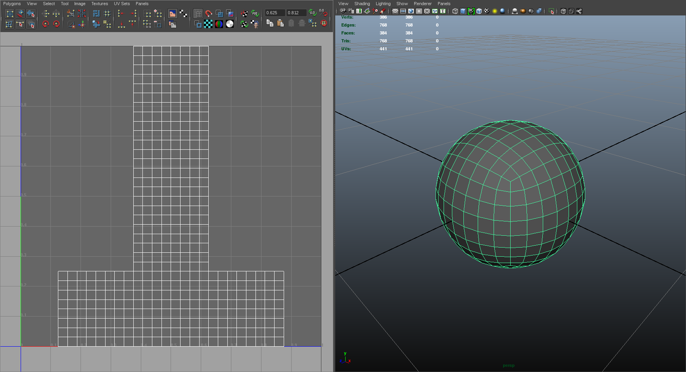
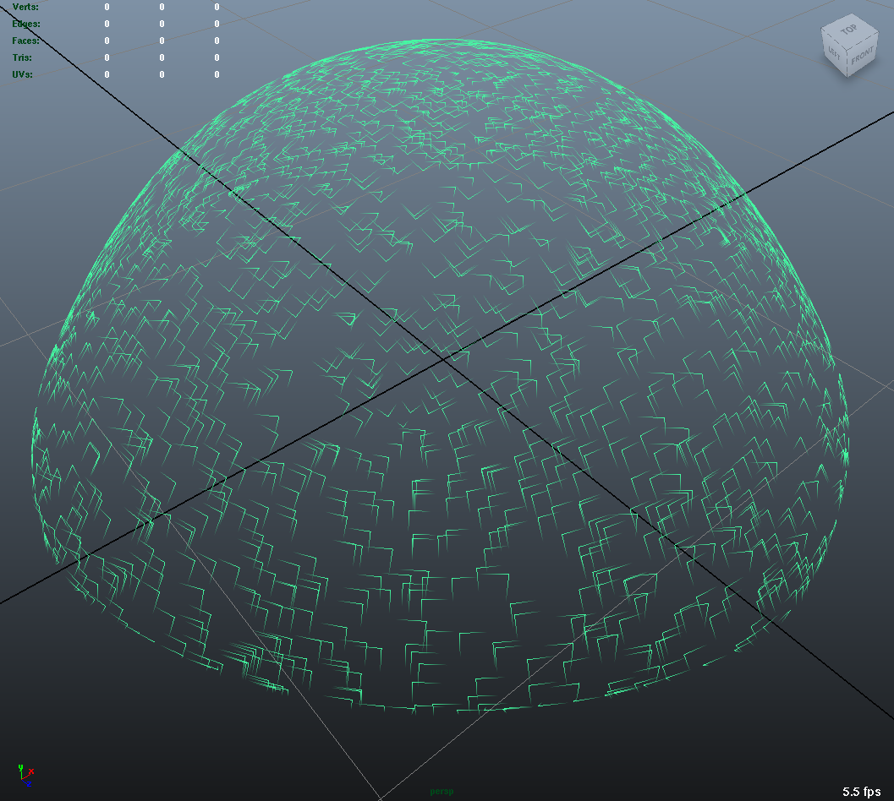

..
     Copyright 2013 Pixar

     Licensed under the Apache License, Version 2.0 (the "Apache License")
     with the following modification; you may not use this file except in
     compliance with the Apache License and the following modification to it:
     Section 6. Trademarks. is deleted and replaced with:

     6. Trademarks. This License does not grant permission to use the trade
        names, trademarks, service marks, or product names of the Licensor
        and its affiliates, except as required to comply with Section 4(c) of
        the License and to reproduce the content of the NOTICE file.

     You may obtain a copy of the Apache License at

         http://www.apache.org/licenses/LICENSE-2.0

     Unless required by applicable law or agreed to in writing, software
     distributed under the Apache License with the above modification is
     distributed on an "AS IS" BASIS, WITHOUT WARRANTIES OR CONDITIONS OF ANY
     KIND, either express or implied. See the Apache License for the specific
     language governing permissions and limitations under the Apache License.

Tutorials
---------

.. contents::
   :local:
   :backlinks: none

----

The tutorial source code can be found in the `github.com repository
<https://github.com/PixarAnimationStudios/OpenSubdiv/tree/master/tutorials>`__
or in your local ``<repository root>/turorials``.

----

.. raw:: html

  

----

.. |far_tut_0| image:: images/far_tutorial_0.0.png
   :width: 100px
   :target: images/far_tutorial_0.0.png

.. |far_tut_1| image:: images/far_tutorial_1.0.png
   :width: 100px
   :target: images/far_tutorial_1.0.png

.. list-table:: **Far Tutorials**
   :class: quickref
   :widths: 50 50

   * - | **Tutorial 0**
       | This tutorial presents in a very succinct way the requisite steps to
         instantiate a Far mesh from simple topological data. `[code] <far_tutorial_0.html>`__
       | |far_tut_0|
       |
       | **Tutorial 1**
       | This tutorial shows how to interface a high-level topology representation
         with Far for better efficiency. In tutorial 0, we showed how to instantiate
         topology from a simple face-vertex list. Here we will show how to take
         advantage of more complex data structures. `[code] <far_tutorial_1.html>`__
       |
       | **Tutorial 2**
       | Building on tutorial 0, this example shows how to instantiate a simple mesh,
         refine it uniformly and then interpolate both 'vertex' and 'varying' primvar
         data. `[code] <far_tutorial_2.html>`__
       | |far_tut_1|
       |
       | **Tutorial 3**
       | Building on tutorial 0, this example shows how to instantiate a simple mesh,
         refine it uniformly and then interpolate both 'vertex' and 'face-varying'
         primvar data.
         The resulting interpolated data is output as an 'obj' file, with the
         'face-varying' data recorded in the uv texture layout.  `[code] <far_tutorial_3.html>`__
       | |far_tut_3|
       |
     - | **Tutorial 4**
       | This tutorial shows how to create and manipulate FarStencilTable. We use the
         factorized stencils to interpolate vertex primvar data buffers. `[code] <far_tutorial_4.html>`__
       |
       | **Tutorial 5**
       | This tutorial shows how to create and manipulate both 'vertex' and 'varying'
         FarStencilTable to interpolate 2 primvar data buffers: vertex positions and
         vertex colors. `[code] <far_tutorial_5.html>`__
       |
       | **Tutorial 6**
       | This tutorial shows how to interpolate surface limits at arbitrary
         parametric locations using feature adaptive Far::PatchTable. `[code] <far_tutorial_6.html>`__
       | |far_tut_6|
       |
       | **Tutorial 7**
       | This tutorial shows how to create and manipulate tables of cascading
         stencils to apply hierarchical vertex edits. `[code] <far_tutorial_7.html>`__
       |

----

.. list-table:: **Osd Tutorials**
   :class: quickref
   :widths: 50 50

   * - | **Tutorial 0**
       | This tutorial demonstrates the manipulation of Osd Evaluator and BufferDescriptor.
         `[code] <osd_tutorial_0.html>`__
       |
     - |

.. |hbr_tut_2| image:: images/hbr_tutorial_2.0.png
   :width: 100px
   :target: images/hbr_tutorial_2.0.png

.. list-table:: **Hbr Tutorials**
   :class: quickref
   :widths: 50 50

   * - | **Tutorial 0**
       | This tutorial presents, in a very succinct way, the requisite steps to
         instantiate an Hbr mesh from simple topological data. `[code] <hbr_tutorial_0.html>`__
       |
       | **Tutorial 1**
       | This tutorial shows how to safely create Hbr meshes from arbitrary topology.
         Because Hbr is a half-edge data structure, it cannot represent non-manifold
         topology. Ensuring that the geometry used is manifold is a requirement to use
         Hbr safely. This tutorial presents some simple tests to detect inappropriate
         topology. `[code] <hbr_tutorial_1.html>`__
       |
     - | **Tutorial 2**
       | This tutorial shows how to subdivide uniformly a simple Hbr mesh. We are
         building upon previous tutorials and assuming a fully instantiated mesh:
         we start with an HbrMesh pointer initialized from the same pyramid shape
         used in hbr_tutorial_0. We then apply the Refine() function sequentially
         to all the faces in the mesh to generate several levels of uniform
         subdivision. The resulting data is then dumped to the terminal in Wavefront
         OBJ format for inspection. `[code] <hbr_tutorial_2.html>`__
       | |hbr_tut_2|
       |

