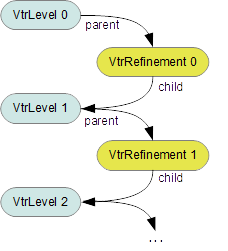

..
     Copyright 2013 Pixar

     Licensed under the Apache License, Version 2.0 (the "Apache License")
     with the following modification; you may not use this file except in
     compliance with the Apache License and the following modification to it:
     Section 6. Trademarks. is deleted and replaced with:

     6. Trademarks. This License does not grant permission to use the trade
        names, trademarks, service marks, or product names of the Licensor
        and its affiliates, except as required to comply with Section 4(c) of
        the License and to reproduce the content of the NOTICE file.

     You may obtain a copy of the Apache License at

         http://www.apache.org/licenses/LICENSE-2.0

     Unless required by applicable law or agreed to in writing, software
     distributed under the Apache License with the above modification is
     distributed on an "AS IS" BASIS, WITHOUT WARRANTIES OR CONDITIONS OF ANY
     KIND, either express or implied. See the Apache License for the specific
     language governing permissions and limitations under the Apache License.

Vtr Overview
------------

.. contents::
   :local:
   :backlinks: none

Vectorized Topology Representation (Vtr)
========================================

*Vtr* consists of a suite of classes that collectively provide an intermediate
representation of topology that supports efficient refinement.

*Vtr* is intended for internal use only and is currently accessed through the
*Far* layer by the `Far::TopologyRefiner <far_overview.html>`__, which assembles
these *Vtr* classes to meet the topological and refinement needs of the *Far*
layer.  What follows is therefore more intended to provide insite into the
underlying architecture than to describe particular usage.  For documentation
more relevant to direct usage, proceed to the *Far* section previously noted.

*Vtr* is vectorized in that its topological data is stored more as a collection of
vectors of primitive elements rather than as the faces, vertices and edges that
make up many other topological representations.  It is essentially a
structure-of-arrays (SOA) approach to topology in contrast to the more common
array-of-structures pattern found in many other topological representations.
Vtr's use of vectors allows it to be fairly efficient in its use of memory and
similarly efficient to refine, but the topology is fixed once defined.

*Vtr* classes are purely topological.  They are even more independent of the
representation of vertices, faces, etc. than Hbr in that they are not even
parameterized by an interface to such components.  So the same set of Vtr
objects can eventually be used to serve more than one representation of these
components.  The primary requirement is that a mesh be expressable as an
indexable set (i.e. a vector or array) of vertices, edges and faces. The index
of a component uniquely identifies it and properties are retrieved by referring
to it by index.

It's worth qualifying the term "topological" here and elsewhere -- we generally
refer to "topology" as "subdivision topology" rather than "mesh topology".  A
subdivision hierarchy is impacted by the presence of semi-sharp creasing, as
the subdivision rules change in response to that creasing.  So subdivision
topology includes the sharpness values assigned to edges and vertices that
affect the semi-sharp creasing.

The two primary classes in *Vtr* consist of:

    * `Vtr::Level <#vtrlevel>`__ - a class representing complete vertex topology
      for a level
    * `Vtr::Refinement <#vtrrefinement>`__ - a class mapping a parent *Vtr::Level*
      to a child level

Others exist to represent the following:

    * selection and appropriate tagging of components for sparse refinement
    * divergence of face-varying topology from the vertex topology
    * mapping between face-varying topology at successive levels
    * common low-level utilities, e.g. simple array classes

Vtr::Level
==========

*Vtr::Level* is a complete topological description of a subdivision level, with the
topological relations, sharpness values and component tags all stored in
vectors (literally std::vectors, but easily changed via typedefs). There are no
classes or objects for the mesh component types (i.e. faces, edges and
vertices) but simply an integer index to identify each.  It can be viewed as a
structure-of-arrays representation of the topology: any property related to a
particular component is stored in an array and accessible using the index
identifying that component. So with no classes the for the components, its
difficult to say what constitutes a "vertex" or a "face": they are each the sum
of all the fields scattered amongst the many vectors included.

*Level* represents a single level of a potential hierarchy and is capable of
representing the complete base mesh.  There are no members that relate data in
one level to any other, either below or above.  As such, any *Level* can be
used as the base level for a new subdivision hierarchy (potentially more than
one). All relationships between separate levels are maintained in the
`Vtr::Refinement <#vtrrefinement>`__ class.

Topological Relationships
*************************

*Level* requires the definition of and associations between a fixed set of
indexable components for all three component types, i.e. an explicit edge list
in addition to the expected set of vertices and faces. There are no explicit
component objects in the representation, only an integer index (*Vtr::Index*)
identifying each component within the set and data associated with that
component in the various vectors.

The topology is stored as six sets of incident relations between the components:
two each for the two other component types incident each component type, i.e.:

    * for each face, its incident vertices and incident edges
    * for each edge, its incident vertices and incident faces
    * for each vertex, its incident edges and incident faces

The collection of incidence relations is a vectorized variation of AIF (the
"Adjacency and Incidence Framework"). The set of these six incidence relations
is not minimal (only four are required, but that set excludes the most desired
face-vertex relation) but all six are kept and maintained to facilitate faster
refinement. While the sizes of several vectors are directly proportional to the
number of vertices, edges or faces to which the data is associated, the sizes
of some of the vectors for these relations is more cumulative and so additional
vectors of offsets is required (typical of the face-vertex list commonly used
as the minimal definition of mesh topology).

Vectors for the sharpness values associated with crease edges and corner
vertices are included (and so sized according to the number of edges and
vertices), along with additional tags for the components that may be helpful to
refinement (i.e. the type of subdivision Rule associated with each vertex).

A *Level* is really just a container for data in a subdivision level, and so
its public methods are primarily to access that data. Modification of the data
is protected and only made available to classes that are intended to construct
*Levels*: currently the *Far* factory class that is responsible for building the
base level, and the `Vtr::Refinement <#vtrrefinement>`__ class that constructs
subsequent levels during refinement.

Memory Efficiency
*****************

One of the advantages in storing data in what is essentially a
structure-of-arrays, rather than the array-of-structures more typical of
topological representations, is that we can be more selective about memory
usage in some cases. Particularly in the case of uniform refinement, when the
data in subsequent levels is typically 4x its predecessor, we can minimize what
we either generate or keep around at each level. For instance, if only a
face-list is required at the finest level, we only need to generate one of the
six topological relations: the vertices incident each face. When we do keep
*Levels* around in memory (as is the case with the `Far::TopologyRefiner
<far_overview.html>`__) we do have do have the opportunity to prune what is not
strictly necessary after the refinement. Just as with construction, whatever
classes are privileged to construct a *Level* are likely those that will be
privileged to prune its contents when needed.

The current implementation of Level is far from optimal though -- there are
opportunities for improvement.  After one level of subdivision, the
faces in a Level will be either all quads or tris.  Having specializations
for these cases and using the more general case in support of N-sided faces
for the base level only is one possibility.  Levels also allocate dozens of 
vectors in which to store all data.  Since these vectors are of fixed size
once created, they could be aggregated by partitioning one or a smaller
number of larger block of memory into the desired pieces.  The desire to
make some of these improvements is part of why Vtr is not directly exposed
for public use and instead exposed via Far.

Vtr::Refinement
===============

While `Vtr::Level <#vtrlevel>`__ contains the topology for each subdivision level,
*Vtr::Refinement*  is responsible for creating a new level via refinement of an
existing one, and for maintaining the relationships between the components in
the parent and child levels. So a simplified view of a subdivision hierarchy
with *Vtr* is a set of *Levels* with a *Refinement*  between each
successive pair.

*Refinement*  is a friend of *Level* and will populate a child level from
a parent given a set of refinement parameters. Aside from parameters related
to data or depth, there are two kinds of refinement supported:  uniform and
sparse.  The latter sparse refinement requires selection of an arbitrary set of
components -- any dependent or *"neighboring"* components that are required for
the limit will be automatically included. So feature-adaptive refinement is
just one form of this selective sparse refinement, the criteria being the
topological features of interest (creases and extra-ordinary vertices). The
intent is to eventually provide more flexibility to facilitate the refinement
of particular regions of interest or more dynamic/adaptive needs.

*Refinement* has also been subclassed according to the type of topological
split being performed, i.e. splitting all faces into quads or tris via the
*QuadRefinement* and *TriRefinement* subclasses.  As noted with *Vtr::Level*,
there is further room for improvement in memory and/or performance here by
combining more optimal specializations for both *Refinement* and *Level* --
with consideration of separating the uniform and sparse cases.

Parent-child and child-parent relationships
*******************************************

While *Refinement* populates a new child *Level* as part of its refinement
operation, it also accumulates the relationships between the parent and child
level (and as with *Level*, this data is stored in vectors indexable by the
components).

The associations between components in the two levels was initially only
uni-directional:  child components were associated with incident components
of a parent component based on the parent components topology, so we had a
parent-to-child mapping (one to many).  Storing the reverse child-to-parent
mapping was avoided to reduce memory (particularly in the case of uniform
refinement) as it often was not necessary, but a growing need for it,
particularly in the case of sparse feature-adaptive refinement, lead to it
being included.

Data flexibility
****************

One of the advantages of the structure-of-arrays representation in both
*Level* and *Refinement* is that we can make more dynamic choices about what
type of data we choose to allocate and use based on needs. For instance, we can
choose between maintaining the parent-child or child-parent mapping in
*Refinement*, or both if needed, and we can remove one if no longer
necessary. An active example of this is uniform refinement: if we only require
the face-vertex list at the finest subdivision level, there is no need to
generate a complete topological description of that level (as would be required
of more traditional representations), and given that level is 4x the magnitude
of its parent, the savings are considerable.

Currently there is nothing specific to a subdivision scheme in the refinement
other than the type of topological splitting to apply. The refinement does
subdivide sharpness values for creasing, but that too is independent of scheme.
Tags were added to the base level that are propagated through the refinement
and these too are dependent on the scheme, but are applied externally.
